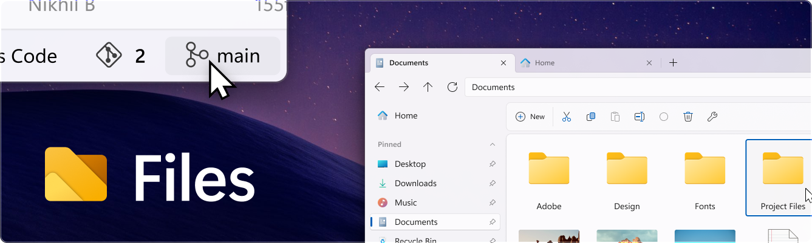
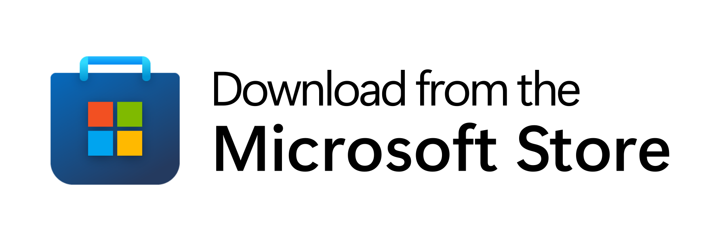
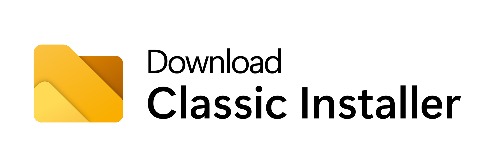
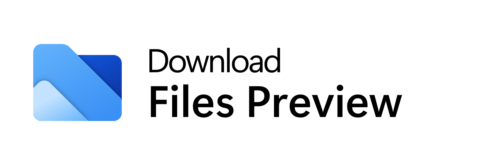
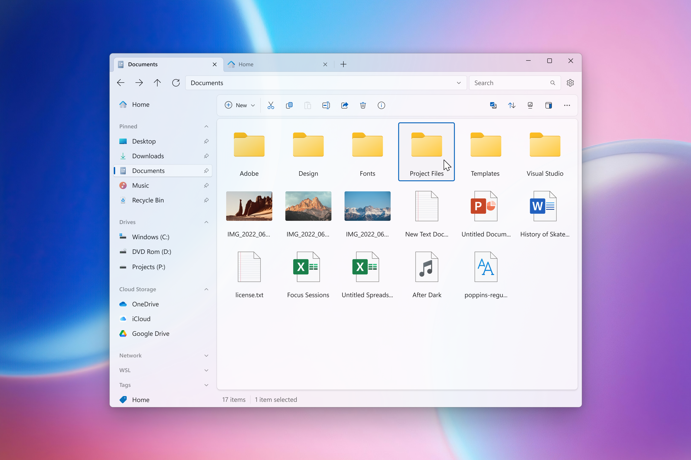

  

  
  
  
  

Files is a modern file manager that helps users organize their files and folders. Our mission with Files is to build the best file manager for Windows, and we’re proud to be building it out in the open so everyone can participate. User feedback helps shape the features we work on, & the bug reports on GitHub help to make Files more reliable. Built and maintained by the open-source community, Files features robust multitasking experiences, file tags, deep integrations, and an intuitive design.

## Installing and running Files

Files is a community-driven project that depends on your support to grow and improve. Please consider purchasing Files through the Microsoft Store or supporting us on GitHub if you use the classic installer.

You can also use the preview version alongside the stable release to get early access to new features and improvements.

  <!-- Store Badge -->
  <a style="text-decoration:none" href="https://apps.microsoft.com/detail/9NGHP3DX8HDX?launch=true&mode=full">
    <picture>
      <source media="(prefers-color-scheme: light)" srcset="../assets/StoreBadge-dark.png" width="220" />
      
  </picture></a>
  &ensp;
  <!-- Classic Installer Badge -->
  <a style="text-decoration:none" href="https://cdn.files.community/files/download/Files.Stable.exe">
    <picture>
      <source media="(prefers-color-scheme: light)" srcset="../assets/ClassicInstallerBadge-dark.png" width="220" />
      
    </picture></a>
  &ensp;
  <!-- Preview Installer Badge -->
  <a style="text-decoration:none" href="https://cdn.files.community/files/download/Files.Stable.exe">
    <picture>
      <source media="(prefers-color-scheme: light)" srcset="../assets/PreviewInstallerBadge-dark.png" width="220" />
      
    </picture></a>

## Building from source

Instructions for building the source code can be found on our [documentation site](https://files.community/docs/contributing/building-from-source).

## Contributing to Files

Before starting contribution, please make sure to read [our contributing guidelines](https://github.com/files-community/Files/blob/main/.github/CONTRIBUTING.md).

**Discuss & talk with the team**
 
We discuss the future of Files on [our Discord server](https://discord.gg/files) in order not to flood GitHub issues and PRs with replies.
You can also get notified of app updates real time and can see developement progress there as well.

**Report bugs & reauest features**
 
When you encounter an issue or you want a new feature, let us know with an [issue](https://github.com/files-community/Files/issues) that communicates your intent to create a [pull request](https://github.com/files-community/Files/pulls).

**Create PRs**
 
Looking for a place to start?
Check out the [Files task board](https://github.com/orgs/files-community/projects/3/views/2), where you can sort tasks by size and priority.

**Improve localization**
 
Localization of Files is maintained in Crowdin. We [invite you](https://crowdin.com/project/files-app) to there if you'd like contribute to localization and give you proofreader role after verification if you'd like you to proofread existing localizations.

## Screenshots

