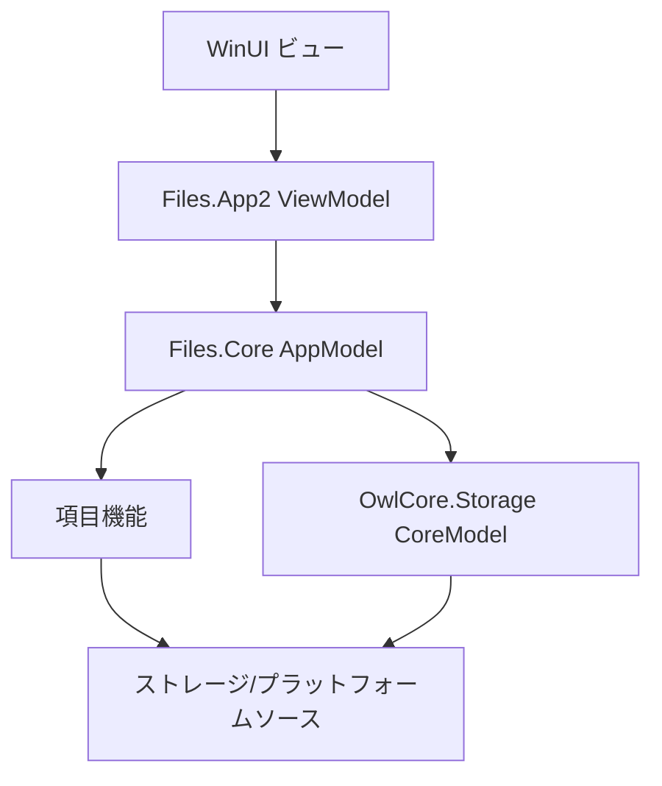
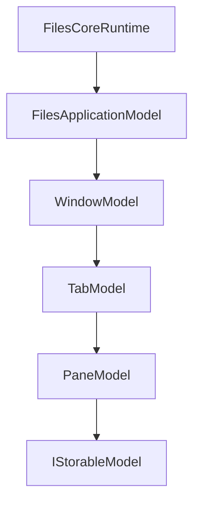

# Files.Core と Files.App のアーキテクチャ

この文書群は、UI に依存しない `Files.Core` 基盤と、それを利用する WinUI アーキテクチャを定義します。
設計は trickle-down MVVM に従います。長寿命の依存関係は 1 回だけ合成してモデルグラフへ渡し、項目のオプション機能は項目機能単位で遅延合成します。

## システム境界

WinUI に依存しないコードを最終的に 1 つの物理的な `Files.Core` プロジェクトへ統合する場合でも、論理的なレイヤーは分離したままにします。

## モデル用語

`Files.Core` はアセンブリ境界であり、単一のアーキテクチャレイヤーの名前ではありません。次の用語を一貫して使います。

| 用語 | 具体的な型 | 意味 |
| --- | --- | --- |
| ストレージ CoreModel | OwlCore.Storage `IStorable`、`IFile`、`IFolder` | ソースが扱う最小限のストレージ形状 |
| 項目 AppModel | `Files.Core.Models.IStorableModel` | Files の識別情報、ライフタイム、合成済み項目機能 |
| アプリケーション状態 AppModel | `Files.Core.AppModels.*` と参照モデル | アプリケーション、ウィンドウ、タブ、ペイン、参照の状態 |
| ViewModel | `Files.App.ViewModels.*` | 1 つの直接的な AppModel を WinUI バインディングへ適応するラッパー |

項目 AppModel とアプリケーション状態 AppModel はどちらも UI 非依存です。完全なアプリケーション状態グラフより先に `Files.Core.Models` 名前空間が存在していたため、
この名前空間を別のアーキテクチャレイヤーだと判断しないでください。また Files.App の最初の移行スライスでは名前を変更しません。

## 依存関係の規則

| レイヤー | 所有するもの | 依存できるもの |
| --- | --- | --- |
| Views | コントロール、表示状態、入力ルーティング | ウィンドウ単位の ViewModel |
| ViewModels | ローカライズ表示、コマンド、UI コレクション | 直接の AppModel と UI アダプター |
| AppModels | ウィンドウ、タブ、ペイン、参照、選択、履歴 | CoreModel と項目機能契約 |
| CoreModels | 標準化されたストレージ項目 | OwlCore.Storage とソース抽象化 |
| 項目機能 | サムネイル、プロパティ、プレビュー、ウォッチャーのオプション処理 | 項目コンテキストとソースサービス |
| ソース | Windows Shell、クラウド、FTP、アーカイブ | バックエンド/プラットフォーム API |

禁止する依存関係:

- `Files.Core` が WinUI、`Window`、`Frame`、`Page`、`DispatcherQueue` を参照すること。
- ViewModel が `IServiceProvider` や `Ioc.Default` をサービスロケーターとして使うこと。
- View が Windows Shell やストレージソースを直接呼び出すこと。
- ソースが ViewModel に依存すること。
- `IStorageSource` を `IStorable` のように扱うこと。
- `IItemFeatures` をプロセス全体の依存性注入として使うこと。
- パスや `LastKnownAddress` を項目識別情報として使うこと。

## Trickle-down による所有関係

親は子を所有し、非同期に破棄します。共有ソース、キャッシュ、スケジューラーはランタイムまたはソースレベルで所有します。
項目に結び付いたアダプターは、その項目の `ItemFeatures` が所有します。

## 文書一覧

新しい Files.App を開始するときは、次の順に読んでください。

1. [移行進捗](migration-progress.md)
2. [アプリケーションモデルグラフ](app-models.md)
3. [合成ルート](composition.md)
4. [新 Files.App2 アーキテクチャ](files-app2.md)
5. [Files.App の Core 統合（互換経路）](files-app.md)
6. [Files.App のコマンド実行](commands.md)
7. [Files.App の項目機能とアクティブ化](files-app-features.md)
8. [クリップボード、ドラッグ/ドロップ、Shell 連携](platform-interactions.md)
9. [テストと性能](testing.md)

参照文書:

- [ストレージモデルの境界と識別情報](storage-models.md)
- [アーカイブ参照と SevenZip フォールバック](archives.md)
- [FTP ストレージソース](ftp-storage.md)
- [項目機能の合成](item-features.md)
- [参照ビュー設定と投影](view-settings.md)
- [プレビューの流れと Shell セッション](previews.md)
- [ストレージ操作](operations.md)
- [`Files.App.Server` によるクラッシュ耐性のある操作](server-operations.md)
- [Windows ストレージソース](windows-storage.md)
- [Windows Shell のスレッド処理](threading.md)
- [移行原則と物理プロジェクト統合](migration.md)

## 文書の役割

`migration-progress.md` だけが、完了した移行境界、現在の作業、次の移行単位を記録します。
その他の文書は、次のような概念を定義します。

- `app-models.md`、`composition.md`、`files-app2.md`: model graph、composition、UI ownership。
- `commands.md`、`platform-interactions.md`、`operations.md`: command、platform、operation contracts。
- `storage-models.md`、`windows-storage.md`、`ftp-storage.md`、`archives.md`: storage boundaries。
- `item-features.md`、`files-app-features.md`、`view-settings.md`、`previews.md`: item and presentation concepts。
- `threading.md`、`testing.md`、`server-operations.md`: threading、validation、failure-isolation concepts。

概念文書は進捗の一覧を複製せず、実装状況を参照するときは `migration-progress.md` を使用します。
