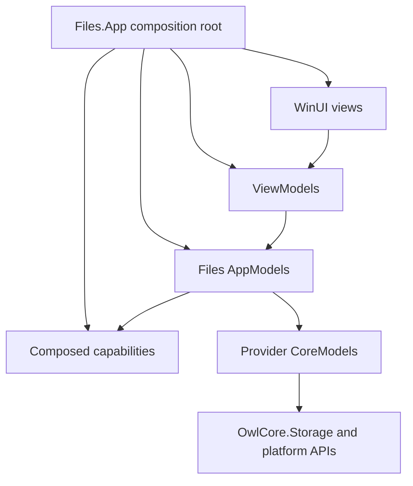
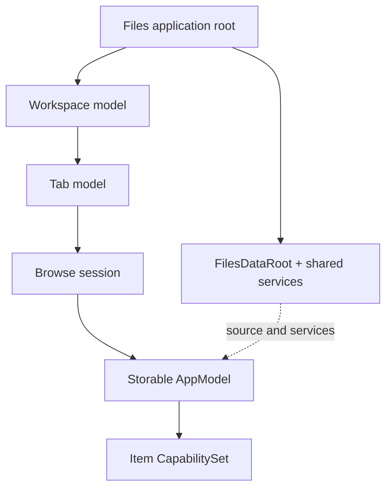

# Files architecture prototype

This directory describes the proposed UI-agnostic architecture and its prototype in `Files.Core`.

The architecture separates responsibilities logically even though most non-UI code can eventually live in one physical project.

## Dependency rules

| Layer | Owns | May depend on |
| --- | --- | --- |
| Views | WinUI controls, visual state, input routing | ViewModels |
| ViewModels | Labels, glyphs, shortcuts, command adapters | AppModels |
| AppModels | Browse sessions, navigation state, Files-specific item behavior | CoreModels and capability contracts |
| CoreModels | Standardized storage items | OwlCore.Storage |
| Capability implementations | Optional thumbnails, previews, properties, watchers, or actions | CoreModels, source services, and their own platform boundary |
| Providers | Windows Shell, FTP, archives, cloud APIs | Platform APIs and CoreModel contracts |

The following dependencies are prohibited:

- AppModels depending on WinUI, `Window`, `Frame`, or `Page`.
- ViewModels locating dependencies through `Ioc.Default`.
- Storage providers depending on ViewModels.
- Views calling Windows Shell, FTP, or archive APIs directly.
- `IStorageSource` pretending to be an `IStorable`.
- `ICapabilitySet` being used as an application-wide dependency injection container.

## Trickle-down composition

Long-lived services are constructed at the application boundary and passed down through the model graph. Item-bound capabilities are created lazily from those registrations.

The prototype implements the storage-backed portion of this graph: `IFilesDataRoot`, typed browse locations, location handlers, `IBrowseSessionModel`, capability composition, and a Windows Shell storage provider. Workspace, tab, pane coordination, and WinUI ViewModels remain later slices.

## Documents

- [Storage model boundaries](storage-models.md)
- [Capability composition](capabilities.md)
- [Windows storage provider](windows-storage.md)
- [Windows Shell threading](threading.md)
- [Browse view settings](view-settings.md)
- [Migration to Files.Core](migration.md)
