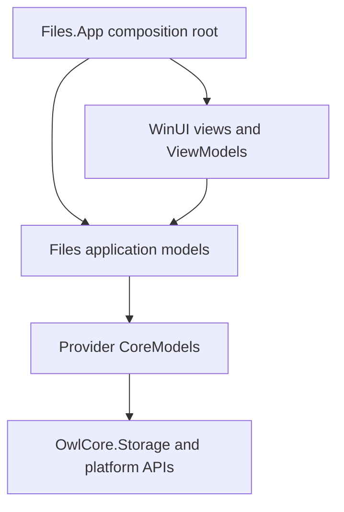
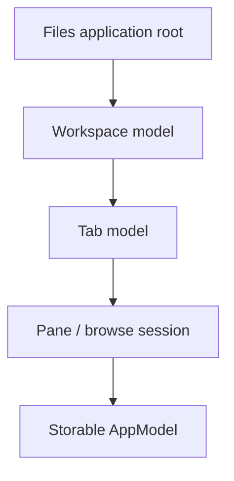

# Files architecture prototype

This directory describes the proposed Files architecture and the first implementation in `Files.Core`.

The architecture separates responsibilities logically even though the long-term plan places most non-UI code in one physical project.

## Dependency rules

| Layer | Owns | May depend on |
| --- | --- | --- |
| Views | WinUI controls, visual state, input routing | ViewModels |
| ViewModels | Labels, glyphs, shortcuts, `ICommand` adapters | AppModels |
| AppModels | Browse sessions, navigation state, Files-specific item behavior | CoreModels |
| CoreModels | Standardized storage items and optional capabilities | OwlCore.Storage |
| Providers | Windows Shell, FTP, archives, cloud APIs | Platform APIs and CoreModel contracts |

The following dependencies are prohibited:

- AppModels depending on WinUI, `Window`, `Frame`, or `Page`.
- ViewModels locating dependencies through `Ioc.Default`.
- Storage providers depending on ViewModels.
- Views calling Windows Shell, FTP, or archive APIs directly.
- `IStorageSource` pretending to be an `IStorable`.

## Trickle-down composition

Objects are constructed at the application boundary and passed down through the model and visual trees.

The prototype currently implements the storage-backed part of this graph: `IFilesDataRoot`, typed browse locations, location handlers, and `IBrowseSessionModel`. Workspace, tab, pane ownership, operations, and ViewModels remain future work.

## Documents

- [Storage model boundaries](storage-models.md)
- [Windows storage provider](windows-storage.md)
- [Migration to Files.Core](migration.md)
