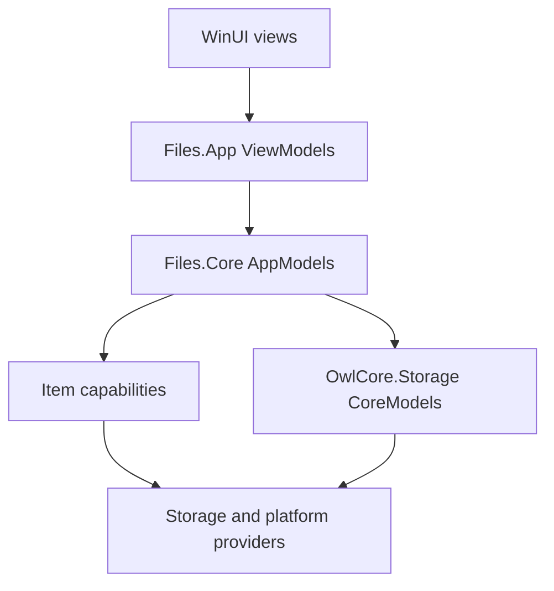
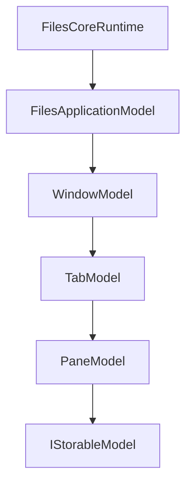

# Files.Core and Files.App architecture

These documents define the UI-independent Files.Core foundation and the
WinUI architecture that consumes it. The design follows trickle-down MVVM:
long-lived dependencies are composed once and passed down through a model
graph; optional item behavior is composed lazily per capability.

## System boundary

Logical layers remain separate even when WinUI-agnostic code is eventually
merged into one physical `Files.Core` project.

## Model terminology

`Files.Core` is an assembly boundary, not the name of one architectural
layer. Use these terms consistently:

| Term | Concrete types | Meaning |
| --- | --- | --- |
| Storage CoreModel | OwlCore.Storage `IStorable`, `IFile`, `IFolder` | Minimal provider-facing storage shape |
| Item AppModel | `Files.Core.Models.IStorableModel` | Files identity, lifetime, and composed item capabilities |
| Application-state AppModel | `Files.Core.AppModels.*` and browsing models | Application, window, tab, pane, and browse state |
| ViewModel | `Files.App.ViewModels.*` | WinUI-bindable wrapper around one direct AppModel |

Both item and application-state AppModels are UI-independent. The
`Files.Core.Models` namespace predates the complete application-state graph;
do not infer a different architectural layer from that namespace, and do not
rename it during the first Files.App adoption slice.

## Dependency rules

| Layer | Owns | May depend on |
| --- | --- | --- |
| Views | Controls, visual state, input routing | Window-scoped ViewModels |
| ViewModels | Localized presentation, commands, UI collections | Direct AppModels and UI adapters |
| AppModels | Windows, tabs, panes, browsing, selection, history | CoreModels and capability contracts |
| CoreModels | Standardized storage items | OwlCore.Storage and provider abstractions |
| Capabilities | Optional thumbnail, property, preview, watcher behavior | Item context and source services |
| Providers | Windows Shell, cloud, FTP, archives | Backend/platform APIs |

Prohibited dependencies:

- Files.Core referencing WinUI, `Window`, `Frame`, `Page`, or
  `DispatcherQueue`;
- ViewModels using `IServiceProvider` or `Ioc.Default` as a service locator;
- Views calling Windows Shell or storage providers directly;
- providers depending on ViewModels;
- `IStorageSource` pretending to be an `IStorable`;
- `ICapabilitySet` being used as process dependency injection;
- paths or `LastKnownAddress` being used as item identity.

## Trickle-down ownership

Parents own and asynchronously dispose their children. Shared providers,
caches, and schedulers are owned at the runtime/source level. Item-bound
adapters are owned by the item's `CapabilitySet`.

## Document map

Read these in order when starting the new Files.App:

1. [Completion boundary](implementation-status.md)
2. [Application model graph](app-models.md)
3. [Composition root](composition.md)
4. [New Files.App architecture](files-app.md)
5. [Files.App command execution](commands.md)
6. [Clipboard, drag/drop, and Shell integration](platform-interactions.md)
7. [Testing and performance](testing.md)

Reference documents:

- [Storage model boundaries and identity](storage-models.md)
- [Archive browsing and SevenZip fallback](archives.md)
- [FTP storage provider](ftp-storage.md)
- [Capability composition](capabilities.md)
- [Browse view settings and projection](view-settings.md)
- [Preview pipeline and Shell sessions](previews.md)
- [Storage operations](operations.md)
- [Windows storage provider](windows-storage.md)
- [Windows Shell threading](threading.md)
- [Migration and physical project merge](migration.md)

## Current state

Files.Core now contains the complete application/window/tab/pane model graph,
home, folder, and archive browsing, selection and projection, view settings,
viewport prefetch, capability composition,
thumbnail/property/folder-change/preview vertical slices, Windows Shell and
FTP storage, storage mutations, composition, tests, benchmarks, and
dedicated CI.

Search/tag backends, cloud/MTP/SFTP providers, WinUI renderers, activation,
context menus, drag/drop, and persistence are explicit extension or Files.App
boundaries. They do not require changing the Core model graph.
