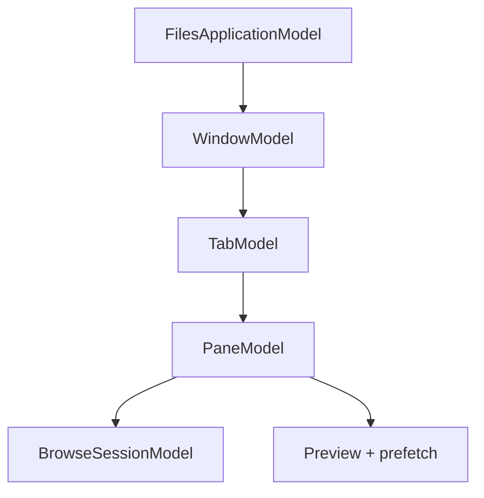
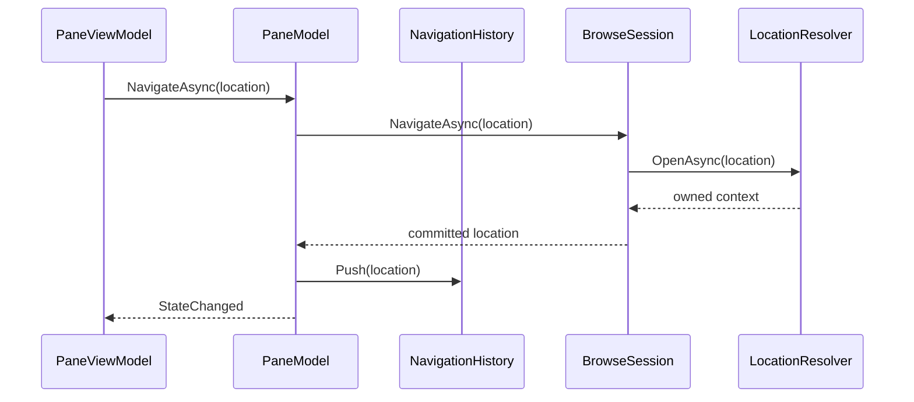
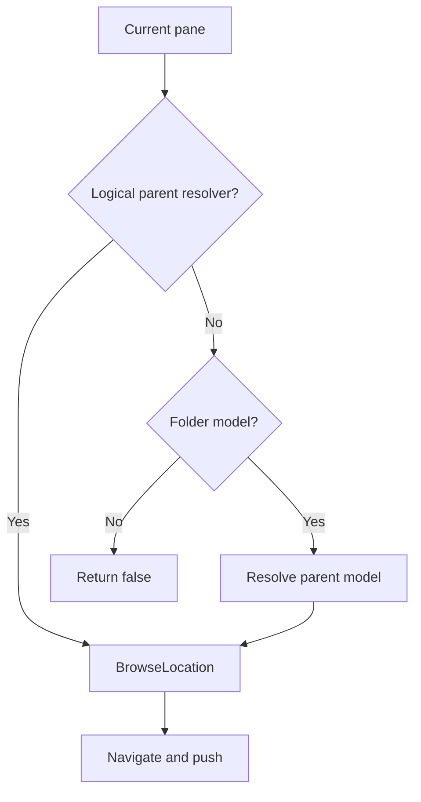
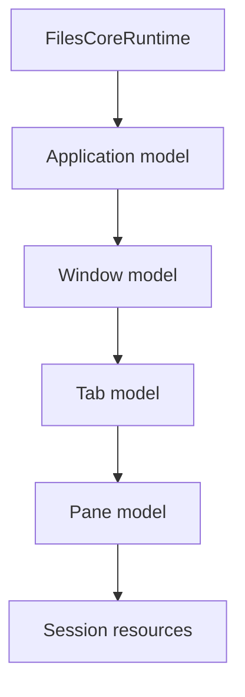

# Application model graph

`Files.Core.AppModels` is the UI-independent state graph for the Files
process. It is the middle of trickle-down MVVM: ViewModels adapt these models,
while the models own browsing state and never reference WinUI.



## Responsibilities

| Model | Owns | Does not own |
| --- | --- | --- |
| `FilesApplicationModel` | Windows and active-window identity | WinUI `Application` or activation |
| `WindowModel` | Ordered tabs and active tab | `Window`, `AppWindow`, title bar |
| `TabModel` | One or two panes, active pane, split orientation | Tab controls or drag visuals |
| `PaneModel` | Navigation history, browse session, preview model, prefetch coordinator | `Frame`, list control, preview HWND |
| `BrowseSessionModel` | Location context, item models, projection, selection, presentation values, view settings | Observable collections or XAML objects |

The model IDs are process-local correlation IDs. Storage identity comes from
`StorableReference`, not from window, tab, or pane IDs.

## Responsibility audit

`BrowseSessionModel` is the aggregate root for the state of one browsable
pane. Its public surface coordinates a navigation transaction, the active
location context, immutable item snapshots, selection, and presentation
state. It is not a destination for every browser-related behavior.

Existing responsibility boundaries are:

| Concern | Owner |
| --- | --- |
| Back/forward history and pane lifetime | `PaneModel` and `BrowseNavigationHistory` |
| Location-specific opening and enumeration | `IBrowseLocationHandler` and `IBrowseLocationContext` |
| Item ordering and granular collection changes | `BrowseItemProjection` |
| Properties and thumbnail scheduling | `BrowsePrefetchCoordinator` |
| Preview selection and lifetime | `BrowsePreviewModel` |
| Create, rename, copy, move, and delete | `IStorageOperationService` |
| Observable collections and dispatcher application | Files.App collection adapter |
| Commands, dialogs, and visual state | Files.App |

Keep `IBrowseSessionModel` stable through the first Files.App adoption slice.
When new behavior introduces its own lifetime, queue, or consistency
invariant, extract an internal collaborator behind this aggregate instead of
adding another responsibility directly. Likely extraction seams are
navigation preparation, folder-change reconciliation, and presentation
state. Do not extract them merely to reduce the source file length; use the
first UI consumer to prove an independently testable boundary.

The following never belong in `BrowseSessionModel`: WinUI types, observable
collections, localized strings, command implementations, dialogs, Shell
interop, provider-specific branching, or process service lookup.

## Creating the graph

Applications normally receive a ready `FilesApplicationModel` from
`FilesCoreRuntime`. Tests and specialized hosts can construct the graph from
`BrowsePaneFactory`.

```csharp
await using var runtime = new FilesCoreBuilder()
	.AddWindowsStorage()
	.Build();

var window = await runtime.Application.CreateWindowAsync(
	HomeLocation.Instance,
	cancellationToken);
var pane = window.ActiveTab!.ActivePane!;
```

`CreateWindowAsync` creates one tab and one pane. A tab may contain at most
two panes:

```csharp
var secondPane = await window.ActiveTab!.OpenSplitAsync(
	PaneSplitOrientation.Vertical,
	cancellationToken: cancellationToken);
```

Closing a child disposes its complete subtree before the close operation
completes.

## Pane navigation

`PaneModel` serializes navigation. A successful push removes the old forward
branch; replace updates the current history entry. Back and forward move the
history cursor only after the browse session accepts the destination.



The history contains `BrowseLocation` values, not paths. `FolderLocation`
contains a stable `StorableReference`; replacing its recovery address does
not create a duplicate entry. The latest location value replaces the old
entry so `LastKnownAddress` remains fresh.

`ArchiveLocation` contains the outer archive's stable reference plus a
normalized logical entry path. It never contains a scoped archive-entry
source ID or credential.

`BrowseNavigationHistorySnapshot` is immutable and validates its cursor. It
is suitable for a Files.App persistence DTO after translating polymorphic
`BrowseLocation` values into an explicit serialized schema. Storage and
versioning of window sessions belong to Files.App because they include
application activation and user settings policy.

## Up navigation

`PaneModel.GoUpAsync` first honors
`IBrowseLocationParentResolver` for logical locations such as archives.
Inside an archive, Up creates another `ArchiveLocation`; from the archive
root, it resolves the outer storage item's parent. Other folders use the
current `IFolderModel`, capture the parent's stable reference, and dispose
that temporary parent model after navigation. A root or non-folder location
returns `false`.



## Selection and item access

Selection is stored in `BrowseSessionModel` as stable `StorableKey` values.
Use `GetFocusedItem()` and `GetSelectedItems()` when an operation needs the
current model snapshots. Do not retain those snapshots across navigation or
folder-change events; capture `StorableReference` values instead.

```csharp
var selectedReferences = pane.BrowseSession
	.GetSelectedItems()
	.Select(static item => item.Reference)
	.ToArray();
```

## Viewport work

The ViewModel reports the visible item range through
`PaneModel.UpdateViewport`. The pane delegates to
`BrowsePrefetchCoordinator`, which requests properties and thumbnails for a
bounded region and rejects results from an obsolete generation.

The UI should call this after range changes, not once per realized element.
The coordinator already prioritizes the visible range and cancels superseded
work.

## Events and UI dispatch

AppModel events are raised on the thread that commits the model transition.
They are not guaranteed to run on the WinUI dispatcher. Files.App must:

1. capture an immutable model snapshot in the event handler;
2. enqueue one update on the window dispatcher;
3. verify that the ViewModel is still attached;
4. apply the item changes or reset to its observable projection.

AppModel event invocation isolates subscriber exceptions and writes them to
tracing. An observer cannot roll back a committed model transition or stop
other observers.

## Cancellation and lifetime

Every parent owns its children:



Disposal is idempotent. Each model:

- stops accepting new mutations;
- cancels its lifetime token;
- waits for its mutation semaphore;
- detaches child events;
- disposes children in reverse ownership order;
- aggregates cleanup failures without abandoning later children.

Files.App disposes ViewModels and active Shell preview sessions first, then
disposes `FilesCoreRuntime`. Synchronous blocking on these asynchronous
disposal paths from the UI thread is prohibited.
