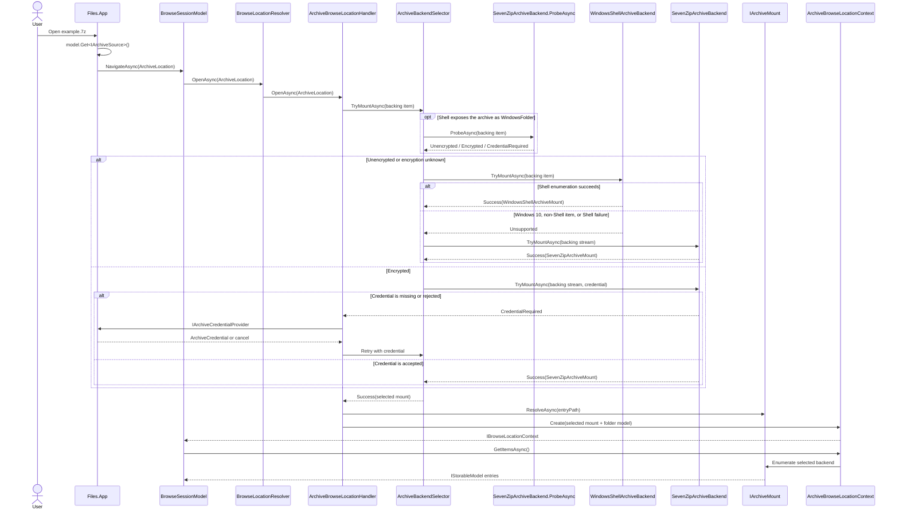
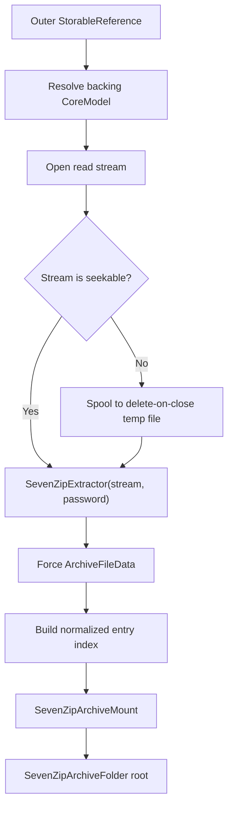
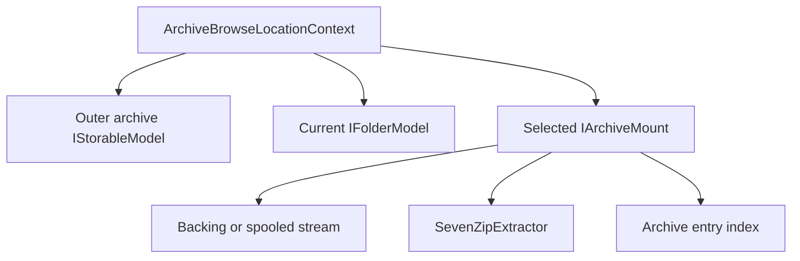

# Archive browsing

Archive browsing is a UI-independent Files.Core vertical slice. It treats an
archive as a mountable browse location while preserving the original file's
`StorableReference`. Windows Shell is preferred when it exposes the archive
as a folder; SevenZipSharp is the Windows 10, encrypted archive, remote
stream, and unsupported-Shell fallback.

## Terminology

`OpenAsync` is not a SevenZipSharp API in this design. There are three
separate operations:

| Operation | Responsibility |
| --- | --- |
| `ArchiveBrowseLocationHandler.OpenAsync` | Opens an `ArchiveLocation` for a browse session |
| `IArchiveBackend.TryMountAsync` | Attempts to select and mount one backend |
| `IArchiveMount.ResolveAsync` | Resolves the root or one entry inside the selected mount |

SevenZipSharp itself is opened by constructing `SevenZipExtractor` over a
seekable stream and forcing `ArchiveFileData` to load.

## End-to-end open flow



Selection happens before any archive entries are committed to the browse
session. Shell children and SevenZip children are never combined. Their
identity, path normalization, metadata, and mutation behavior are not
assumed to match.

## Files.App entry point

Both a Shell archive folder and a normal file can expose
`IArchiveSource`. Files.App must check this capability before treating an
`IFolderModel` as an ordinary folder:

```csharp
BrowseLocation CreateOpenLocation(IStorableModel item)
{
	if (item.Get<IArchiveSource>() is { } archive)
	{
		return new ArchiveLocation(archive.Archive);
	}

	if (item is IFolderModel folder)
	{
		return new FolderLocation(folder.Reference);
	}

	throw new InvalidOperationException(
		$"'{item.Name}' is not browsable.");
}
```

Folders returned by the SevenZip backend implement `IArchiveEntry`.
Opening one creates another `ArchiveLocation` with the same outer archive and
its normalized entry path:

```csharp
if (item is IFolderModel
	&& item.Get<IArchiveEntry>() is { } entry)
{
	return new ArchiveLocation(entry);
}
```

The `ArchiveLocation` never contains a password:

```text
ArchiveLocation
├── Archive: StorableReference to example.7z
└── EntryPath: "" or "Documents/Reports"
```

## Backend selection

The default registration order is:

| Priority | Backend | Eligible when |
| ---: | --- | --- |
| 200 | `WindowsShellArchiveBackend` | The backing source is `WindowsStorageSource`, the item is an `IFolder` with `SFGAO_STREAM`, and Shell enumeration succeeds |
| 100 | `SevenZipArchiveBackend` | A seekable archive stream can be opened by SevenZipSharp |

The SevenZip probe runs before selecting a Shell folder so encrypted
archives do not appear to browse successfully and then fail when an entry is
read. The probe is advisory for other storage items; Windows 10 `.7z` files
and remote files proceed directly to the SevenZip mount and are not parsed
twice.

For Windows items, archive-extension detection uses the filesystem or Shell
parsing name rather than the UI display name, so Explorer's “hide known file
extensions” preference cannot change capability composition.

Do not select by OS version. A Windows build, installed Shell extension,
format, association, or policy can change whether the item is exposed as a
folder. The actual storage shape and enumeration attempt are the capability
probe.

## SevenZip mount



`ArchiveFileData` is flat. `SevenZipArchiveIndex` synthesizes missing parent
folders and provides immediate-child lookup. Entry paths use `/`, are
case-sensitive, and reject rooted paths, NUL characters, and `..` traversal.
Unsafe entries are not published.

Opening an inner file calls `ExtractFileAsync` into a seekable,
delete-on-close temporary stream. This avoids loading an arbitrarily large
entry into one `MemoryStream`. Access to a mount's `SevenZipExtractor` is
serialized because the native extractor is not treated as thread-safe.

SevenZipSharp does not provide cooperative cancellation for the native
extraction already in progress. Cancellation is checked before and after the
native call, and the temporary output is deleted on failure.

SevenZipSharp is a managed wrapper around the native 7-Zip library. The
application package must continue to deploy the architecture-matched
`7z.dll`, `7z64.dll`, or `7zArm64.dll`; the existing `Files.App.csproj`
already includes these files. Files.Core owns the abstraction and managed
backend, but application packaging remains responsible for native
deployment.

## Credentials

Files.Core defines `IArchiveCredentialProvider`; Files.App supplies its
implementation. Core never creates a dialog:

```csharp
public sealed class ArchiveCredentialProvider
	: IArchiveCredentialProvider
{
	public async ValueTask<ArchiveCredential?> GetCredentialAsync(
		ArchiveCredentialChallenge challenge,
		CancellationToken cancellationToken)
	{
		// Dispatch to the owning Window and show WinUI content.
		return await dialogService.RequestArchivePasswordAsync(
			challenge,
			cancellationToken);
	}
}
```

Missing or rejected passwords produce a typed
`ArchiveMountResult.CredentialRequired`. The handler asks the provider and
retries before returning a context. Without a configured provider,
`ArchiveCredentialRequiredException` is surfaced. Credentials are not
stored in `StorableReference`, `StorageAddress`, history, or view settings.
`ArchiveCredential.ToString()` is intentionally redacted; application
telemetry must still avoid serializing its `Password` property.

Some ZIP formats expose unencrypted directory metadata and validate the
password only when an encrypted entry is extracted. The SevenZip mount
retains the same credential-provider contract, serializes a new prompt,
recreates its extractor over the seekable backing stream, clears partial
output, and retries. Files.App's provider must therefore be safe to call from
both location opening and later entry-stream opening.

## Ownership



The context disposes the current folder model, then the mount, then the
outer archive model. The SevenZip mount closes its extractor and backing
stream. A Shell mount does not own the process-wide Windows source; it only
adapts it for the current browse context.

## Scope

Implemented:

- Shell-first browse selection;
- Windows 10 and unsupported-Shell fallback;
- encrypted archive credential flow;
- local and non-seekable backing streams;
- normalized folder enumeration;
- read-only entry streams;
- deterministic asynchronous cleanup.

Separate archive operation providers are still required for compression,
extract-all, entry creation, entry deletion, rename, update, split volumes,
and progress/collision policy. Those operations must reuse the same Core
result and credential contracts without placing dialogs in Files.Core.

A nested archive inside a SevenZip-backed archive is not advertised as a new
`IArchiveSource` yet. Its backing entry belongs to a scoped mount and cannot
be cold-resolved through `FilesDataRoot` after that context is replaced.
Supporting it requires an explicit mount-chain reference or a ref-counted
mount registry; it must not be approximated with a stale scoped source ID.
