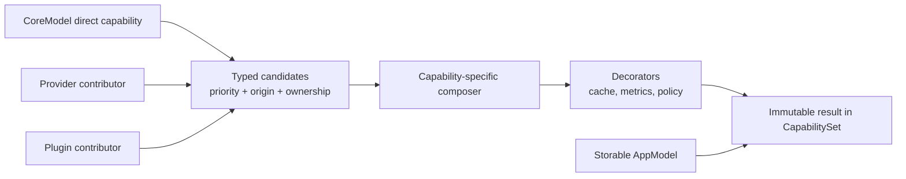
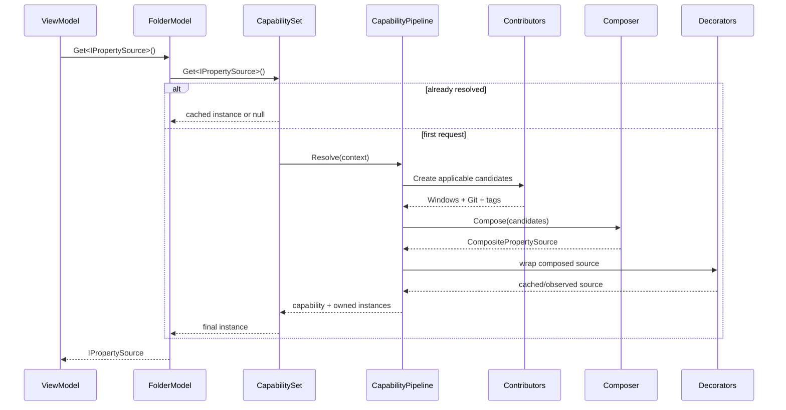
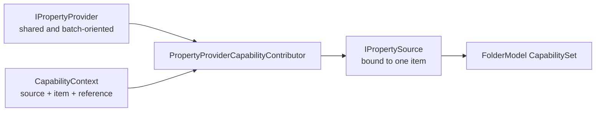
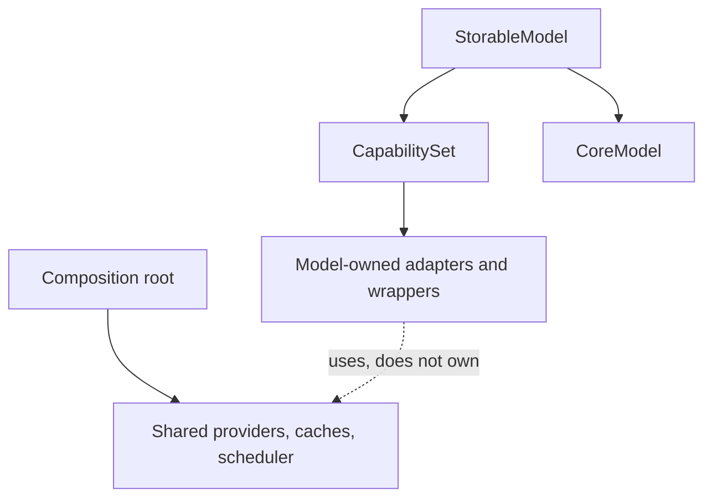

# Capability composition

Capabilities are optional, item-bound behavior such as thumbnails, previews, properties, watchers, or operations. They are not base classes and they do not inherit from `IStorable`.

An AppModel exposes the final set:

```csharp
var properties = folderModel.Get<IPropertySource>();

if (properties is not null)
{
	var values = await properties.GetPropertiesAsync(
		new PropertyRequest(["System.Size", "System.DateModified"]),
		cancellationToken);
}
```

`Get<TCapability>()` is an extension over `IStorableModel.Capabilities`. It is concise for callers, but it resolves only capability contracts registered for that model. It is not a general service locator.

## Resolution pipeline

The composition root registers contributors, one optional composer per contract, and decorators. Resolution is lazy and cached per model.





Contributors are invoked only the first time their capability contract is requested. Listing 10,000 items therefore does not eagerly create 10,000 thumbnail, preview, and property adapters.

## Composition is contract-specific

Multiple implementations do not have one universally correct meaning. The prototype makes that policy explicit.

| Capability shape | Composition rule | Prototype |
| --- | --- | --- |
| Thumbnail | Try candidates by descending priority until one returns a result | `ThumbnailSourceComposer` |
| Preview | Route by descending priority; `null` means “not handled” | `PreviewSourceComposer` |
| Properties | Merge all sources; higher priority wins duplicate property IDs | `PropertySourceComposer` |
| Watcher or mutation service | Normally exactly one implementation | Default ambiguity exception or `PriorityCapabilityComposer<T>` |
| Commands or adornments | Aggregate all applicable contributions | A contract-specific composer should define ordering and duplicate behavior |

Without a registered composer, zero candidates resolve to `null`, one candidate is returned directly, and multiple candidates throw. This prevents registration order from silently deciding correctness.

The thumbnail chain treats only `null` as “try the next provider.” Exceptions are real failures and propagate. A lower-priority source therefore cannot conceal a broken higher-priority implementation.

## Registration example

```csharp
var thumbnailCache = new MemoryThumbnailCache();
var windowsThumbnailBackend = new WindowsShellThumbnailBackend();
var windowsProperties = new WindowsPropertyProvider();

var capabilities = new CapabilityPipelineBuilder()
	.AddContributor<IThumbnailSource>(
		new WindowsThumbnailCapabilityContributor(windowsThumbnailBackend),
		priority: 0,
		origin: "Windows Shell")
	.AddContributor<IPropertySource>(
		new PropertyProviderCapabilityContributor(windowsProperties),
		priority: 100,
		origin: "Windows Shell")
	.AddContributor<IPropertySource>(
		new PropertyProviderCapabilityContributor(gitProperties),
		priority: 50,
		origin: "Git")
	.SetComposer<IPropertySource>(new PropertySourceComposer())
	.SetComposer<IThumbnailSource>(new ThumbnailSourceComposer())
	.AddDecorator<IThumbnailSource>(new ThumbnailCacheDecorator(thumbnailCache))
	.Build();

var modelFactory = new StorableModelFactory(capabilities);
```

A plugin participates by registering another contributor for the same contract. It does not replace `StorableModelFactory`, modify `FolderModel`, or reach into the visual tree.

Decorators run in registration order. Each decorator receives the result of the previous stage, so the last registered decorator is the outermost wrapper.

## Item source versus batch provider

`IPropertySource` and `IPropertyProvider` deliberately represent different scopes.



- `IPropertyProvider` is source-scoped or plugin-scoped. It can query several `CapabilityContext` instances in one request and is owned by the composition root.
- `IPropertySource` is the convenient item-bound contract returned by `model.Get<IPropertySource>()`.
- `PropertyProviderCapabilityContributor` creates the small adapter between the two.
- A future list prefetch coordinator can call the same provider in batches rather than resolving every row independently.

`PropertyRequest` currently carries only the requested property IDs. A fast-only option is intentionally not exposed until providers can enforce the same latency contract; the current Windows provider reads its small supported typed set directly from `IShellItem2`.

This split also applies to other expensive capabilities: item-bound access is convenient, while a shared provider can batch, cache, throttle, and schedule the actual work.

## Ownership



- The application root owns shared providers, caches, and schedulers.
- A `StorableModel` owns its `CapabilitySet` and CoreModel.
- The set owns disposable instances marked `CapabilityOwnership.Model`, plus new disposable composer/decorator wrappers.
- `CapabilityOwnership.External` marks instances owned elsewhere.
- Composers and decorators must not dispose the candidate or inner capability they wrap; the set tracks those lifetimes separately.
- Model-scoped resources currently use synchronous `IDisposable`. Long-lived asynchronous resources belong at the root or source boundary.
- Disposal runs wrappers and candidates in reverse creation order, then the AppModel disposes its CoreModel.

Direct capabilities implemented by the CoreModel are always externally owned by the pipeline because the AppModel already owns the CoreModel itself.

Thumbnail cache keys use source ID plus item ID, not `LastKnownAddress`. Watchers and successful mutations should call `IThumbnailCache.InvalidateAsync` for affected references so cache lifetime never substitutes for content-version tracking.
