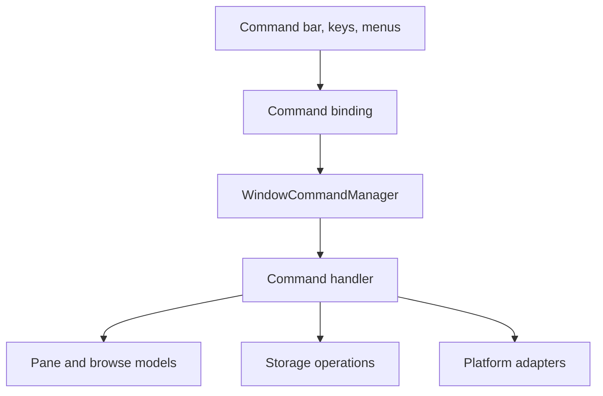
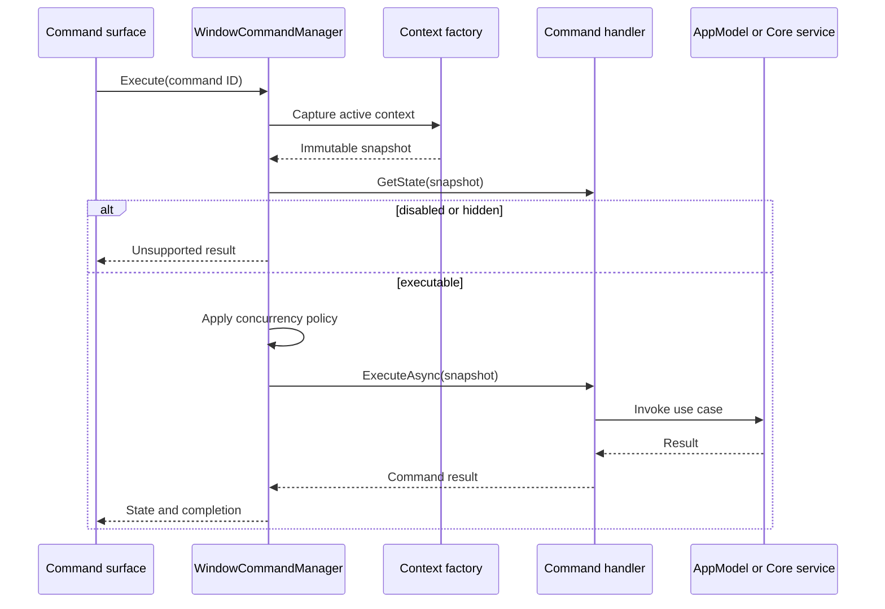
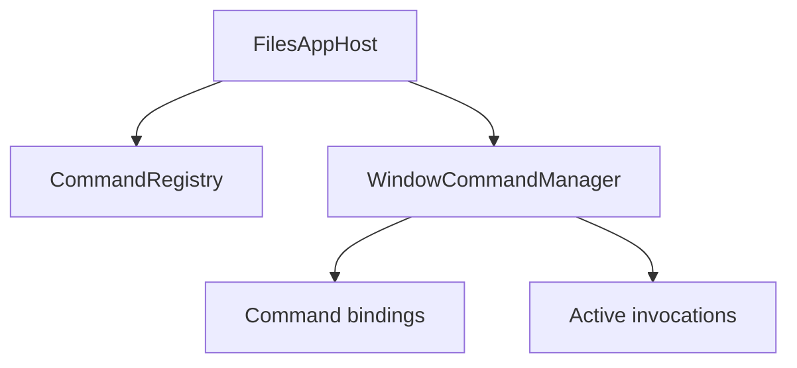

# Files.App command execution

Files.App needs one command path for command bars, keyboard shortcuts, context
menus, the command palette, and automation. The command path adapts
window-scoped UI intent to the navigation and storage use cases already
implemented by Files.Core.

This is an application boundary. Files.Core continues to own navigation
state, storage operation requests, provider selection, and result contracts.
Files.App owns localized presentation, input gestures, prompts, progress UI,
and error policy.

## Goals

- Give every built-in command a stable ID independent of its label, icon, and
  shortcut.
- Capture an immutable invocation context before asynchronous work begins.
- Use the same handler regardless of which UI surface invoked the command.
- Derive enabled, visible, and checked state from the active window model.
- Make cancellation and concurrent invocation behavior explicit.
- Keep handlers testable without constructing XAML controls.
- Allow selection-scoped command contributions without turning the command
  registry into a service locator.

The command system does not replace `PaneModel`,
`IStorageOperationService`, provider capability composition, or WinUI input
routing. It coordinates those existing boundaries.

## Dependency boundary



Files.Core must not reference `ICommand`, `XamlUICommand`, localized resource
loaders, dialogs, window handles, or keyboard types. Files.App handlers may
depend on a direct AppModel and the narrow adapter interfaces they need; they
must not resolve dependencies from a global container.

## Proposed source layout

```text
src/Files.App/Commands/
  CommandId.cs
  CommandDescriptor.cs
  CommandContext.cs
  CommandState.cs
  CommandExecutionResult.cs
  CommandConcurrencyPolicy.cs
  ICommandHandler.cs
  CommandRegistry.cs
  CommandRegistryBuilder.cs
  WindowCommandManager.cs
  CommandBindingViewModel.cs
  CommandContextFactory.cs
  Adapters/
    NavigationCommandAdapter.cs
    StorageCommandAdapter.cs
    ClipboardCommandAdapter.cs
  Contributions/
    ICommandContributionProvider.cs
    CommandContribution.cs
```

`CommandRegistry` is an immutable catalog built during application
composition. `WindowCommandManager` is created once per window and owns the
state and execution lifetime of that window's commands.

## Core contracts

### Stable identity and presentation

Persist shortcuts and customization by a stable string ID. Never persist a
localized label or enum ordinal.

```csharp
public readonly record struct CommandId
{
	public CommandId(string value)
	{
		ArgumentException.ThrowIfNullOrWhiteSpace(value);
		Value = value;
	}

	public string Value { get; }
}

public sealed record CommandDescriptor(
	CommandId Id,
	string LabelResourceKey,
	string DescriptionResourceKey,
	string IconKey,
	string Group,
	int Order,
	IReadOnlyList<KeyGesture> DefaultGestures);
```

Built-in IDs use a version-independent namespace such as
`files.navigation.back`, `files.item.rename`, and `files.clipboard.paste`.
Removing or renaming an ID requires a settings migration.

The descriptor contains resource and icon keys, not constructed WinUI
objects. `CommandBindingViewModel` resolves those keys for its window and
creates the dispatcher-affine icon or `XamlUICommand`.

### Immutable invocation context

The manager captures context when the command is invoked:

```csharp
public sealed record CommandContext(
	Guid WindowId,
	Guid TabId,
	Guid PaneId,
	BrowseLocation Location,
	ImmutableArray<StorableReference> Selection,
	StorableReference? FocusedItem,
	long BrowseGeneration,
	long ItemsVersion,
	CommandInvocationSource InvocationSource);
```

The context contains references and model IDs, not retained
`IStorableModel` instances or XAML controls. A handler resolves a reference
again if it needs a current model. A handler that depends on the current
browse snapshot verifies the generation and item version after each awaited
prompt or platform call.

`CommandContextFactory` is window-scoped and reads the active tab, pane,
selection, and focused item atomically on the UI dispatcher. The command
manager does not accept arbitrary `object` parameters from a view.

### State and execution

State queries must be cheap and synchronous because selection, focus, and
loading changes can invalidate many bindings at once.

```csharp
public sealed record CommandState(
	bool IsVisible,
	bool IsEnabled,
	bool IsChecked = false,
	string? DisabledReasonResourceKey = null);

public interface ICommandHandler
{
	CommandId Id { get; }

	CommandConcurrencyPolicy ConcurrencyPolicy { get; }

	CommandState GetState(CommandContext context);

	ValueTask<CommandExecutionResult> ExecuteAsync(
		CommandContext context,
		IProgress<CommandProgress>? progress = null,
		CancellationToken cancellationToken = default);
}
```

`GetState` may inspect AppModel state and call cheap methods such as
`IStorageOperationService.CanHandle`. It must not enumerate a folder, query a
network provider, activate COM, read the clipboard, or display UI. Unknown
expensive state remains enabled when execution can provide a useful failure,
or is supplied by an asynchronously refreshed cache.

Execution returns an explicit outcome:

```csharp
public enum CommandExecutionStatus
{
	Succeeded,
	Canceled,
	Unsupported,
	PartiallySucceeded,
	Failed,
}

public sealed record CommandExecutionResult(
	CommandExecutionStatus Status,
	IReadOnlyList<CommandItemResult> Items,
	Exception? Error = null);
```

Expected cancellation is not an error dialog. Multi-item commands retain
per-item results instead of collapsing partial success into one exception.

## Registry and window manager

`CommandRegistryBuilder` accepts explicit handler factories at process
composition. Duplicate built-in IDs are rejected. `Build` produces an
immutable registry and can be called only once.

Factories receive explicit application services. Leaf handlers never receive
`IServiceProvider`, `FilesCoreRuntime`, or the registry itself.

`WindowCommandManager`:

- owns one handler instance per registered window-scoped command;
- owns each command's active cancellation token and concurrency gate;
- exposes stable `CommandBindingViewModel` instances to Views;
- recomputes state when the active pane, selection, browse generation,
  clipboard snapshot, or operation state changes;
- raises one coalesced state-change notification on its window dispatcher;
- rejects invocation after disposal.

The binding implements WinUI's command interface as a presentation adapter.
Its `Execute` method starts the manager task and forwards failures to the
window error policy; no `async void` handler contains command logic.

## Invocation flow



State is checked again at invocation. A stale `CanExecute` value rendered by
the UI never authorizes an operation by itself.

## Concurrency and cancellation

Each descriptor selects one policy:

| Policy | Behavior | Typical commands |
| --- | --- | --- |
| `CancelPrevious` | Cancel the previous invocation, then start the new one | Navigate, refresh, search |
| `RejectWhileRunning` | Keep one invocation and disable repeats | Rename, create, properties |
| `Serialize` | Queue invocations in order | Clipboard paste, ordered batch operations |
| `AllowParallel` | Run independently with separate progress | Open in new window |

Cancellation is linked to the window, pane, and command invocation. Closing a
pane cancels pane commands; closing a window cancels all of its commands.
Disposing the process host happens only after every window manager has
stopped.

Do not hold the UI dispatcher while waiting for a storage operation. Prompts
and state updates marshal to the dispatcher through the window's
`IUiDispatcher`.

## Navigation adapter

`NavigationCommandAdapter` calls the direct `PaneModel` supplied at window
construction.

| Command ID | Model action | State source |
| --- | --- | --- |
| `files.navigation.back` | `GoBackAsync` | `CanGoBack` and `IsLoading` |
| `files.navigation.forward` | `GoForwardAsync` | `CanGoForward` and `IsLoading` |
| `files.navigation.up` | `GoUpAsync` | `CanGoUp` and `IsLoading` |
| `files.navigation.refresh` | `RefreshAsync` | Pane membership and loading policy |
| `files.item.open` | Resolve an appropriate `BrowseLocation` | Focused item and selection count |

Open checks `IArchiveEntry` and `IArchiveSource` before ordinary folder
shape. This preserves Shell-first archive behavior and the encrypted archive
fallback. Opening a non-browsable file is routed to a platform launch
adapter, not treated as folder navigation.

Navigation cancellation does not mutate history until the new location has
opened successfully. The pane remains the authoritative history owner.

## Storage adapter

`StorageCommandAdapter` translates application intent into existing
`StorageOperationRequest` values.

| Command ID | Request |
| --- | --- |
| `files.item.rename` | `RenameOperationRequest` |
| `files.item.createFile` | `CreateItemOperationRequest` |
| `files.item.createFolder` | `CreateItemOperationRequest` |
| `files.item.copyTo` | `CopyOperationRequest` |
| `files.item.moveTo` | `MoveOperationRequest` |
| `files.item.delete` | `DeleteOperationRequest` |

The adapter owns UI policy around the request:

1. capture references from `CommandContext`;
2. request a name, destination, conflict choice, or delete confirmation;
3. verify that the pane and relevant browse generation still exist;
4. call `IStorageOperationService`;
5. aggregate progress and per-item outcomes;
6. use returned references only for reveal or focus intent.

It never edits the visible item collection after a successful operation.
Folder change notifications reconcile the session. If a source does not
provide change notifications, the adapter requests one bounded refresh after
the operation completes.

The existing provider request is intentionally single-item. Multi-selection
uses bounded scheduling and preserves every item result. A future provider
may add a specialized batch request, but Files.App must not claim atomicity
when a backend cannot provide it.

Same-source requests continue through `IStorageOperationService`.
Windows-to-FTP and other cross-source commands require the separate generic
transfer coordinator described in
[Clipboard, drag/drop, and Shell integration](platform-interactions.md).

## Dynamic command contributions

Built-in commands have stable process registrations. Context-dependent
commands from plugins or non-Shell providers use a selection-scoped provider:

```csharp
public interface ICommandContributionProvider
{
	ValueTask<IReadOnlyList<CommandContribution>> GetCommandsAsync(
		CommandContext context,
		CancellationToken cancellationToken = default);

	ValueTask<CommandExecutionResult> ExecuteAsync(
		CommandContributionToken token,
		CommandContext context,
		CancellationToken cancellationToken = default);
}
```

Contributions contain a descriptor, provider-owned opaque token, and the
generation for which they were created. The manager discards them when the
selection or browse generation changes.

This is not `item.Get<ICommand>()`. Commands often depend on multiple selected
items, their common parent, the destination, and window policy. An item
capability cannot represent that context correctly.

Windows Shell verbs use a native menu session rather than this contribution
contract because owner-drawn, dynamic, and nested Shell extensions cannot be
faithfully copied into XAML. Files-native and plugin commands may use the
contract.

## Shortcuts and presentation

Shortcut settings map `CommandId` to serialized gestures. At load:

1. discard malformed gestures;
2. detect duplicates deterministically;
3. prefer an explicit user binding over a default;
4. report unresolved conflicts without rewriting unrelated settings;
5. retain unknown command IDs so a temporarily unavailable extension does not
   destroy its customization.

Input routing resolves the active window and pane before invoking the
command. A process-global shortcut must still produce a window-scoped
`CommandContext`.

Labels, descriptions, access keys, icons, and automation names remain
presentation metadata. A handler contains no localized strings and constructs
no UI elements.

## Error and telemetry policy

The manager records command ID, invocation source, duration, final status, and
backend category. It never records item names, paths, FTP credentials,
clipboard contents, or Shell command parameters by default.

Files.App maps outcomes as follows:

- canceled: no error UI;
- unsupported: disable the command or show a concise explanation;
- access denied: offer the applicable permission or elevation path;
- partial success: show the failed subset and keep successful work;
- unexpected failure: log the exception and show a stable error code.

Handlers return backend errors unchanged when Files.App needs to choose the
message. They do not swallow exceptions and pretend that the command
succeeded.

## Ownership



The host owns the immutable registry. Each window owns its manager, binding
objects, context factory, subscriptions, and active invocations. Closing the
window:

1. stops new command execution;
2. cancels active invocations;
3. unsubscribes state inputs;
4. disposes command handlers and platform sessions;
5. disposes ViewModels;
6. releases the Core window model.

## Testing

Unit tests cover:

- duplicate command ID rejection;
- context capture using references rather than model instances;
- state recomputation and notification coalescing;
- every concurrency policy;
- cancellation during prompts and operations;
- stale browse generation rejection;
- navigation mapping and archive-open precedence;
- storage request construction;
- multi-item partial success and bounded concurrency;
- shortcut conflict resolution;
- contribution invalidation after selection changes.

Use fake handlers and direct AppModels. Command tests do not construct WinUI
controls. A small Windows integration suite verifies only the binding and
dispatcher adapters.

## Migration from the existing command system

The current `IRichCommand` combines WinUI objects, localization, hotkeys,
state, and execution and resolves services through global IoC. Do not move it
wholesale into the new folders.

Migrate incrementally:

1. introduce stable `CommandId` values compatible with existing command
   settings;
2. build the registry and one window manager;
3. implement navigation handlers against the new `PaneModel`;
4. implement storage handlers against `IStorageOperationService`;
5. adapt existing command bar and shortcut surfaces to
   `CommandBindingViewModel`;
6. migrate clipboard and Shell commands to platform adapters;
7. remove old `IAction` and `IRichCommand` registrations after their final
   consumer moves.

During migration, a temporary legacy handler may invoke an old action, but
new handlers must not depend on `Ioc.Default`.

## Implementation order

1. Add the value contracts and registry builder.
2. Add `CommandContextFactory` and `WindowCommandManager`.
3. Add navigation handlers and unit tests.
4. Add storage handlers, progress aggregation, and unit tests.
5. Add WinUI binding and shortcut adapters.
6. Add clipboard and drag/drop commands.
7. Add Shell and plugin contributions.
8. Remove the corresponding legacy command path.

## Anti-patterns

Do not:

- add `ICommand` or WinUI types to Files.Core;
- resolve handlers from global IoC during execution;
- retain an `IStorableModel` across a prompt or long operation;
- use labels, indexes, or enum ordinals as persisted command identity;
- perform network, COM, or enumeration work in `GetState`;
- mutate `BrowseSessionModel.Items` after an operation;
- represent a multi-selection command as an item capability;
- copy native Shell menu items into XAML and assume all extensions still work;
- let an `async void` method own execution or error handling.
