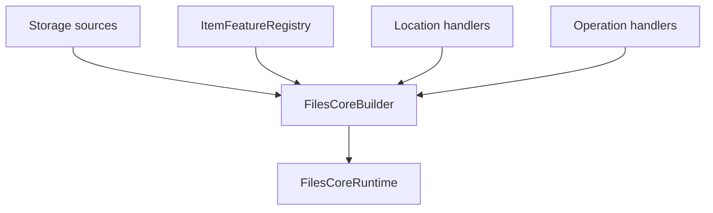
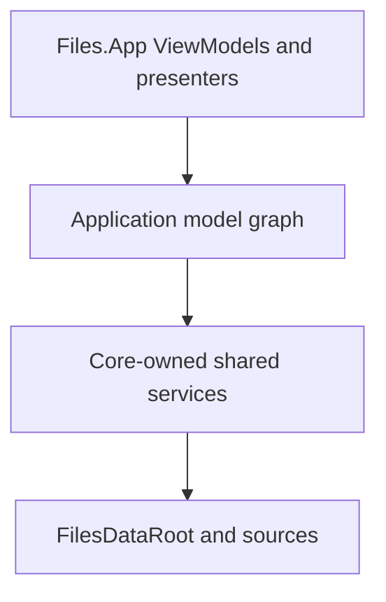

# Composition root

`FilesCoreBuilder` is the supported composition boundary for the new model
graph. It gathers source-scoped services before any item model exists and
produces one owned `FilesCoreRuntime`.



## Default Core services

The builder always installs:

| Service | Default |
| --- | --- |
| Thumbnail composition | Priority fallback through `ThumbnailSourceCombiner` |
| Property composition | Priority merge through `PropertySourceCombiner` |
| Preview composition | Priority routing through `PreviewSourceCombiner` |
| Thumbnail wrapper | Shared `MemoryThumbnailCache` |
| View settings | `InMemoryViewSettingsStore` |
| Locations | `HomeBrowseLocationHandler` and `FolderBrowseLocationHandler` |
| AppModels | `BrowsePaneFactory` and `FilesApplicationModel` |
| Operations | `StorageOperationService` over registered handlers |

Files.App should inject its persisted `IViewSettingsStore` and any durable or
instrumented `IThumbnailCache` before `Build`.

## Windows vertical slice

`AddWindowsStorage` registers one `WindowsStorageSource`, its operation
handler, Windows thumbnail/property/folder-change factories, stream
preview loaders, the Windows Shell preview loader, and default archive
browsing.

```csharp
var builder = new FilesCoreBuilder(
	viewSettingsStore,
	thumbnailCache);

builder.AddWindowsStorage(
	streamPreviewPolicy: previewAccessPolicy,
	shellPreviewPolicy: shellPreviewPolicy,
	archiveCredentialResolver: archiveCredentials);

await using var runtime = builder.Build();
```

Known stream formats have priority 200. Windows Shell preview descriptors
have priority 100. A stream loader that returns `null` falls through to the
Shell loader; a blocked stream result is terminal.

`AddWindowsStorage(enablePreviews: false)` omits both preview paths. The
permissive policy defaults are useful for tests and early integration.
Production Files.App should inject policies that account for cloud hydration,
trust, managed policy, and user settings.

`AddWindowsStorage(enableArchives: false)` omits archive item features and its
location handler. `AddArchiveBrowsing` can also be registered independently
with custom backends, probe, and credential resolver. The default selector
uses Windows Shell at priority 200 and SevenZipSharp at priority 100.

## FTP vertical slice

Each `AddFtpStorage` call registers one configured `FtpStorageSource`, its
operation handler, and its source-scoped property factory. Generic
stream previews and archive browsing are registered once and work through
the FTP `IFile` stream.

```csharp
builder.AddFtpStorage(
	new FtpConnectionProfile(
		connectionId: "primary",
		displayName: "Publishing server",
		host: "ftp.example.com",
		securityMode: FtpSecurityMode.ExplicitTls,
		rootPath: "/public"),
	ftpCredentialResolver,
	streamPreviewPolicy: previewAccessPolicy,
	archiveCredentialResolver: archiveCredentials);
```

The profile contains no password. Files.App supplies an
`IFtpCredentialResolver` backed by protected application infrastructure.
Call `AddFtpStorage` once per saved profile before `Build`; see
[FTP storage](ftp-storage.md) for identity, stream ownership, and current
runtime-registration limits.

## Extending Core

A backend supplies three independent kinds of registration:

```csharp
builder
	.AddStorageSource(source)
	.AddStorageOperationHandler(operationHandler)
	.AddBrowseLocationHandler(
		dataRoot => new SearchBrowseLocationHandler(dataRoot, searchService));

builder.ItemFeatures.Add<IPropertySource>(
	new PropertySourceFactory(propertyReader),
	priority: 50,
	origin: "Git");
```

- Storage sources resolve CoreModels and own their connections.
- Item feature factories create optional item-bound behavior.
- Location handlers open an owned context for a typed `BrowseLocation`.
- Operation handlers execute mutations for references they own.

Registering an item feature does not register a process-wide service locator
entry. `model.Get<T>()` can resolve only item feature contracts from that
model's registry and context.

## Runtime surface

`FilesCoreRuntime` exposes explicit roots:

| Property | Consumer |
| --- | --- |
| `Application` | Window-level Files.App host |
| `PaneFactory` | Tests or specialized window restoration |
| `LocationResolver` | Diagnostics and custom AppModels |
| `DataRoot` | Source discovery and explicit reference resolution |
| `StorageOperations` | Command adapters |
| `ViewSettingsStore` | Settings diagnostics or migration |
| `ThumbnailCache` | Invalidation and telemetry |
| `WindowsShellPreviewSessions` | WinUI Shell preview presenter |

These are construction-time dependencies. A leaf ViewModel should receive
the one AppModel or adapter it needs; it should not receive the runtime and
use it as a service locator.

## Build and disposal guarantees

A builder can build only once. Duplicate `StorageSourceId` values and a
second Shell preview session factory are rejected. If any custom handler
factory fails during construction, already-created sources, application
models, and owned services are all cleaned up; cleanup failures are
aggregated with the construction failure.

`FilesCoreBuilder` is itself asynchronously disposable. Disposing an unbuilt
builder cleans every source and owned service it has accepted. A successful
`Build` transfers those resources to `FilesCoreRuntime`; disposing the builder
after that transfer is therefore a no-op, and the runtime becomes the sole
owner.

The runtime disposes in this order:



The first node is owned by Files.App and must be disposed before the runtime.
Inside the runtime, application models are disposed first, dedicated services
such as the preview STA next, and storage sources last. Each stage continues
after an error and final disposal is idempotent.

## Anti-patterns

Do not:

- call `Build` once per window;
- create a scheduler, cache, or source once per item;
- resolve dependencies from a global IoC container inside a model;
- register WinUI renderers as item features;
- let Files.App dispose a source borrowed from `FilesDataRoot`;
- keep a `WindowsStorable` model alive as a substitute for a
  `StorableReference`.
