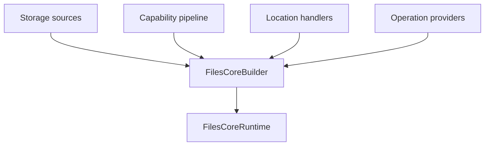
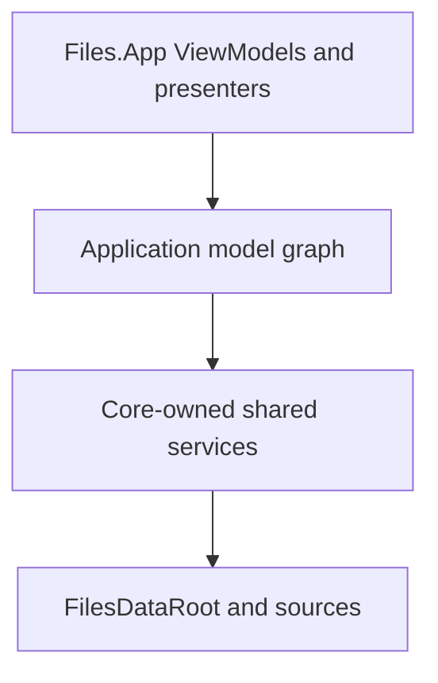

# Composition root

`FilesCoreBuilder` is the supported composition boundary for the new model
graph. It gathers source-scoped services before any item model exists and
produces one owned `FilesCoreRuntime`.



## Default Core services

The builder always installs:

| Service | Default |
| --- | --- |
| Thumbnail composition | Priority fallback through `ThumbnailSourceComposer` |
| Property composition | Priority merge through `PropertySourceComposer` |
| Preview composition | Priority routing through `PreviewSourceComposer` |
| Thumbnail decorator | Shared `MemoryThumbnailCache` |
| View settings | `InMemoryViewSettingsStore` |
| Locations | `HomeBrowseLocationHandler` and `FolderBrowseLocationHandler` |
| AppModels | `BrowsePaneFactory` and `FilesApplicationModel` |
| Operations | `StorageOperationService` over registered providers |

Files.App should inject its persisted `IViewSettingsStore` and any durable or
instrumented `IThumbnailCache` before `Build`.

## Windows vertical slice

`AddWindowsStorage` registers one `WindowsStorageSource`, its operation
provider, Windows thumbnail/property/folder-change contributors, stream
preview providers, and the Windows Shell preview provider.

```csharp
var builder = new FilesCoreBuilder(
	viewSettingsStore,
	thumbnailCache);

builder.AddWindowsStorage(
	streamPreviewPolicy: previewAccessPolicy,
	shellPreviewPolicy: shellPreviewPolicy);

await using var runtime = builder.Build();
```

Known stream formats have priority 200. Windows Shell preview descriptors
have priority 100. A stream provider that returns `null` falls through to the
Shell provider; a blocked stream result is terminal.

`AddWindowsStorage(enablePreviews: false)` omits both preview paths. The
permissive policy defaults are useful for tests and early integration.
Production Files.App should inject policies that account for cloud hydration,
trust, managed policy, and user settings.

## Extending Core

A backend supplies three independent kinds of registration:

```csharp
builder
	.AddStorageSource(source)
	.AddStorageOperationProvider(operationProvider)
	.AddBrowseLocationHandler(
		dataRoot => new SearchBrowseLocationHandler(dataRoot, searchService));

builder.Capabilities.AddContributor<IPropertySource>(
	new PropertyProviderCapabilityContributor(provider),
	priority: 50,
	origin: "Git");
```

- Storage sources resolve CoreModels and own provider connections.
- Capability contributors create optional item-bound behavior.
- Location handlers open an owned context for a typed `BrowseLocation`.
- Operation providers execute mutations for references they own.

Registering a capability does not register a process-wide service locator
entry. `model.Get<T>()` can resolve only item capability contracts from that
model's pipeline and context.

## Runtime surface

`FilesCoreRuntime` exposes explicit roots:

| Property | Consumer |
| --- | --- |
| `Application` | Window-level Files.App host |
| `PaneFactory` | Tests or specialized window restoration |
| `LocationResolver` | Diagnostics and custom AppModels |
| `DataRoot` | Source discovery and explicit reference resolution |
| `StorageOperations` | Command adapters |
| `ViewSettingsStore` | Settings diagnostics or migration |
| `ThumbnailCache` | Invalidation and telemetry |
| `WindowsShellPreviewSessions` | WinUI Shell preview presenter |

These are construction-time dependencies. A leaf ViewModel should receive
the one AppModel or adapter it needs; it should not receive the runtime and
use it as a service locator.

## Build and disposal guarantees

A builder can build only once. Duplicate `StorageSourceId` values and a
second Shell preview session factory are rejected. If any custom handler
factory fails during construction, already-created sources, application
models, and owned services are all cleaned up; cleanup failures are
aggregated with the construction failure.

The runtime disposes in this order:



The first node is owned by Files.App and must be disposed before the runtime.
Inside the runtime, application models are disposed first, dedicated services
such as the preview STA next, and storage sources last. Each stage continues
after an error and final disposal is idempotent.

## Anti-patterns

Do not:

- call `Build` once per window;
- create a scheduler, cache, or provider once per item;
- resolve dependencies from a global IoC container inside a model;
- register WinUI renderers as item capabilities;
- let Files.App dispose a source borrowed from `FilesDataRoot`;
- keep a `WindowsStorable` model alive as a substitute for a
  `StorableReference`.
