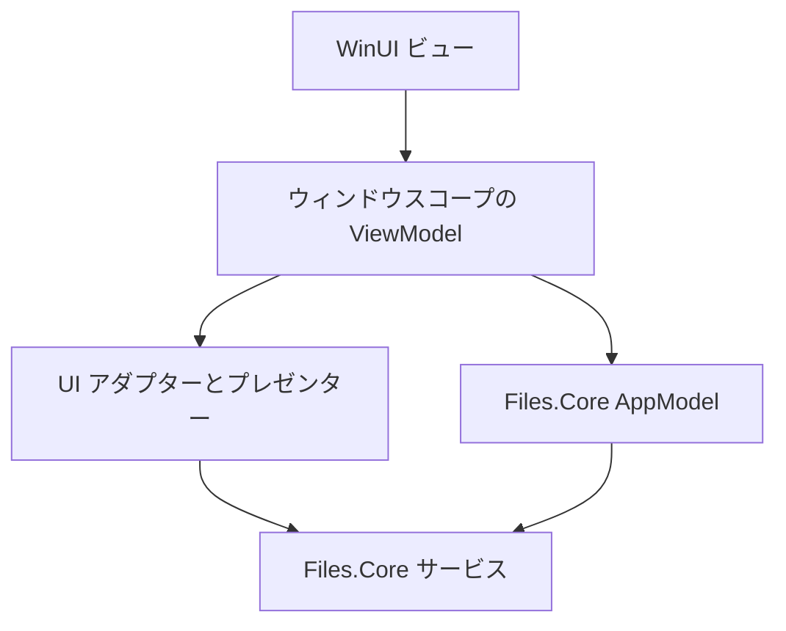
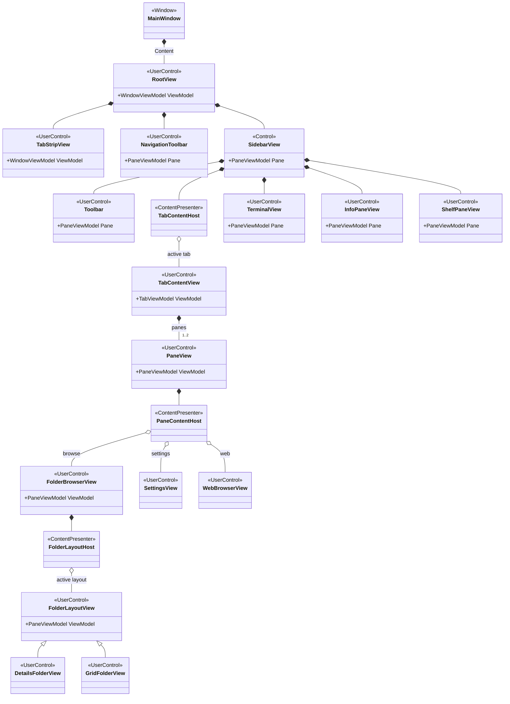
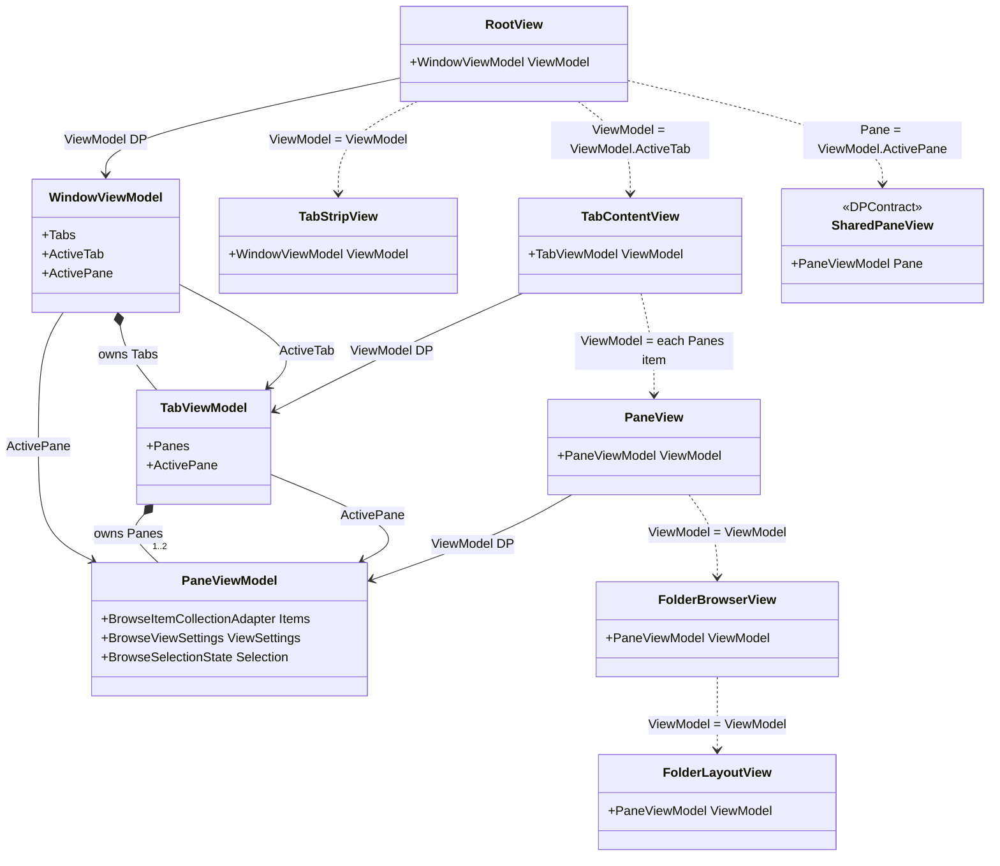
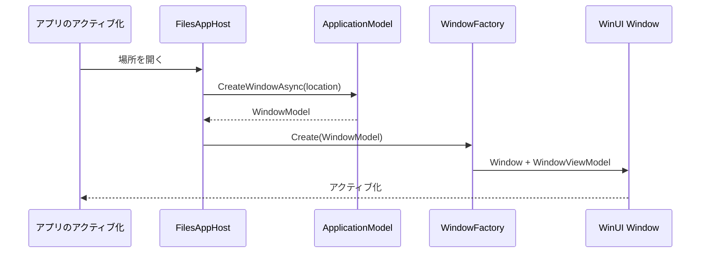
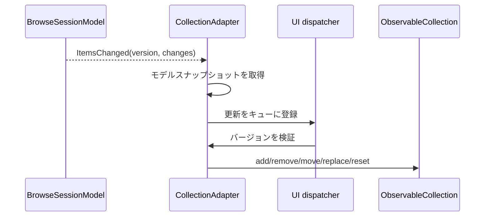
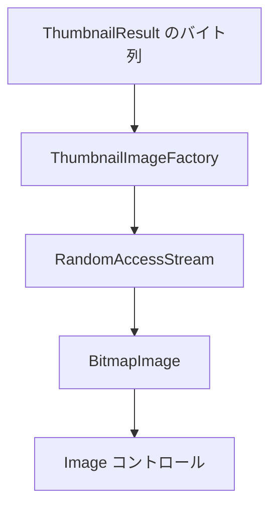
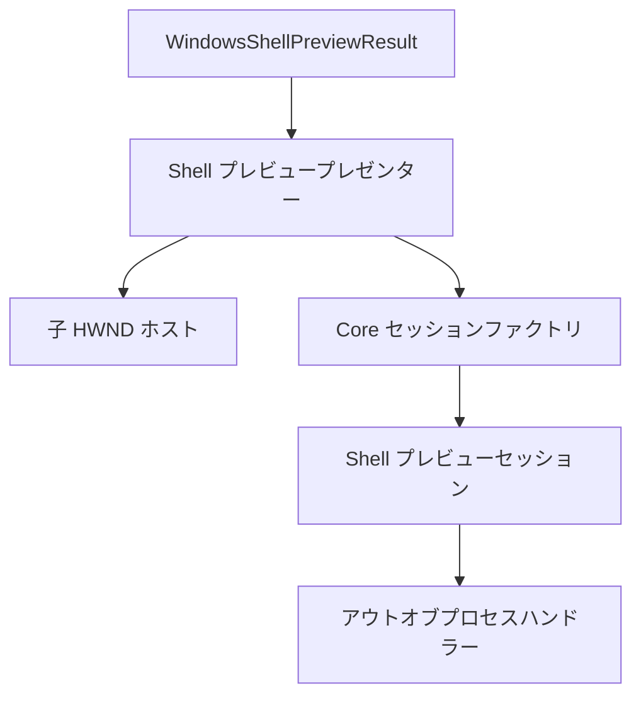
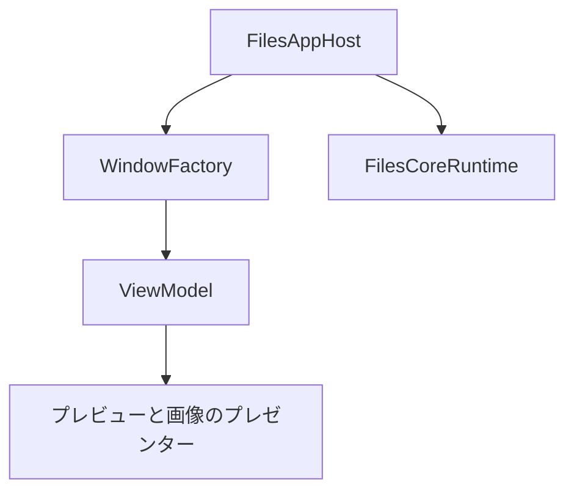

# 新 Files.App アーキテクチャ

この文書は、新しい WinUI アプリケーションの実装設計図です。Files.Core は UI に依存しないモデルグラフ、
Files.App はウィンドウ単位の薄い適応・描画レイヤーです。

## 依存方向



許可される依存関係:

| レイヤー | 依存してよいもの |
| --- | --- |
| ビュー | ViewModel と WinUI 専用のビヘイビア |
| ViewModel | AppModel、UI アダプターインターフェース、コマンドアダプター |
| WinUI アダプター | Files.Core の結果契約と WinUI/プラットフォーム API |
| AppModel | CoreModel と項目機能の契約 |
| ストレージソース | それぞれのバックエンド API と Core の契約 |

Files.Core が Files.App を参照することはありません。ViewModel がストレージソースや Windows Shell API を直接呼び出すこともありません。

## 提案するソース配置

```text
src/Files.App/
  Bootstrap/
    FilesAppHost.cs
    FilesCoreComposition.cs
    WindowFactory.cs
  ViewModels/
    Windows/WindowViewModel.cs
    Tabs/TabViewModel.cs
    Panes/PaneViewModel.cs
    Items/BrowseItemViewModel.cs
  Collections/
    BrowseItemCollectionAdapter.cs
  Commands/
    CommandRegistry.cs
    WindowCommandManager.cs
    CommandBindingViewModel.cs
    Adapters/NavigationCommandAdapter.cs
    Adapters/StorageCommandAdapter.cs
    Adapters/ClipboardCommandAdapter.cs
  Archives/
    ArchiveCredentialResolver.cs
    ArchiveCredentialDialogService.cs
  Connections/
    FtpConnectionProfileStore.cs
    FtpCredentialResolver.cs
    FtpConnectionDialogService.cs
  Previews/
    PreviewPresenter.cs
    StreamPreviewPresenter.cs
    WindowsShellPreviewPresenter.cs
  Imaging/
    ThumbnailImageFactory.cs
  Platform/
    WinUiDispatcher.cs
    PreviewHostWindow.cs
    Clipboard/OleClipboardService.cs
    DragDrop/DragDropService.cs
    Shell/ShellContextMenuService.cs
    Shell/ShellMenuMessageRouter.cs
  Settings/
    PersistedViewSettingsStore.cs
    WindowSessionStore.cs
  Views/
    Windows/MainWindow.xaml
    Windows/RootView.xaml
    Shell/NavigationToolbar.xaml
    Shell/SidebarView.xaml
    Tabs/TabStripView.xaml
    Tabs/TabContentView.xaml
    Panes/PaneView.xaml
    Browsing/FolderBrowserView.xaml
    Browsing/Layouts/DetailsFolderView.xaml
    Browsing/Layouts/GridFolderView.xaml
    Previews/PreviewView.xaml
```

フォルダー名は境界を表すもので、新しいプロジェクトではありません。既存の UI 以外のプロジェクトを物理的に Files.Core へ統合した後も、この配置を維持します。

## UI の合成と状態の流れ

`Frame` と `Page` によるナビゲーションを、保持する `UserControl` インスタンスのツリーと `ContentPresenter` ホストに置き換えます。
既存の `Sidebar` はテンプレート化されたコントロールとして残して構いませんが、合成されたユーザーコントロールと同じ依存関係プロパティ境界に従います。



`RootView` はウィンドウスコープの合成ビューです。`WindowViewModel` からタブの所属を描画し、アクティブペインに応じて共有 Shell コントロールを更新します。
`TabContentView` は `TabViewModel` に従って保持された 1 つまたは 2 つの `PaneView` インスタンスを描画します。
各参照ペインは `PaneViewModel` のライフタイム中、保持された `FolderBrowserView` を 1 つ所有します。

ツールバー、サイドバー、ターミナル、情報ペイン、シェルフペインはウィンドウごとに 1 回だけ生成します。タブまたは分割ペイン間でフォーカスが移動すると、
それらのペイン依存関係が変わります。この依存関係の変更で Core モデルを再生成したり、列挙を再開したり、別のアクティブペイン ID を維持したりしてはいけません。

### 依存関係プロパティ契約

直接の ViewModel を明示的に下へ渡します。プロセス全体の現在ウィンドウ、暗黙的なサービス検索、シリアライズされたナビゲーションパラメーターに依存してはいけません。

ViewModel は依存関係プロパティを宣言したり消費したりしません。UI に依存しないオブジェクトのままです。親 View は直接の ViewModel を読み取り、対応する子 ViewModel を各子コントロールの依存関係プロパティへ設定します。



`SharedPaneView` は `NavigationToolbar`、`Toolbar`、`SidebarView`、`TerminalView`、`InfoPaneView`、`ShelfPaneView` が共通で使う依存関係プロパティ契約を表します。
共通の CLR 基底クラスは必要ありません。代入ラベルはデータの流れを表すだけで、View が受け取った子 ViewModel を構築することはありません。

`WindowViewModel.ActivePane` は `ActiveTab?.ActivePane` を投影する、監視可能な派生プロパティです。別のペインを所有したり、競合するアクティブペイン ID を保存したりしません。
アクティブタブまたはそのタブのアクティブペインが変わったとき、共有されるすべての `Pane` 依存関係プロパティを更新することが目的です。

| View | 主な依存関係プロパティ | ライフタイム |
| --- | --- | --- |
| `RootView` | `WindowViewModel ViewModel` | WinUI ウィンドウごとに 1 つ |
| `TabStripView` | `WindowViewModel ViewModel` | ウィンドウで共有 |
| `TabContentView` | `TabViewModel ViewModel` | モデルのタブごとに 1 つ |
| `NavigationToolbar`、`Toolbar`、`SidebarView` | `PaneViewModel? Pane` | 共有。フォーカスされたペインに追従 |
| `TerminalView`、`InfoPaneView`、`ShelfPaneView` | `PaneViewModel? Pane` | 共有。フォーカスされたペインに追従 |
| `PaneView` | `PaneViewModel ViewModel` | モデルのペインごとに 1 つ |
| `FolderBrowserView` | `PaneViewModel ViewModel` | 参照ペインごとに 1 つ |
| フォルダーレイアウトビュー | `PaneViewModel ViewModel` | フォルダーブラウザビューが所有 |

コントロールはこれらの ViewModel を借用参照として扱います。プロパティ変更コールバックは、古い値からハンドラーを外してから新しい値へ接続します。
ViewModel の所有者は対応する親 ViewModel または `WindowFactory` のままです。コントロールのアンロードでモデルグラフを破棄してはいけません。

コントロール境界では依存関係プロパティと `x:Bind` を使用します。通常のテンプレート要素はコントロールの依存関係プロパティにバインドできますが、
入れ子のコントロールには依存関係を明示的に渡さなければなりません。これにより、ビジュアルツリーと AppModel・ViewModel の所有ツリーが一致します。

### ContentPresenter によるコンテンツ選択

コンテンツの選択は View の責務です。

- `TabContentPresenter` はアクティブな保持済み `TabContentView` を選択する。
- `PaneContentPresenter` はペインのコンテンツに使う `UserControl` を選択する。
- `FolderBrowserView` は `BrowseViewSettings` からレイアウトビューを選択する。
- ViewModel が公開するのは状態とコマンドであり、`UIElement`、`Type`、`DataTemplate` ではない。
- キー付きテンプレートまたはウィンドウスコープのビュー・ファクトリはコントロールを作成してよいが、Core サービスを解決したり AppModel を所有したりしてはいけない。

最初の導入スライスでは `FolderBrowserView` をサポートします。設定と Web コンテンツは、`BrowseSessionModel` を変更せず、Files.App のコンテンツ ViewModel を通じて後から追加できます。
`Frame.Navigate`、ページ型によるルーティング、プロセス内ナビゲーションのためのモデルオブジェクトのシリアライズは禁止です。

## プロセスの起動

Files プロセスごとに Core ランタイムを正確に 1 つ作成します。

```csharp
public sealed class FilesAppHost : IAsyncDisposable
{
	private readonly FilesCoreRuntime core;
	private readonly WindowFactory windowFactory;

	private FilesAppHost(
		FilesCoreRuntime core,
		WindowFactory windowFactory)
	{
		this.core = core;
		this.windowFactory = windowFactory;
	}

	public static FilesAppHost Create(AppServices services)
	{
		var core = new FilesCoreBuilder(
				services.ViewSettings,
				services.ThumbnailCache)
			.AddWindowsStorage(
				streamPreviewPolicy: services.StreamPreviewPolicy,
				shellPreviewPolicy: services.ShellPreviewPolicy,
				archiveCredentialResolver:
					services.ArchiveCredentials)
			.Build();

		return new FilesAppHost(
			core,
			new WindowFactory(core, services));
	}

	public async ValueTask DisposeAsync()
	{
		await windowFactory.DisposeAsync();
		await core.DisposeAsync();
	}
}
```

起動処理では `Microsoft.Extensions.DependencyInjection` を使ってプロセスサービスを構築しても構いません。そのコンテナーの有効範囲は合成ルートまでです。
`IServiceProvider` をモデルや ViewModel に注入してはいけません。

起動時に秘密情報を含まない FTP プロファイルをすべて読み込み、`Build` の前に `AddFtpStorage` を呼び出します。
`FtpCredentialResolver` は Windows Credential Manager からパスワードを解決し、所有ウィンドウへ認証要求をマーシャリングできます。
パスワードを `StorageAddress`、ナビゲーション履歴、テレメトリ、ViewModel に追加してはいけません。Files.Core が可変ソースレジストリを得るまで、
接続の追加・削除にはプロセス全体のランタイム再構築またはプロセス再起動が必要です。

## ウィンドウの作成

1 つの WinUI ウィンドウが 1 つの `WindowModel` を適応します。



`WindowFactory` はモデル ID と WinUI ウィンドウの対応付けを所有します。ViewModel と WinUI リソースを閉じてから `FilesApplicationModel.CloseWindowAsync` を呼び出します。

モデルがタブ/ペインの所属とアクティブ ID の権威です。WinUI コントロールはその状態を描画するだけで、競合するタブグラフを保持しません。

## ViewModel 階層

各 ViewModel は直接のモデルと明示的な UI アダプターを受け取ります。

```csharp
public sealed class PaneViewModel : IAsyncDisposable
{
	public PaneViewModel(
		PaneModel model,
		IUiDispatcher dispatcher,
		ThumbnailImageFactory thumbnails,
		PreviewPresenter previews,
		StorageCommandAdapter operations)
	{
		// Subscribe, capture an initial snapshot, and create commands.
	}
}
```

推奨する対応付け:

| ViewModel | モデル | 追加の責務 |
| --- | --- | --- |
| `WindowViewModel` | `WindowModel` | ウィンドウのタイトル/アクティブ化、タブ VM のライフタイム |
| `TabViewModel` | `TabModel` | 分割レイアウト VM のライフタイム |
| `PaneViewModel` | `PaneModel` | ナビゲーションコマンド、コレクションアダプター |
| `BrowseItemViewModel` | `StorableReference` と現在の表示 | ローカライズされたラベル、画像オブジェクト、選択ファサード |

`BrowseItemViewModel` は置換変更後に古い `IStorableModel` を保持してはいけません。新しいスナップショットから更新するか、コレクションアダプターが置き換えます。

## 参照コレクションアダプター

`BrowseSessionModel.Items` は不変のスナップショットです。`BrowseItemsChangedEventArgs` はバージョンと細粒度の変更を提供します。
`BrowseItemCollectionAdapter` が WinUI 向けの `ObservableCollection<BrowseItemViewModel>` を所有します。



ルール:

- Core のイベントスレッドから observable collection を変更しない。
- 直前のバージョンがアダプターのバージョンと一致する場合だけ変更を適用する。
- 欠落、古いイベント、サポートされない変更列があれば、`session.Items` からリセットする。
- 項目 VM のキーにはパスやリストインデックスではなく `StorableKey` を使う。
- UI の選択変更が `SetSelection` へ無限に反響しないよう、選択同期をガードする。

## サムネイル

Core はエンコード済みの不変バイト列を返します。

```csharp
ThumbnailResult result = presentation.Thumbnail;
ReadOnlyMemory<byte> encoded = result.Content;
```

`ThumbnailImageFactory` は UI 側でバイト列を変換します。WinUI 実装ではメモリを `InMemoryRandomAccessStream` へコピーし、位置 0 にシークして `BitmapImage.SetSourceAsync` を呼び出せます。
dispatcher に依存するため `ImageSource` のキャッシュが必要な場合でも、キャッシュするのは UI レイヤーだけにします。共有 Core キャッシュはエンコード済みバイト列を保持し続けます。



項目 VM が置き換えられたとき、または非実体化されたときはデコードをキャンセルします。画像を設定する前に `StorableKey` と表示バージョンを検証します。

## プレビュープレゼンター

`PreviewPresenter` は `BrowsePreviewSnapshot.Result` に基づいて切り替えます。

| 結果 | Files.App プレゼンター |
| --- | --- |
| `StreamPreviewResult` 画像 | 画像デコーダー/ビュー |
| `StreamPreviewResult` 音声/動画 | メディアプレーヤーアダプター |
| `StreamPreviewResult` テキスト | 範囲を限定したテキストリーダー/エディターアダプター |
| `StreamPreviewResult` PDF/HTML | 明示的に安全なレンダラーまたは Web アダプター |
| `WindowsShellPreviewResult` | `WindowsShellPreviewPresenter` |
| `BlockedPreviewResult` | ポリシーの説明と任意の hydration 操作 |

プレゼンターが UI オブジェクトを所有し、`BrowsePreviewModel` が `PreviewResult` を所有します。スナップショットが変わったらプレゼンターは結果の使用を停止し、
モデル所有の結果を破棄してはいけません。

### Windows Shell プレビューホスト

Shell プレゼンターだけが `IPreviewHandler` に対する WinUI 境界です。



実装順序:

1. ペインのプレビューサーフェスが所有する専用の子 HWND を作成する。
2. 配置された論理ピクセルを物理ピクセルの `WindowsPreviewBounds` へ変換する。
3. `CreateAsync(result, host)` を呼び出す。
4. サイズ、テーマ、フォーカス、アクセラレーターの更新を転送する。
5. 子 HWND を破棄する前にセッションを破棄する。
6. `FilesCoreRuntime` の前にすべてのセッションを破棄する。

XAML コントロールのポインターを HWND として渡してはいけません。UI スレッドでハンドラーをアクティブ化してはいけません。
Core ファクトリが専用プレビュー STA を所有し、既定ではローカルサーバーとしてアクティブ化します。

## ナビゲーションコマンド

ウィンドウスコープのレジストリ、バインディング、コンテキスト、キャンセル、実行の規則は、[Files.App のコマンド実行](commands.md) で定義します。
コマンドサーフェスは安定したコマンド ID を呼び出し、ペインを直接呼び出しません。ナビゲーションアダプターがペインを呼び出します。

| コマンド | モデル呼び出し |
| --- | --- |
| 項目を開く | `NavigateAsync(location)` または `FileLauncher.OpenAsync(target)` |
| 更新 | `RefreshAsync()` |
| 戻る | `GoBackAsync()` |
| 進む | `GoForwardAsync()` |
| 上へ | `GoUpAsync()` |
| レイアウト/並べ替え/列の変更 | `BrowseSession.UpdateViewSettingsAsync()` |

実行可否の状態は `CanGoBack`、`CanGoForward`、`CanGoUp`、`IsLoading`、モデルの所属から取得します。コマンドはコマンドごとの `CancellationTokenSource` を保持し、dispatcher をブロックしてはいけません。

### アーカイブを開く

開くコマンドは通常のフォルダー形状より先にアーカイブ項目機能を確認します。Windows Shell が `.zip` や `.7z` を `IFolderModel` として公開しても、
暗号化アーカイブは SevenZip フォールバックへ送らなければならないためです。
参照可能な場所を返す分岐は次の形です。`null` の通常ファイルは `ILaunchTargetSource` と `FileLauncher` へ送ります。

```csharp
private static BrowseLocation? GetBrowseLocation(
	IStorableModel item)
{
	if (item is IFolderModel
		&& item.Get<IArchiveEntry>() is { } entry)
	{
		return new ArchiveLocation(entry);
	}

	if (item.Get<IArchiveSource>() is { } archive)
	{
		return new ArchiveLocation(archive.Archive);
	}

	if (item is IFolderModel folder)
	{
		return new FolderLocation(folder.Reference);
	}

	return null;
}
```

`ArchiveCredentialResolver` はウィンドウを認識するアプリケーション基盤です。所有ウィンドウの dispatcher へマーシャリングし、ローカライズされた WinUI コンテンツを表示し、
キャンセル時には `ArchiveCredential` または `null` を返します。パスワードをナビゲーション履歴や項目 ViewModel に保存しません。

Core のアーカイブコンテキストでは、別の `ArchiveLocation` でアーカイブ内の上へ移動を解決します。アーカイブルートから上へ移動すると外側のアーカイブのストレージ親を解決し、
`FolderLocation` を返します。戻る・進むでは外側の参照と正規化されたエントリパスを保持します。

バックエンドの選択と所有権については、[アーカイブ参照](archives.md) を参照してください。
通常ファイルのオープン、ダブルクリックの入力取得、Quick Look、クラウド検出、列の合成については、
[Files.App の項目機能とアクティブ化](files-app-features.md) を参照してください。

## ストレージコマンド

`StorageCommandAdapter` はペインから参照を取得し、UI 入力を要求し、要求を構築してから `runtime.StorageOperations` を呼び出します。

```csharp
var request = new RenameOperationRequest(item.Reference, newName);
if (!operations.CanHandle(request))
{
	return RenameOutcome.Unsupported;
}

var result = await operations.ExecuteAsync(
	request,
	progress,
	cancellationToken);
```

アダプターはアプリケーションポリシーに従って `result.Error` を表示します。項目コレクションを直接編集しません。フォルダーウォッチャーがセッションを更新し、
結果で返された参照は表示/フォーカスの意図に使えます。

ドラッグ/ドロップパッケージ、クリップボード形式、昇格、競合プロンプト、元に戻す UI はこのアダプターレイヤーに置きます。ストレージ要求は UI に依存しません。
具体的なコマンドのライフサイクルは [Files.App のコマンド実行](commands.md) で定義します。ネイティブクリップボード、ドラッグ/ドロップ、ソース間転送、
Shell メニューの所有権は [クリップボード、ドラッグ/ドロップ、Shell 連携](platform-interactions.md) で定義します。

## ビュー設定

既存の設定データベース上に、Files.App の `PersistedViewSettingsStore` を実装します。明示的な場所 DTO でシリアライズします。

- 場所の種別。
- フォルダーのソース ID と項目 ID。
- アーカイブの外側のソース/項目識別情報と正規化されたエントリパス。
- キーには使わない現在の復旧アドレスのメタデータ。
- 検索クエリ/スコープ。
- タグ ID。
- スキーマバージョン。

列幅は論理ピクセルです。古いデータを読むときは、レイアウト enum 値、プロパティ ID、順序、表示状態、最小/最大幅を検証します。
`InMemoryViewSettingsStore` はテストとフォールバックの実装として残します。

## UI dispatch とエラーポリシー

ウィンドウスコープの小さな抽象化を 1 つ定義します。

```csharp
public interface IUiDispatcher
{
	bool HasThreadAccess { get; }

	ValueTask EnqueueAsync(
		Action action,
		CancellationToken cancellationToken = default);
}
```

各ウィンドウには専用 dispatcher を与えます。ViewModel はプロセスに UI スレッドが 1 つだけあると仮定してはいけません。

Core の例外はバックエンドの意味を保持します。Files.App はそれをローカライズされた、行動可能な UI に対応付けます。

- キャンセル: エラーダイアログなし。
- 未サポート: コマンドを無効にするか説明する。
- アクセス拒否: 権限の案内。
- 識別情報が見つからない: 更新/表示の失敗。
- プレビューのブロック: ポリシー固有の UI。
- 想定外の失敗: 例外全体をログに記録し、安定したエラーコードを表示する。

## 所有権と終了



終了順序:

1. アクティブ化と新しいウィンドウ作成を停止する。
2. ViewModel とコレクションアダプターを破棄する。
3. Shell プレビューセッションと子 HWND を破棄する。
4. モデルのウィンドウを閉じるか、アプリケーショングラフを破棄する。
5. `FilesCoreRuntime` を破棄する。
6. アプリケーション専用のテレメトリ/設定サービスを破棄する。

すべてのイベント購読には所有者と決定論的な購読解除を持たせます。正しいライフタイムの代わりに弱いイベントを使わないでください。

## 導入スライス

最初のスライスは、完全なブラウザーではなくウォーキングスケルトンです。

1. 一時的な Files.App 機能境界の背後に Files.Core を参照する。
2. `FilesAppHost` と本番ポリシーを構築する。
3. `HomeLocation` から 1 つの `MainWindow` と `RootView` を作成する。
4. 1 つのウィンドウ、1 つのタブ、1 つのペインを適応する。
5. `PaneContentPresenter` を通して 1 つの `FolderBrowserView` を保持する。
6. コレクションアダプターで `BrowseSessionModel.Items` を表示する。
7. 選択と戻る/進む/上へ/更新を実装する。

このスライスは、`Frame` なしで Home と 1 つのファイルシステムフォルダーが描画され、アクティブペインが依存関係プロパティだけで共有コントロールへ届き、
Files.App の x64 ビルドが成功した時点で完了です。

以降も、独立してビルドできるスライスで続けます。

1. ビューポート報告、詳細/グリッド設定、サムネイルデコード。
2. ストリームプレビュー、続いて子 HWND の Shell プレビュープレゼンター。
3. 名前変更/作成/コピー/移動/削除のコマンドアダプター。
4. 分割ペインと複数タブ。
5. 永続化されたビュー状態とウィンドウセッション状態。

古い ViewModel を最初に新しいフォルダーへ移してはいけません。各スライスを Files.Core の契約に対して構築し、既存のユーザーフローを 1 つずつ移行します。

## 関連する実装設計図

- [Files.App のコマンド実行](commands.md)
- [Files.App の項目機能とアクティブ化](files-app-features.md)
- [クリップボード、ドラッグ/ドロップ、Shell 連携](platform-interactions.md)
- [ストレージ操作](operations.md)
- [新 Files.Core の合成](composition.md)
