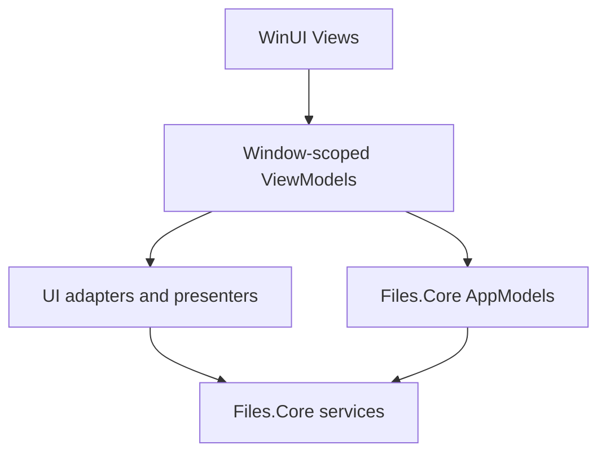
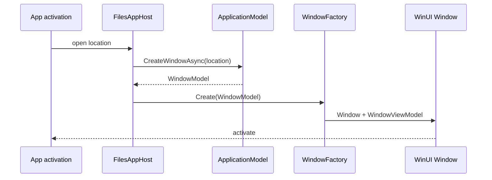
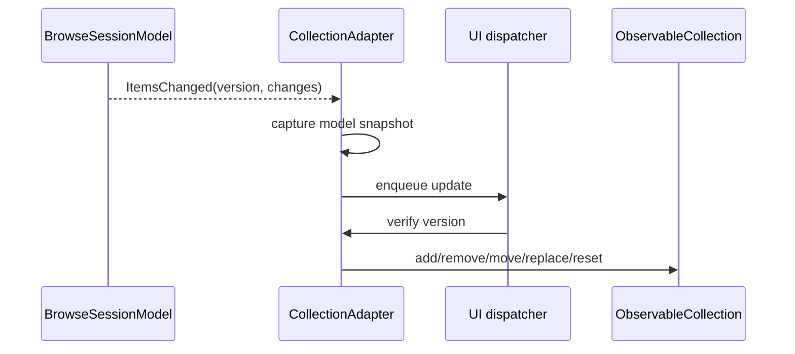
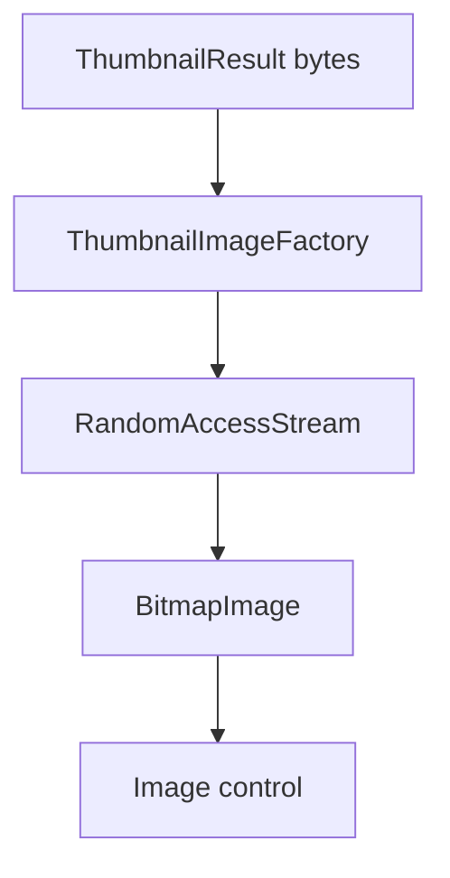
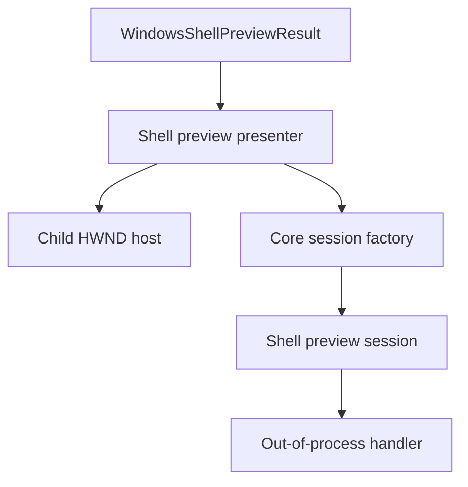
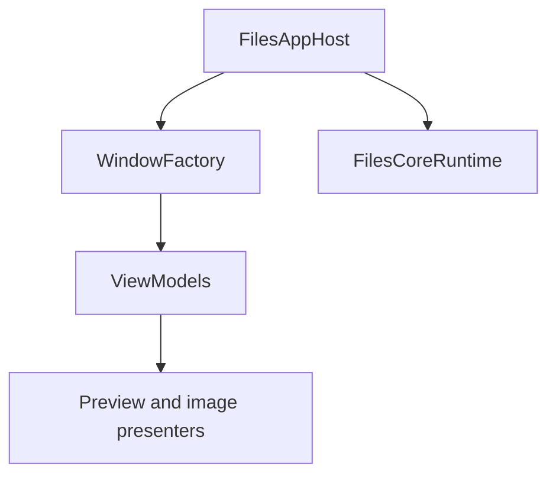

# New Files.App architecture

This document is the implementation blueprint for the new WinUI application.
Files.Core is the UI-independent model graph; Files.App is a thin,
window-scoped adaptation and rendering layer.

## Dependency direction



Allowed dependencies:

| Layer | May depend on |
| --- | --- |
| Views | ViewModels and WinUI-only behaviors |
| ViewModels | AppModels, UI adapter interfaces, command adapters |
| WinUI adapters | Files.Core result contracts and WinUI/platform APIs |
| AppModels | CoreModels and capability contracts |
| Providers | Their backend APIs and Core contracts |

Files.Core never references Files.App. ViewModels never call provider or
Windows Shell APIs directly.

## Proposed source layout

```text
src/Files.App/
  Bootstrap/
    FilesAppHost.cs
    FilesCoreComposition.cs
    WindowFactory.cs
  ViewModels/
    Windows/WindowViewModel.cs
    Tabs/TabViewModel.cs
    Panes/PaneViewModel.cs
    Items/BrowseItemViewModel.cs
  Collections/
    BrowseItemCollectionAdapter.cs
  Commands/
    StorageCommandAdapter.cs
    NavigationCommandAdapter.cs
  Previews/
    PreviewPresenter.cs
    StreamPreviewPresenter.cs
    WindowsShellPreviewPresenter.cs
  Imaging/
    ThumbnailImageFactory.cs
  Platform/
    WinUiDispatcher.cs
    PreviewHostWindow.cs
  Settings/
    PersistedViewSettingsStore.cs
    WindowSessionStore.cs
  Views/
    Windows/MainWindow.xaml
    Tabs/TabView.xaml
    Panes/PaneView.xaml
    Previews/PreviewView.xaml
```

Folder names are boundaries, not new projects. Keep them even after the
existing non-UI projects are physically merged into Files.Core.

## Process bootstrap

Create exactly one Core runtime per Files process:

```csharp
public sealed class FilesAppHost : IAsyncDisposable
{
	private readonly FilesCoreRuntime core;
	private readonly WindowFactory windowFactory;

	private FilesAppHost(
		FilesCoreRuntime core,
		WindowFactory windowFactory)
	{
		this.core = core;
		this.windowFactory = windowFactory;
	}

	public static FilesAppHost Create(AppServices services)
	{
		var core = new FilesCoreBuilder(
				services.ViewSettings,
				services.ThumbnailCache)
			.AddWindowsStorage(
				streamPreviewPolicy: services.StreamPreviewPolicy,
				shellPreviewPolicy: services.ShellPreviewPolicy)
			.Build();

		return new FilesAppHost(
			core,
			new WindowFactory(core, services));
	}

	public async ValueTask DisposeAsync()
	{
		await windowFactory.DisposeAsync();
		await core.DisposeAsync();
	}
}
```

The bootstrap may use `Microsoft.Extensions.DependencyInjection` to construct
process services. That container ends at the composition root. Do not inject
`IServiceProvider` into models or ViewModels.

## Window creation

One WinUI window adapts one `WindowModel`:



`WindowFactory` owns the mapping between model IDs and WinUI windows. It
closes the ViewModel and WinUI resources before calling
`FilesApplicationModel.CloseWindowAsync`.

The model is authoritative for tab/pane membership and active IDs. WinUI
controls render that state; they do not maintain a competing tab graph.

## ViewModel hierarchy

Each ViewModel receives its direct model and explicit UI adapters:

```csharp
public sealed class PaneViewModel : IAsyncDisposable
{
	public PaneViewModel(
		PaneModel model,
		IUiDispatcher dispatcher,
		ThumbnailImageFactory thumbnails,
		PreviewPresenter previews,
		StorageCommandAdapter operations)
	{
		// Subscribe, capture an initial snapshot, and create commands.
	}
}
```

Recommended mapping:

| ViewModel | Model | Additional responsibility |
| --- | --- | --- |
| `WindowViewModel` | `WindowModel` | Window title/activation, tab VM lifetime |
| `TabViewModel` | `TabModel` | Split layout VM lifetime |
| `PaneViewModel` | `PaneModel` | Navigation commands, collection adapter |
| `BrowseItemViewModel` | `StorableReference` plus current presentation | Localized labels, image object, selection facade |

`BrowseItemViewModel` must not retain an old `IStorableModel` after a replace
change. It should update from the new snapshot or be replaced by the
collection adapter.

## Browse collection adapter

`BrowseSessionModel.Items` is an immutable snapshot.
`BrowseItemsChangedEventArgs` supplies a version and granular changes.
`BrowseItemCollectionAdapter` owns the WinUI-facing
`ObservableCollection<BrowseItemViewModel>`.



Rules:

- Never mutate an observable collection from a Core event thread.
- Apply changes only when their previous version matches the adapter version.
- On a gap, stale event, or unsupported change sequence, reset from
  `session.Items`.
- Key item VMs by `StorableKey`, not by path or list index.
- Keep selection synchronization guarded so UI selection changes do not echo
  indefinitely back into `SetSelection`.

## Thumbnails

Core returns encoded immutable bytes:

```csharp
ThumbnailResult result = presentation.Thumbnail;
ReadOnlyMemory<byte> encoded = result.Content;
```

`ThumbnailImageFactory` converts those bytes on the UI side. A WinUI
implementation can copy the memory into an `InMemoryRandomAccessStream`,
seek to zero, and call `BitmapImage.SetSourceAsync`. Cache the resulting
`ImageSource` only at the UI layer when it is dispatcher-affine; the shared
Core cache continues to store encoded bytes.



Cancel decoding when an item VM is replaced or unrealized. Verify its
`StorableKey` and presentation version before assigning the image.

## Preview presenters

`PreviewPresenter` switches on `BrowsePreviewSnapshot.Result`:

| Result | Files.App presenter |
| --- | --- |
| `StreamPreviewResult` image | Image decoder/view |
| `StreamPreviewResult` audio/video | Media player adapter |
| `StreamPreviewResult` text | Bounded text reader/editor adapter |
| `StreamPreviewResult` PDF/HTML | Explicit safe renderer or web adapter |
| `WindowsShellPreviewResult` | `WindowsShellPreviewPresenter` |
| `BlockedPreviewResult` | Policy explanation and optional hydrate action |

The presenter owns the UI object; `BrowsePreviewModel` owns the
`PreviewResult`. A presenter must stop using the result when the snapshot
changes and must not dispose the model-owned result itself.

### Windows Shell preview host

The Shell presenter is the only WinUI boundary for `IPreviewHandler`:



Implementation order:

1. create a dedicated child HWND owned by the pane's preview surface;
2. convert arranged logical pixels to physical-pixel
   `WindowsPreviewBounds`;
3. call `CreateAsync(result, host)`;
4. forward size, theme, focus, and accelerator updates;
5. dispose the session before destroying the child HWND;
6. dispose every session before `FilesCoreRuntime`.

Do not pass a XAML control pointer as an HWND. Do not activate a handler on
the UI thread. The Core factory owns the dedicated preview STA and defaults
to local-server activation.

## Navigation commands

Command adapters call the pane directly:

| Command | Model call |
| --- | --- |
| Open | `NavigateAsync(location)` |
| Refresh | `RefreshAsync()` |
| Back | `GoBackAsync()` |
| Forward | `GoForwardAsync()` |
| Up | `GoUpAsync()` |
| Change layout/sort/columns | `BrowseSession.UpdateViewSettingsAsync()` |

Can-execute state comes from `CanGoBack`, `CanGoForward`, `CanGoUp`,
`IsLoading`, and model membership. Commands should hold a per-command
`CancellationTokenSource` and never block the dispatcher.

## Storage commands

`StorageCommandAdapter` captures references from the pane, prompts for any UI
input, constructs a request, then calls `runtime.StorageOperations`.

```csharp
var request = new RenameOperationRequest(item.Reference, newName);
if (!operations.CanHandle(request))
{
	return RenameOutcome.Unsupported;
}

var result = await operations.ExecuteAsync(
	request,
	progress,
	cancellationToken);
```

The adapter displays `result.Error` according to application policy.
It does not directly edit the item collection. The folder watcher updates the
session; the returned result reference is useful for reveal/focus intent.

Drag/drop packages, clipboard formats, elevation, conflict prompts, and undo
UI live in this adapter layer. The storage request remains UI-independent.

## View settings

Implement `PersistedViewSettingsStore` in Files.App over the existing settings
database. Serialize by an explicit location DTO:

- location kind;
- source ID and item ID for folders;
- current recovery address as non-key metadata;
- search query/scope;
- tag ID;
- schema version.

Column widths are logical pixels. Validate layout enum values, property IDs,
orders, visibility, and minimum/maximum widths when reading old data.
`InMemoryViewSettingsStore` remains the test and fallback implementation.

## UI dispatch and error policy

Define one small window-scoped abstraction:

```csharp
public interface IUiDispatcher
{
	bool HasThreadAccess { get; }

	ValueTask EnqueueAsync(
		Action action,
		CancellationToken cancellationToken = default);
}
```

Each window gets its own dispatcher. A ViewModel cannot assume the process has
one UI thread.

Core exceptions retain backend meaning. Files.App maps them to localized,
actionable UI:

- cancellation: no error dialog;
- not supported: disable or explain the command;
- access denied: permission guidance;
- missing identity: refresh/reveal failure;
- preview blocked: policy-specific UI;
- unexpected failure: log full exception and show a stable error code.

## Ownership and shutdown



Shutdown order:

1. stop activation and new window creation;
2. dispose ViewModels and collection adapters;
3. dispose Shell preview sessions and child HWNDs;
4. close model windows or dispose the application graph;
5. dispose `FilesCoreRuntime`;
6. dispose application-only telemetry/settings services.

Every event subscription must have an owner and deterministic unsubscription.
Avoid weak events as a substitute for correct lifetime.

## First implementation slice

Start the new Files.App with this narrow vertical slice:

1. build `FilesAppHost` and production policies;
2. create one window from `HomeLocation`;
3. adapt one tab and one pane;
4. display `BrowseSessionModel.Items` through the collection adapter;
5. implement selection, viewport reporting, details/grid settings;
6. decode `ThumbnailResult` bytes;
7. implement back/forward/up/refresh;
8. add stream preview rendering;
9. add the child-HWND Shell preview presenter;
10. add rename/create/copy/move/delete command adapters;
11. add split pane and multiple tabs;
12. persist view and window-session state.

Do not begin by moving old ViewModels into the new folders. Build this slice
against Files.Core contracts, then migrate one existing user flow at a time.
