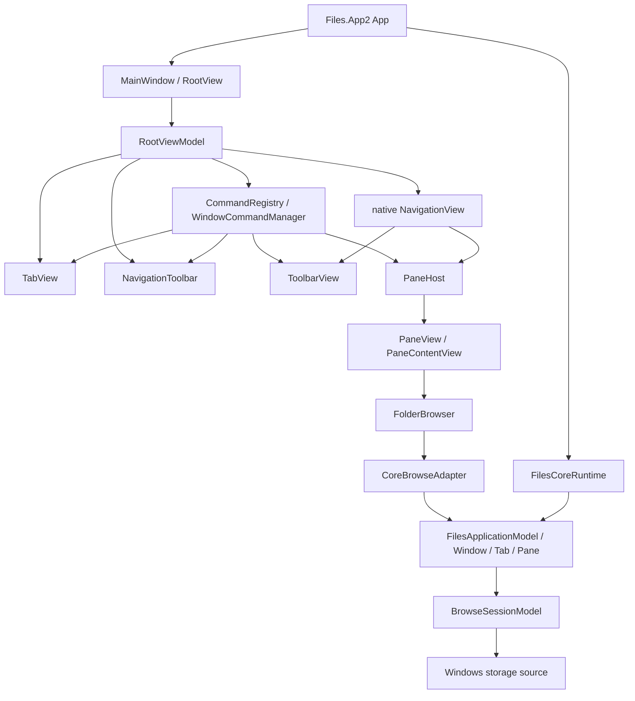
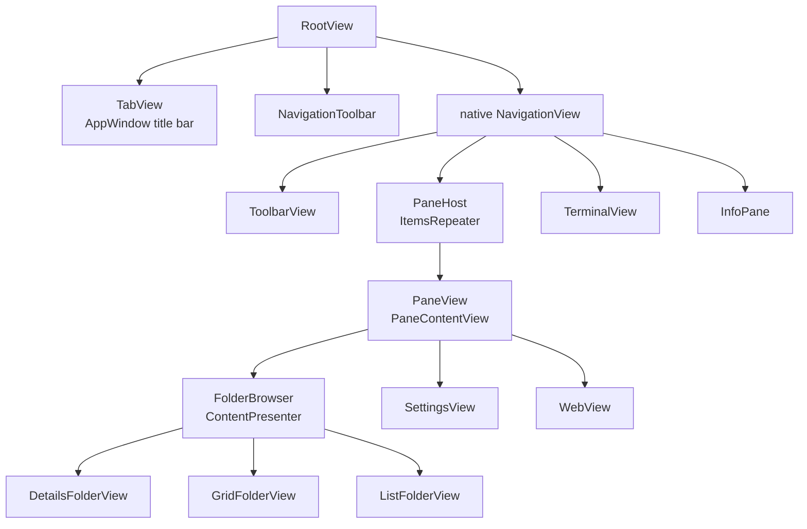

# Files.App2 アーキテクチャ

`Files.App2` は、旧 `Files.App` のサービスロケーター、設定サービス、legacy storage shapeを持ち込まずに
`Files.Core`をWinUIへ接続するための移行ホストです。旧アプリは機能互換性を保つために残しますが、App2の
新しい機能は旧経路へ依存しません。

## 依存方向と所有権

`App`はprocess scopeの`FilesCoreRuntime`を所有します。`MainWindow`はCoreの`WindowModel`を
`RootView`/`RootViewModel`へ渡し、`CoreBrowseAdapter`が`PaneModel`の状態をUI向けsnapshotへ変換します。
window終了時は`RootView`の購読を先に解除し、その後runtimeを非同期破棄します。

## UIコントロール階層

App2のShellは、旧`MainPage`へ機能を集約せず、Coreの所有階層に対応する独立したcontrolへ分割します。

- `RootView`はwindow単位の`TabView`、`NavigationToolbar`、native `NavigationView`の接続だけを担当します。
- `TabView`はWinUI 3の`AppWindow.TitleBar`/`Window.SetTitleBar`を所有し、tab stripだけを描画します。
- `NavigationToolbar`はwindowに1つだけ存在し、`RootViewModel`のcommand bindingとactive browserへ接続します。
- `RootView`は`NavigationView`を直接宣言します。NavigationViewのContentに`ToolbarView`、`PaneHost`、
  `TerminalView`、`InfoPane`、status surfaceを配置します。
- `PaneHost`は`LeftPane`/`RightPane`の固定プロパティを持たず、`TabViewModel.Panes`を`ItemsRepeater`で描画します。
  Core `TabModel`は1..2 paneを所有し、UI側はterminalなどの複数paneレイアウトへ置き換えられる境界を維持します。
- `PaneContentView`はpaneのcontent kindに応じて`FolderBrowser`、`SettingsView`、`WebView`を選択します。
- `FolderBrowser`は表示モードのhostです。現在は`DetailsFolderView`を既定にし、`GridFolderView`と`ListFolderView`を
  同じ`ContentPresenter`へ差し替え、Card/Columns viewを同じ境界へ追加できます。
- controlはCore modelを直接XAMLへ公開せず、`RootViewModel`/`TabViewModel`/`PaneViewModel`/
  `FolderBrowserViewModel`だけをバインド対象にします。

## コマンド登録と実行

`src/Files.App2/Commands/`は、App2専用の最初のコマンド境界です。

- `App2CommandRegistration.Build()`は`App`のcomposition rootで一度だけ呼び出され、stable `CommandId`を
  `CommandRegistryBuilder`へ明示登録します。
- `CommandRegistry`はimmutableなprocess-level catalogです。各`MainWindow`はそれから独立した
  `WindowCommandManager`を作成します。
- `RootViewModel`はwindow managerとcommand bindingを所有し、`NavigationToolbar`、`ToolbarView`、`TabView`、
  sidebarのHome、folder double-clickへ同じcommand surfaceを渡します。
- 基本登録対象はback/forward/up/home/path/refresh/open item、新規・終了tab、新規・終了paneです。
  storage operation、shortcut、localization、plugin commandは後続sliceで追加します。
- handlerは`Files.Core`へ直接WinUI型を持ち込まず、既存のApp2 ViewModelとCore adapterを通して実行します。

## 基本 browsing 垂直スライス

- `FilesCoreBuilder.AddWindowsStorage()`でWindows sourceを合成する。
- Homeと`file:` rooted folderを`PaneModel`へnavigateする。
- Coreのgeneration/items version付き状態をUI dispatcherへsnapshotする。
- `StorableReference`/`StorableKey`を保持した表示項目を作る。
- command registryを通してback/forward/up、refresh、path navigation、複数選択、folder double-clickをCoreへroutingする。

CoreイベントはUI threadで発生するとは限らないため、adapterはCore項目をそのままWinUI collectionへ渡しません。
snapshotのversionを検査し、DispatcherQueue上で一覧とselectionを更新します。Coreが所有するmodelの破棄は
runtimeとpaneに任せ、UI項目は参照値だけを保持します。

## App2に入れないもの

旧設定サービス、`Ioc.Default`、legacy `ListedItem`、Frame履歴、旧command registryはApp2の依存にしません。
preview、操作dialog、activation、localization、Search/Library/Tag/FTPは、対応するCore契約とUI adapterを
別のvertical sliceとして追加します。

## デバッグとベンチマーク

手動の起動/Home/folder navigation/selection/refresh/終了スモークと、Debugでのstartup/navigation/refresh計測は
[テストと性能](testing.md)に定義します。DebugのUI計測は退行検出用です。比較可能な性能値は同一fixtureを使った
Releaseの`Files.Core.Benchmarks`で取得し、Shellやディスクの遅延をCoreのマイクロベンチマークへ混ぜません。
