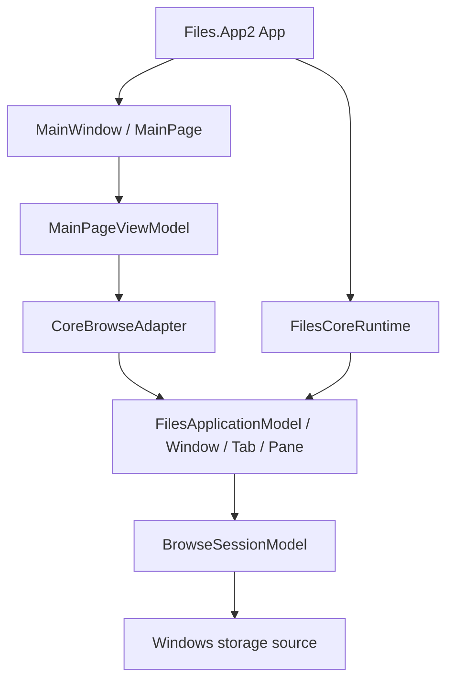

# Files.App2 アーキテクチャ

`Files.App2` は、旧 `Files.App` のサービスロケーター、設定サービス、legacy storage shapeを持ち込まずに
`Files.Core`をWinUIへ接続するための移行ホストです。旧アプリは機能互換性を保つために残しますが、App2の
新しい機能は旧経路へ依存しません。

## 依存方向と所有権

`App`はprocess scopeの`FilesCoreRuntime`を所有します。Coreが作成したactive `WindowModel`のactive
`TabModel`/`PaneModel`を`MainPage`へ渡し、`CoreBrowseAdapter`がUI向けのsnapshotへ変換します。
window終了時は`MainPage`の購読を先に解除し、その後runtimeを非同期破棄します。

## 最初の垂直スライス

- `FilesCoreBuilder.AddWindowsStorage()`でWindows sourceを合成する。
- Homeと`file:` rooted folderを`PaneModel`へnavigateする。
- Coreのgeneration/items version付き状態をUI dispatcherへsnapshotする。
- `StorableReference`/`StorableKey`を保持した表示項目を作る。
- back/forward/up、refresh、複数選択、folder double-clickをCoreへroutingする。

CoreイベントはUI threadで発生するとは限らないため、adapterはCore項目をそのままWinUI collectionへ渡しません。
snapshotのversionを検査し、DispatcherQueue上で一覧とselectionを更新します。Coreが所有するmodelの破棄は
runtimeとpaneに任せ、UI項目は参照値だけを保持します。

## App2に入れないもの

旧設定サービス、`Ioc.Default`、legacy `ListedItem`、Frame履歴、旧command registryはApp2の依存にしません。
preview、操作dialog、activation、localization、Search/Library/Tag/FTPは、対応するCore契約とUI adapterを
別のvertical sliceとして追加します。

## デバッグとベンチマーク

手動の起動/Home/folder navigation/selection/refresh/終了スモークと、Debugでのstartup/navigation/refresh計測は
[テストと性能](testing.md)に定義します。DebugのUI計測は退行検出用です。比較可能な性能値は同一fixtureを使った
Releaseの`Files.Core.Benchmarks`で取得し、Shellやディスクの遅延をCoreのマイクロベンチマークへ混ぜません。
