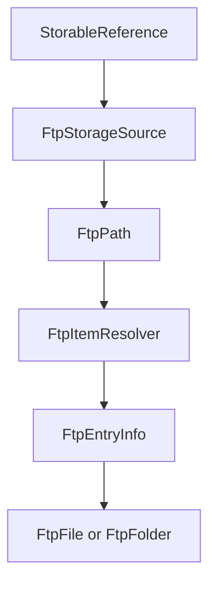
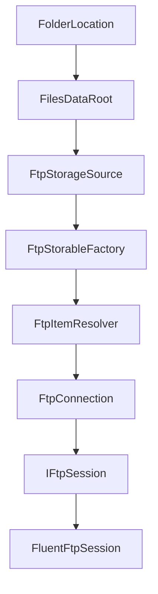
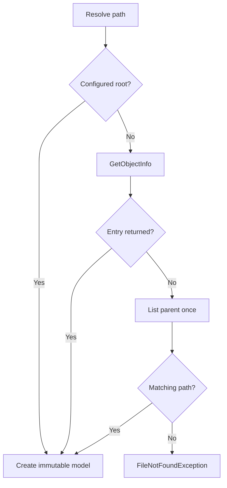
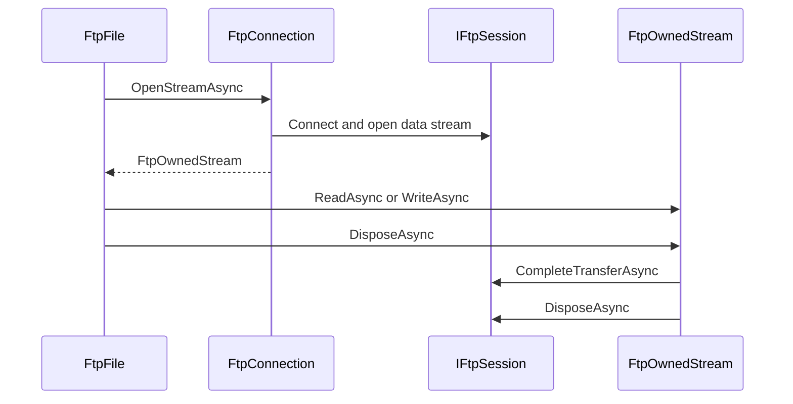

# FTP storage provider

Files.Core represents each saved FTP connection as one
`FtpStorageSource`. FTP items are ordinary OwlCore.Storage `IFile` and
`IFolder` CoreModels, so folder browsing, stream previews, archive browsing,
properties, and storage commands do not need FTP-specific AppModels.

SFTP is not FTP over TLS and is outside this provider. It requires a separate
source and transport implementation.

## Source and item identity

One profile is one source even when two profiles use the same host. Accounts,
ports, TLS modes, and configured roots can differ independently.

| Value | FTP meaning |
| --- | --- |
| `StorageSourceId` | `ftp:<ConnectionId>` |
| `IStorable.Id` | Normalized absolute remote path inside that source |
| `StorageAddress` | Credential-free `ftp:`, `ftpes:`, or `ftps:` endpoint and path |
| `LastKnownAddress` | Recovery/display hint; never a credential or identity key |

FTP has no portable stable file identifier. Rename and move therefore
invalidate the old path-based item ID and return a new `StorableReference`.
The old reference normally stops resolving after the path changes. If a
different remote item later reuses exactly the same path, FTP exposes no
portable identity with which Core could distinguish it.

`FtpPath` preserves spelling and uses `/` separators. The connection profile
declares whether the server compares paths case-sensitively. It also prevents
resolution outside the configured root.



Addresses never include a username or password. The internal `ftpes` scheme
denotes explicit TLS, while `ftps` denotes implicit TLS:

| Profile mode | Address scheme | Default port |
| --- | --- | --- |
| Plain | `ftp` | 21 |
| Explicit TLS | `ftpes` | 21 |
| Implicit TLS | `ftps` | 990 |

## Component boundary



Responsibilities are intentionally separated:

| Component | Responsibility |
| --- | --- |
| `FtpConnectionProfile` | Non-secret endpoint, root, TLS, and comparison settings |
| `IFtpCredentialProvider` | Supplies transient credentials from Files.App policy |
| `FtpConnection` | Caches credentials, retries one rejected credential, and creates isolated command sessions |
| `IFtpSession` | Testable FTP command and data-stream boundary |
| `FluentFtpSession` | The only layer translating FluentFTP types |
| `FtpItemResolver` | Resolves paths and filters items outside the configured root |
| `FtpStorableFactory` | Materializes immutable CoreModel snapshots |
| `FtpStorageOperationProvider` | Mutates references owned by one FTP source |
| `FtpPropertyProvider` | Publishes listing metadata without another network call |

Each command uses a short-lived session. This avoids sharing one control
connection concurrently and makes command cancellation and failure
containment explicit.

## Folder and item resolution

The configured root is synthesized as a folder even when a server cannot
return metadata for `/`. Other items first use `GetObjectInfo`. Servers
without MLST support fall back to one parent listing.



`FtpFolder.GetItemsAsync` performs one listing, copies remote metadata into
`FtpEntryInfo`, closes the session, and then yields CoreModels. CoreModels
never retain the FluentFTP client or a live listing response.

## Stream ownership

Low-level FTP data streams require the control connection to stay alive and
require a final reply to be consumed. Returning a stream after disposing its
client is invalid.

`FtpOwnedStream` owns both the data stream and `IFtpSession`:



The caller owns the returned stream. `FileAccess.ReadWrite` is rejected
because FTP exposes separate download and upload data channels. Stream
disposal also validates the final FTP reply, so a server-side transfer failure
is not reported as success merely because the data stream closed.

## Operations

`FtpStorageOperationProvider` handles operations only when every reference
belongs to its source.

| Request | FTP behavior |
| --- | --- |
| Create file | Upload an empty file without overwrite |
| Create folder | Create one remote directory |
| Rename | Server move in the current parent; case-only rename uses a temporary path when configured case-insensitive |
| Move | Server move inside the same FTP source |
| Copy file | Two owned sessions stream to a temporary sibling, then a no-overwrite server move publishes it |
| Copy folder | Recursively populate a temporary sibling, then publish it with a no-overwrite server move |
| Delete | Recursive permanent delete only |

Copy and move reject a folder destination inside the source folder. File and
folder copies populate a random temporary sibling, then publish it with a
no-overwrite server move. Failure cleanup therefore removes only that
provider-owned temporary item; a concurrently created target is never
treated as provider-owned cleanup. `GenerateUniqueName` produces
`name (2).ext`, `name (3).ext`, and so on.

FTP has no Recycle Bin. A `DeleteOperationRequest` with
`Permanently == false` returns a failed result so Files.App can request
explicit confirmation.

Transfers between FTP and another source are not hidden inside this provider.
They belong to a future storage-independent cross-source transfer
coordinator that resolves both sources and streams between their CoreModels.

## Existing capabilities reused by FTP

No FTP-specific browse location, preview provider, archive provider, or
thumbnail provider is registered.

- `FolderBrowseLocationHandler` browses `FtpFolder`.
- `StreamPreviewProvider` previews supported `FtpFile` formats.
- Archive probing and SevenZip fallback consume the FTP read stream. A
  non-seekable stream is already spooled by the archive pipeline.
- `FtpPropertyProvider` publishes size and timestamps captured by listings.
- Thumbnail retrieval remains policy-controlled future work; browsing must
  not download arbitrary remote files merely to decorate a list.
- FTP has no general push notification API. An optional polling folder-change
  provider can be added later without changing CoreModels.
- Symbolic-link metadata is retained, but a link is currently file-shaped
  unless a future resolver safely determines that its target is a folder.

## Composition

Load saved profiles before building the one process-wide runtime:

```csharp
var builder = new FilesCoreBuilder(
	viewSettingsStore,
	thumbnailCache)
	.AddWindowsStorage(
		streamPreviewPolicy: streamPolicy,
		shellPreviewPolicy: shellPolicy);

foreach (var profile in ftpProfiles)
{
	builder.AddFtpStorage(
		profile,
		ftpCredentials,
		streamPreviewPolicy: streamPolicy,
		archiveCredentialProvider: archiveCredentials);
}

await using var runtime = builder.Build();
```

`AddDefaultStreamPreviews` and archive browsing use feature guards, so adding
multiple FTP sources does not register duplicate global providers. The FTP
property contributor remains source-scoped.

The current `FilesDataRoot` source set is immutable after `Build`. Adding or
removing saved connections at runtime requires a future source-registry
contract with explicit source lifetime rules. The initial Files.App can load
profiles at process startup.

## Files.App responsibilities

Files.App owns:

- durable non-secret profile serialization;
- Windows Credential Manager or another protected secret store;
- a window-aware `IFtpCredentialProvider` and authentication prompt;
- warnings before plain unencrypted FTP;
- invalid-certificate trust UI and persisted certificate policy if added;
- connection creation/removal UI and runtime restart until sources become
  dynamically registered;
- localized presentation of authentication, connection, and permanent-delete
  errors.

Files.Core never invokes WinUI, stores a password in a URI/reference, or
accepts an invalid FTPS certificate globally.
