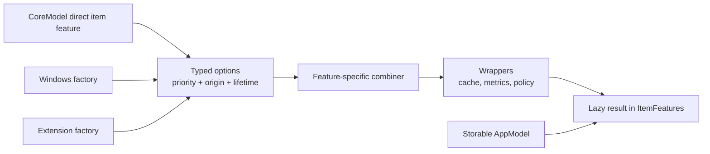
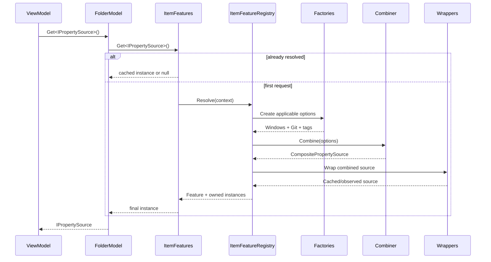
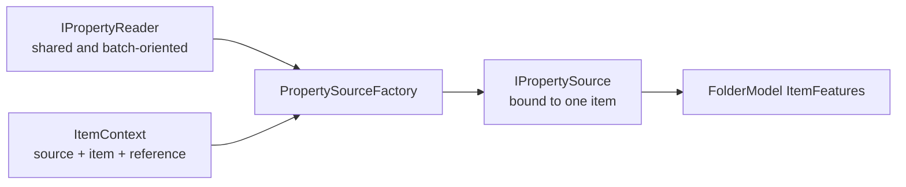
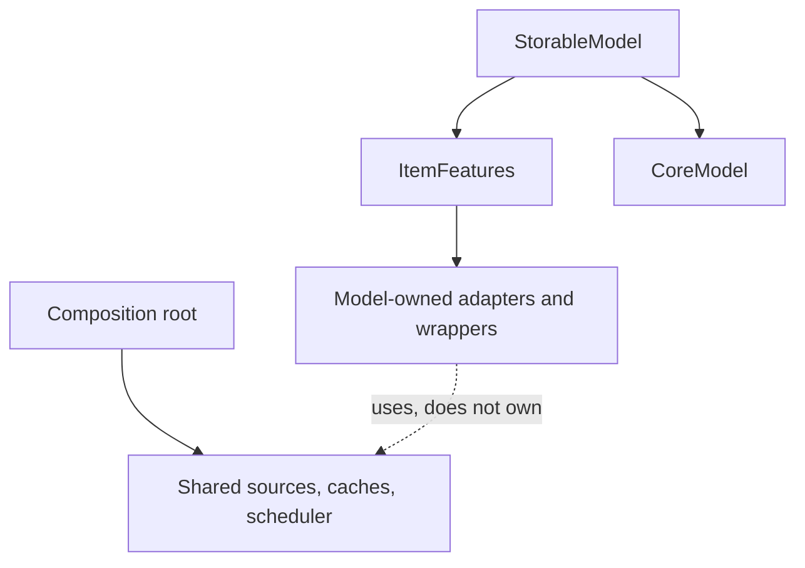

# Item feature composition

Item features are optional, item-bound behavior such as thumbnails, previews, properties, watchers, or operations. They are not base classes and they do not inherit from `IStorable`.

An AppModel exposes the final set:

```csharp
var properties = folderModel.Get<IPropertySource>();

if (properties is not null)
{
	var values = await properties.GetPropertiesAsync(
		new PropertyRequest(["System.Size", "System.DateModified"]),
		cancellationToken);
}
```

`Get<TFeature>()` is an extension over `IStorableModel.Features`. It is concise for callers, but it resolves only item feature contracts registered for that model. It is not a general service locator.

## Resolution flow

The composition root registers factories, one optional combiner per contract, and wrappers. Resolution is lazy and cached per model.





Factories are invoked only the first time their item feature contract is requested. Listing 10,000 items therefore does not eagerly create 10,000 thumbnail, preview, and property adapters.

## Each feature has its own combining rule

Multiple implementations do not have one universally correct meaning. Files.Core makes that policy explicit.

| Item feature shape | Composition rule | Prototype |
| --- | --- | --- |
| Thumbnail | Try options by descending priority until one returns a result | `ThumbnailSourceCombiner` |
| Preview | Route by descending priority; `null` means “not handled” | `PreviewSourceCombiner` |
| Properties | Merge all sources; higher priority wins duplicate property IDs | `PropertySourceCombiner` |
| Watcher or mutation service | Normally exactly one implementation | Default ambiguity exception or `PriorityItemFeatureCombiner<T>` |
| Archive navigation marker | Select the highest-priority applicable marker | `PriorityItemFeatureCombiner<IArchiveSource>` |
| Commands or adornments | Aggregate all applicable options | A contract-specific combiner should define ordering and duplicate behavior |

Without a registered combiner, zero options resolve to `null`, one option is returned directly, and multiple options throw. This prevents registration order from silently deciding correctness.

The thumbnail chain treats only `null` as “try the next source.” Exceptions are real failures and propagate. A lower-priority source therefore cannot conceal a broken higher-priority implementation.

## Registration example

```csharp
var thumbnailCache = new MemoryThumbnailCache();
var windowsThumbnailBackend = new WindowsShellThumbnailBackend();
var windowsProperties = new WindowsPropertyReader();

var itemFeatureRegistry = new ItemFeatureBuilder()
	.Add<IThumbnailSource>(
		new WindowsThumbnailSourceFactory(windowsThumbnailBackend),
		priority: 0,
		origin: "Windows Shell")
	.Add<IPropertySource>(
		new PropertySourceFactory(windowsProperties),
		priority: 100,
		origin: "Windows Shell")
	.Add<IPropertySource>(
		new PropertySourceFactory(gitProperties),
		priority: 50,
		origin: "Git")
	.SetCombiner<IPropertySource>(new PropertySourceCombiner())
	.SetCombiner<IThumbnailSource>(new ThumbnailSourceCombiner())
	.AddWrapper<IThumbnailSource>(new ThumbnailCacheWrapper(thumbnailCache))
	.Build();

var modelFactory = new StorableModelFactory(itemFeatureRegistry);
```

A plugin participates by registering another factory for the same contract. It does not replace `StorableModelFactory`, modify `FolderModel`, or reach into the visual tree.

Wrappers run in registration order. Each wrapper receives the result of the previous stage, so the last registered wrapper is the outermost wrapper.

## Item-bound source versus shared reader

`IPropertySource` and `IPropertyReader` deliberately represent different scopes.



- `IPropertyReader` is source-scoped or plugin-scoped. It can query several `ItemContext` instances in one request and is owned by the composition root.
- `IPropertySource` is the convenient item-bound contract returned by `model.Get<IPropertySource>()`.
- `PropertySourceFactory` creates the small adapter between the two.
- `BrowsePrefetchCoordinator` currently uses the item-bound source and publishes accepted values into the session's snapshot-scoped presentation store.
- A later batch optimization can group compatible item contexts and call the same reader directly without changing the item-bound contract or the UI-facing result flow.

`PropertyRequest` currently carries only the requested property IDs. A fast-only option is intentionally not exposed until readers can enforce the same latency contract; the current Windows reader reads its small supported typed set directly from `IShellItem2`.

This split also applies to other expensive item features: item-bound access is convenient, while a shared reader or loader can batch, cache, throttle, and schedule the actual work.

## Archive navigation item features

`IArchiveSource` marks an outer file, including a Windows Shell archive that
also appears as an `IFolder`, as a candidate for `ArchiveLocation`.
It does not open SevenZip or select a backend during item feature resolution.
That asynchronous work belongs to `ArchiveBrowseLocationHandler`.

SevenZip-backed folders directly implement `IArchiveEntry`, which preserves
the outer archive reference and normalized entry path for child navigation.
Files.App checks `IArchiveEntry`, then `IArchiveSource`, then ordinary
`IFolderModel` shape. See [Archive browsing](archives.md).

## Folder changes

`IFolderChangeSource` is the item-bound watcher contract. The source is explicitly started and then fans out managed `FolderChange` values through an event; it does not expose Shell notification handles, paths, or COM interfaces to the model layer.

```csharp
if (model.Get<IFolderChangeSource>() is not { } changes)
{
	return;
}

changes.Changed += OnChanged;
await changes.StartAsync(cancellationToken);

void OnChanged(object? sender, FolderChangeEventArgs args)
{
	if (args.Change.RequiresRefresh)
	{
		ReloadFolder();
		return;
	}

	ApplyChange(args.Change);
}

// Detach before disposing the model-bound item feature.
changes.Changed -= OnChanged;
await changes.DisposeAsync();
```

The Windows implementation is a model-bound event source over a `WindowsShellChangeWatcher` owned by `WindowsStorageSource`. One watcher owns one hidden notification window; identical folder registrations are shared and each item-bound source fans out to its event handlers. Window creation, registration, unregistration, and destruction all run on the ordered Shell STA. The watcher copies PIDLs while the Shell notification is locked and publishes only the managed copies after unlocking. The event is raised by the item-bound source's processing pump, never directly from the Shell window procedure.

`Faulted` reports terminal failures from the notification pump. Exceptions from individual `Changed` handlers are isolated and written to tracing instead; they do not stop the native watcher or prevent other consumers from receiving changes.

`Created`, `Deleted`, `Renamed`, and `Updated` carry best-effort `StorableReference` values. `DirectoryUpdated` and notifications whose PIDLs cannot be materialized set `RequiresRefresh`, so a consumer can re-enumerate instead of relying on incomplete event detail. This also keeps virtual Shell items and long paths representable because the watcher never converts notifications through `SHGetPathFromIDList`.

## Ownership



- The application root owns shared sources, caches, and schedulers.
- A `StorableModel` owns its `ItemFeatures` and CoreModel.
- `ItemFeatures` owns disposable instances marked `ItemFeatureLifetime.Item`, plus new disposable results created by combiners and wrappers.
- `ItemFeatureLifetime.Shared` marks instances owned elsewhere.
- Combiners and wrappers must not dispose the option or inner item feature they wrap; `ItemFeatures` tracks those lifetimes separately.
- `IItemFeatures` supports both `IDisposable` and `IAsyncDisposable`.
  Asynchronous disposal is preferred and awaited; synchronous disposal is a
  compatibility bridge for callers that cannot yet flow async lifetime.
- Long-lived sources expose `IAsyncDisposable` for ordered native cleanup.
- Disposal runs wrappers and options in reverse creation order, then the AppModel disposes its CoreModel.

Direct item features implemented by the CoreModel use `ItemFeatureLifetime.Shared` because the AppModel already owns the CoreModel itself.

Thumbnail cache keys use source ID plus item ID, not `LastKnownAddress`. Watchers and successful mutations call `IThumbnailCache.InvalidateAsync` for affected references. A wrapper captures the cache's invalidation version before extraction and uses `TrySetAsync` afterward; the cache stores the result atomically only if that version is still current. An old extraction therefore cannot repopulate an entry after an update invalidates it.
