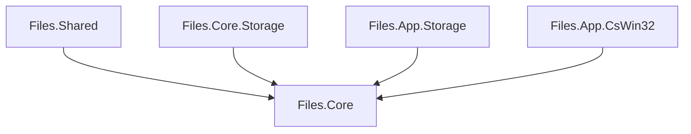
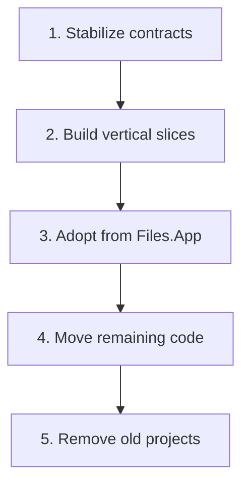
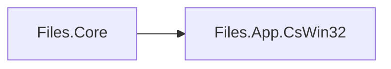

# Migration to Files.Core

The final physical layout and the logical architecture are separate decisions. Moving files between projects should not be mixed with replacing the model graph.

## Target project layout

One assembly does not mean one layer. `Files.Core` should retain namespaces and folders for storage contracts, sources, AppModels, browsing, operations, and interop.

## Safe migration order

1. Stabilize `IStorageSource`, CoreModel item features, AppModels, and
   browse-session ownership in the new project. **Complete.**
2. Implement one source and one browser path end to end. Windows storage,
   browsing, presentation, preview, and operations are the first slice.
   **Complete.**
3. Introduce `FilesCoreRuntime` in `Files.App` behind a feature boundary. Do
   not move unrelated source files during adoption. **Next step.**
4. Move WinUI-agnostic logic from the four existing projects after consumers use the new contracts.
5. Remove old projects and temporary references only after their dependency edges reach zero.

## Transitional dependency

Files.Core currently has this temporary edge:

It allows the Windows source to use existing source-generated interop
without copying generated code. When CsWin32 moves into `Files.Core`, this
project reference disappears while namespaces and higher-level contracts
remain stable.

See [New Files.App architecture](files-app.md) for the exact adoption slice.

## Conflict controls

- Do not rename or move the existing four projects while the architecture contracts are still changing.
- Do not make existing storage services implement new contracts through large compatibility classes.
- Prefer a vertical feature boundary over a repository-wide type replacement.
- Keep WinUI out of `Files.Core`, even though `Files.Core` targets Windows.
- Keep existing and new implementations side by side until a consumer is migrated and verified.
- Keep item feature contracts and Windows threading boundaries stable while files are still moving between assemblies.
- Treat a later project merge as a mechanical dependency change, not as permission to collapse the logical layers.
