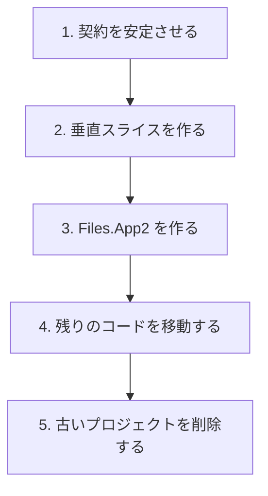
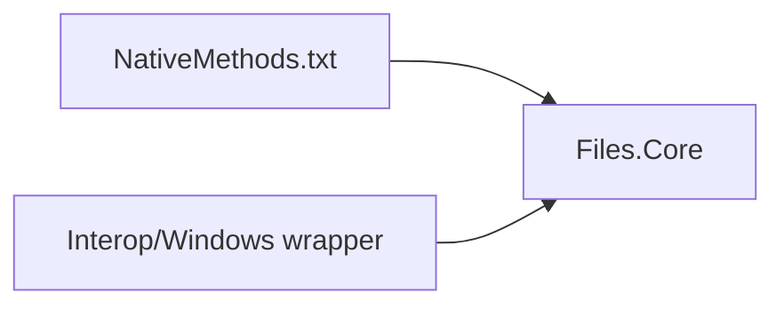

# Files.Core への移行

最終的な物理配置と論理アーキテクチャは別の決定です。プロジェクト間でファイルを移動することと、モデルグラフを置き換えることを同時に行ってはいけません。

## 目標のプロジェクト配置

1 つのアセンブリになっても、1 つのレイヤーになるわけではありません。`Files.Core` ではストレージ契約、ソース、AppModel、参照、操作、相互運用の名前空間とフォルダーを維持します。

## 安全な移行順序

1. 新しいプロジェクトで `IStorageSource`、CoreModel の項目機能、AppModel、参照セッションの所有権を安定させます。**完了。**
2. 1 つのソースと 1 つのブラウザ経路をエンドツーエンドで実装します。最初のスライスは Windows ストレージ、参照、表示、プレビュー、操作です。**完了。**
3. 既存のFiles.Appサービスグラフをコピーせず、`Files.App2` に `FilesCoreRuntime` とWindows folder browseの最初のUI adapterを実装します。**完了。**
4. CsWin32 の入力とラッパーは `Files.Core` へ移動済みで、廃止された `Files.Core.Storage` と `Files.App.Storage` プロジェクトは削除済みです。**完了。**
5. 残りの presentation、operation、preview、provider を `Files.App2` の後続vertical sliceとして移し、旧 Files.App を削除可能にします。**進行中。**

旧Files.Appの導入では既存XAMLとFrameを保持した互換adapterを使いますが、新規のApp2機能はこの経路へ戻しません。
App2の実装済み境界と所有権は[新 Files.App2 アーキテクチャ](files-app2.md)を参照してください。

## 相互運用コードの所有権

Files.Core が CsWin32 の生成を所有します。

生成出力は追跡対象外のままにし、直接編集してはいけません。アセンブリが移動しても、既存の `Windows.Win32` 名前空間は維持します。

正確な導入スライスは[新 Files.App アーキテクチャ](files-app.md)を参照してください。

## 競合の抑制

- 既存のストレージサービスに大きな互換性クラスを追加して新しい契約を実装させない。
- リポジトリ全体の型置換より、垂直な機能境界を優先する。
- `Files.Core` が Windows を対象にしていても、WinUI を入れない。
- ファイルがアセンブリ間を移動している間も、項目機能契約と Windows のスレッド境界を安定させる。
- プロジェクト統合は機械的な依存関係変更として扱い、論理レイヤーを潰す許可とはみなさない。
