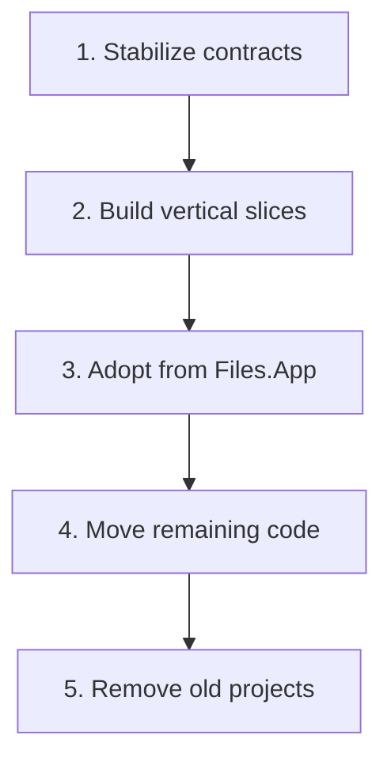
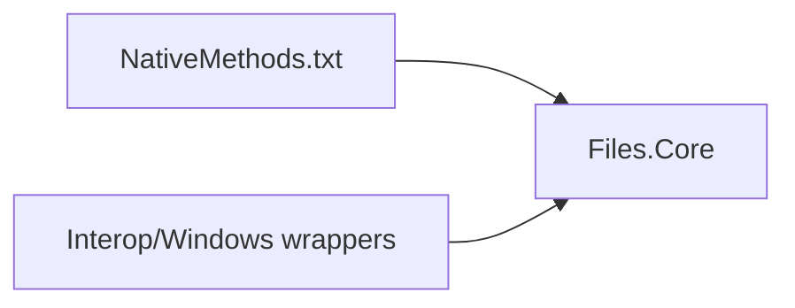

# Migration to Files.Core

The final physical layout and the logical architecture are separate decisions. Moving files between projects should not be mixed with replacing the model graph.

## Target project layout

One assembly does not mean one layer. `Files.Core` should retain namespaces and folders for storage contracts, sources, AppModels, browsing, operations, and interop.

## Safe migration order

1. Stabilize `IStorageSource`, CoreModel item features, AppModels, and
   browse-session ownership in the new project. **Complete.**
2. Implement one source and one browser path end to end. Windows storage,
   browsing, presentation, preview, and operations are the first slice.
   **Complete.**
3. Introduce `FilesCoreRuntime` in `Files.App` behind a feature boundary. Do
   not move unrelated source files during adoption. **Next step.**
4. CsWin32 input and wrappers now live in `Files.Core`; the obsolete
   `Files.Core.Storage` and `Files.App.Storage` projects have been removed.
   **Complete.**
5. Move remaining Files.App consumers to the new contracts and decide whether
   any `Files.Shared` code belongs in Core.

## Interop ownership

Files.Core now owns CsWin32 generation:

Generated output remains untracked and must not be edited directly. Existing
`Windows.Win32` namespaces remain stable despite the assembly move.

See [New Files.App architecture](files-app.md) for the exact adoption slice.

## Conflict controls

- Do not make existing storage services implement new contracts through large compatibility classes.
- Prefer a vertical feature boundary over a repository-wide type replacement.
- Keep WinUI out of `Files.Core`, even though `Files.Core` targets Windows.
- Keep item feature contracts and Windows threading boundaries stable while files are still moving between assemblies.
- Treat project merges as mechanical dependency changes, not as permission to collapse the logical layers.
