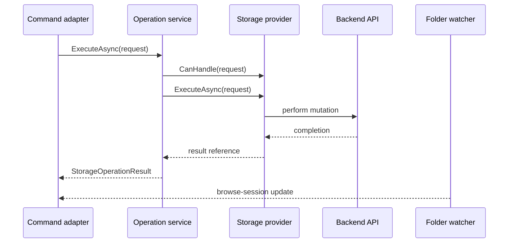
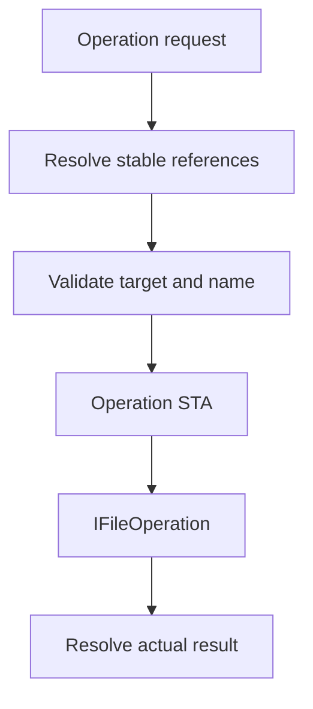

# Storage operations

Storage mutation is request-based and provider-routed. Files.App constructs a
UI-independent request from stable references; `StorageOperationService`
selects the first provider that accepts it.

## Contracts

The Core operation set is:

| Request | Result |
| --- | --- |
| `CreateItemOperationRequest` | Reference to the new file or folder |
| `RenameOperationRequest` | New snapshot reference for the same logical item |
| `CopyOperationRequest` | Reference to the copy |
| `MoveOperationRequest` | Reference at the destination |
| `DeleteOperationRequest` | No result reference |

Create, copy, and move accept `StorageConflictBehavior.Fail` or
`GenerateUniqueName`. Delete defaults to the Recycle Bin; permanent deletion
must be explicit.

`IStorageOperationService.CanHandle` is a cheap command-enablement check for a
fully formed request. It does not guarantee later success: permissions,
connectivity, collisions, or identity may change before execution.

## Flow

`Succeeded == false` carries the error as data. Cancellation requested by the
caller is the exception: `OperationCanceledException` propagates so the
command can distinguish cancellation from a failed operation.

## Windows implementation

`WindowsStorageOperationProvider` uses `IFileOperation` on the dedicated
operation STA. It supports:

- filesystem create;
- filesystem rename;
- filesystem copy and move;
- Shell delete for filesystem or virtual items.

Name validation rejects path traversal, separators, trailing spaces or dots,
invalid characters, and reserved DOS device names. Collision checks happen
before queuing the Shell operation. `GenerateUniqueName` uses the familiar
`name (2).ext` sequence.

Rename rechecks the item ID immediately before mutation and verifies that the
result path still identifies the expected item. Create, copy, and move
materialize the actual destination through the source rather than returning a
guessed path.

Cancellation can prevent work that has not started. It cannot interrupt a
synchronous Shell extension already executing. After a side effect commits,
result materialization intentionally completes without the caller token so a
successful mutation is not reported as canceled and retried unsafely.

## Identity after mutation

An operation never mutates an existing `IStorableModel`. Folder notifications
or refresh replace the old snapshot with a new model.

- A same-volume rename normally retains `ItemId`.
- A move may retain or change `ItemId`, depending on provider semantics.
- A copy always represents a new item.
- `LastKnownAddress` is updated in the returned reference but is excluded
  from reference equality.

Files.App should discard captured model instances after completion and use
the returned reference only for focus/reveal intent. The browse session
remains authoritative for the displayed item collection.

## Multi-item commands

The provider contract intentionally operates on one request. Files.App may
run a bounded sequence for multi-selection and aggregate progress, or a
backend may add a specialized batch request/provider later. Keeping the
single-item semantic stable avoids pretending that all providers support one
atomic bulk transaction.

For a Files.App batch adapter:

1. capture all selected `StorableReference` values;
2. execute with bounded concurrency appropriate to the provider;
3. stop scheduling new items when canceled;
4. retain per-item failures rather than losing partial success;
5. let folder notifications reconcile the visible session;
6. use result references only for final focus/reveal.
