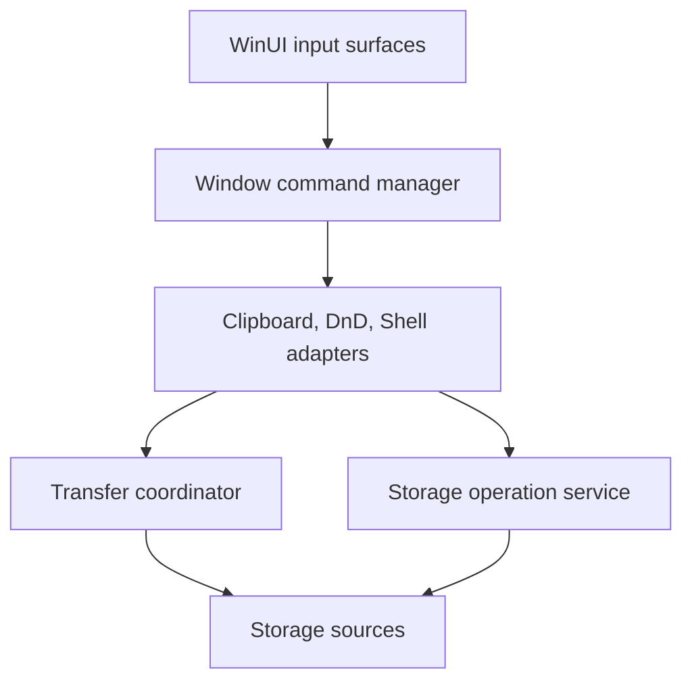
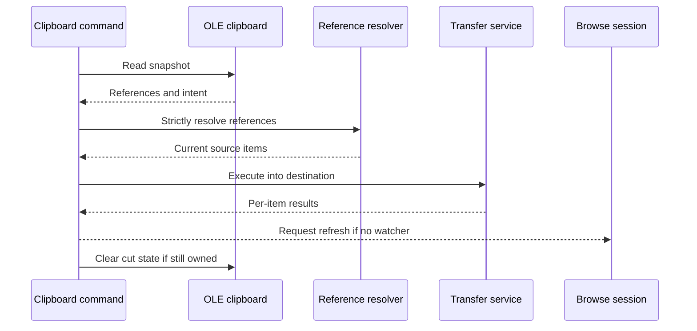
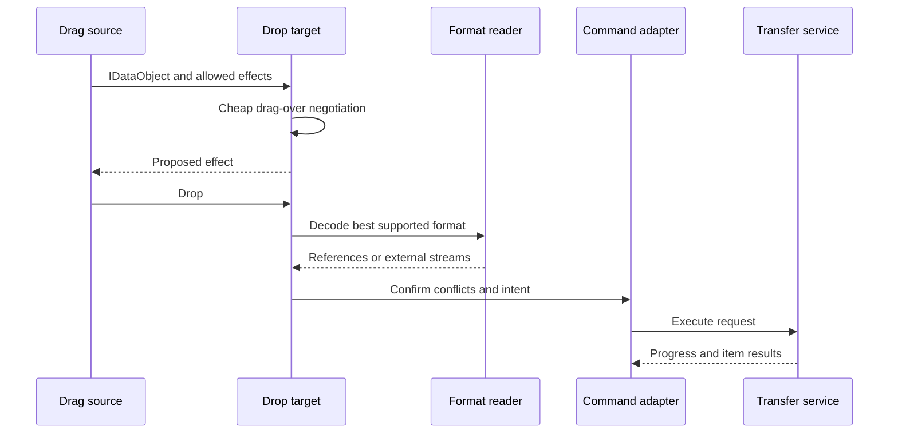
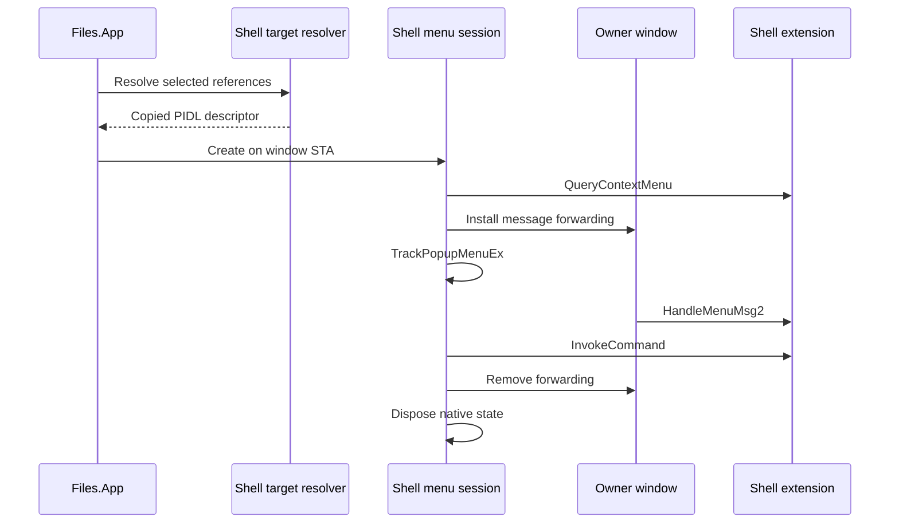
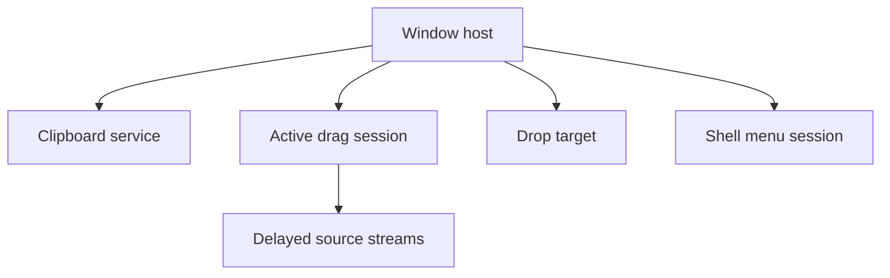

# Clipboard, drag/drop, and Shell integration

Clipboard, drag/drop, and Windows Shell context menus connect the new
Files.App model graph to other applications and native extensions. They are
high-risk platform adapters: they combine untrusted external data, HWND and
OLE STA affinity, delayed streams, mutable selection, and destructive storage
operations.

Files.App owns these adapters. Files.Core supplies stable item references,
source resolution, same-source operations, and a future cross-source transfer
coordinator. No WinUI or OLE data object enters a CoreModel or AppModel.

## Boundary



The adapters translate between native formats and application intent. They do
not implement file copies themselves and do not edit browse collections.

## Proposed source layout

```text
src/Files.App/
  Commands/Adapters/
    ClipboardCommandAdapter.cs
    DragDropCommandAdapter.cs
    ShellVerbCommandAdapter.cs
  Platform/Clipboard/
    IClipboardService.cs
    OleClipboardService.cs
    ClipboardSnapshot.cs
    FilesClipboardPayload.cs
    FilesClipboardDataObject.cs
    ClipboardFormatReader.cs
  Platform/DragDrop/
    DragSession.cs
    DragDropService.cs
    DropNegotiator.cs
    FilesDropTarget.cs
    VirtualFileDataObject.cs
  Platform/Shell/
    IShellContextMenuService.cs
    ShellContextMenuService.cs
    ShellContextMenuSession.cs
    ShellSelectionTarget.cs
    ShellMenuMessageRouter.cs
  Platform/Interop/
    NativeDataObjectAdapter.cs
    StgMediumLease.cs
```

Native declarations and generated interfaces remain in
`Files.App.CsWin32`. Add missing APIs to `NativeMethods.txt` or an existing
wrapper; do not add duplicate ad hoc P/Invokes or edit generated output.

## Shared transfer intent

Clipboard paste and drop converge on the same UI-independent transfer
request:

```csharp
public enum TransferIntent
{
	Copy,
	Move,
	Link,
}

public sealed record StorageTransferRequest(
	ImmutableArray<StorableReference> Sources,
	StorableReference DestinationFolder,
	TransferIntent Intent,
	StorageConflictBehavior ConflictBehavior);

public interface IStorageTransferService
{
	bool CanHandle(StorageTransferRequest request);

	ValueTask<StorageTransferResult> ExecuteAsync(
		StorageTransferRequest request,
		IProgress<StorageTransferProgress>? progress = null,
		CancellationToken cancellationToken = default);
}
```

`IStorageTransferService` belongs in Files.Core because it moves streams
between arbitrary storage sources without knowing whether the request came
from paste, drop, or another UI. Its routing rules are:

1. use the source's native `IStorageOperationHandler` for a supported
   same-source copy or move;
2. otherwise copy through readable and writable OwlCore storage streams;
3. write to a source-owned temporary sibling when possible;
4. flush, close, and publish the temporary item before reporting success;
5. for a cross-source move, delete the source only after the copy commits;
6. report copy success plus delete failure as partial success;
7. never claim transactionality across two sources.

Link is handled only when the destination source explicitly supports a link
operation. It never silently degrades to copy.

Conflict prompting remains in Files.App. Core receives a resolved policy or a
source-neutral callback contract; it does not display UI.

## Clipboard architecture

### Internal format

Files writes one versioned private format in addition to applicable Windows
formats:

```text
application/vnd.files.storable-references+json
```

The payload contains:

```json
{
  "schemaVersion": 1,
  "operationId": "b8996716-74f2-4436-9690-a0a858745ddb",
  "intent": "copy",
  "items": [
    {
      "sourceId": "windows",
      "itemId": "source-defined-stable-id",
      "lastKnownAddress": "C:\\Example\\item.txt"
    }
  ]
}
```

`sourceId` and `itemId` are identity. `lastKnownAddress` is optional recovery
metadata and is never trusted as proof that the same item still exists. The
payload never contains an FTP password, access token, credential key,
thumbnail bytes, retained model, PIDL pointer, or process-local object handle.

The parser enforces:

- an explicit supported schema version;
- maximum item count and payload size;
- valid source and item ID lengths;
- known intent values;
- no duplicate operation or item entries;
- strict reference resolution before execution.

External applications can forge the private format. Treat it as untrusted
input even when it contains a Files operation ID.

### Windows formats

Publish the richest formats supported by the selected items:

| Format | Use |
| --- | --- |
| Files private format | Lossless in-app and cross-window references |
| `CFSTR_PREFERREDDROPEFFECT` | Copy or move intent |
| `CFSTR_SHELLIDLIST` | Native Shell items, including virtual namespace items |
| `CF_HDROP` | Filesystem paths for broad legacy compatibility |
| `CFSTR_FILEDESCRIPTORW` | Metadata for remote or virtual files |
| `CFSTR_FILECONTENTS` | Delayed stream for each virtual file |

Do not advertise `CF_HDROP` for FTP or archive items that do not have a real
filesystem path. A fabricated path creates incorrect identity and lifetime
semantics.

For a Windows-only selection, obtain Shell identity through the Windows
storage bridge and publish Shell-native formats. For mixed or remote
selection, always publish the private format; publish virtual-file formats
only when the external consumer can receive a bounded stream.

### OLE adapter

`OleClipboardService` uses OLE `IDataObject` as the canonical Windows
boundary. WinUI `DataPackage` may adapt simple formats at the view edge, but
it is not the authoritative representation because it cannot faithfully
model every indexed `CFSTR_FILECONTENTS` stream and Shell data object.

All calls to `OleGetClipboard`, `OleSetClipboard`, and `OleFlushClipboard`
run on an initialized STA. Clipboard reads copy or lease each `STGMEDIUM`
according to its ownership rules and always call `ReleaseStgMedium`.

`ClipboardSnapshot` captures:

- the clipboard sequence number;
- recognized formats;
- decoded references or external item descriptors;
- preferred effect;
- the Files operation ID when present.

The snapshot does not retain borrowed native pointers after its data object
lease ends.

### Copy, cut, and paste

Copy and cut only publish data. Cut does not rename, delete, dim, or otherwise
mutate an item. The UI may render cut state by matching the active clipboard
operation ID and references.



Paste captures the destination reference and clipboard sequence before
showing any conflict prompt. Before execution it verifies that the clipboard
sequence and destination pane are still valid. A replacement clipboard is
never cleared after a delayed paste finishes.

After a successful cut-paste, clear or replace cut state only when:

- the clipboard still contains the same operation ID;
- its sequence number is unchanged;
- every requested move succeeded.

Partial moves keep the failed references available and report the successful
subset.

### Clipboard lifetime

The process may call `OleFlushClipboard` for small, fully materialized
formats so copied local files remain available after Files exits. It must not
pretend that delayed FTP or archive streams can outlive their source and
runtime. For virtual files, either materialize to an owned temporary export
with an explicit cleanup lifetime or keep the process serving the data
object.

Temporary exports are never placed at an unresolved broad path and are
deleted only when Files can prove ownership.

## Drag and drop

### Drag session

`DragSession` is window-owned and short-lived. It captures:

- source window and pane IDs;
- browse generation and item version;
- immutable selected references;
- allowed effects;
- a unique operation ID;
- cancellation and data-object lifetime.

It does not retain `BrowseItemViewModel`, `IStorableModel`, XAML controls, or
borrowed PIDLs.

The same native data object builder used by the clipboard supplies drag
formats. `DoDragDrop` and the OLE modal loop stay on the owning UI STA.
Source stream reads may execute asynchronously behind delayed rendering,
but COM callbacks are marshaled through the data object's owning apartment.

### Drop negotiation

`DropNegotiator` makes drag-over decisions from cached metadata only:

- whether the target is a folder-like destination;
- source and destination source IDs;
- source-declared operation support;
- allowed source effects;
- keyboard modifiers;
- application policy.

Drag-over never opens a network connection, enumerates a folder, prompts, or
performs strict identity recovery. Drop performs full validation again.

Default intent follows Windows conventions:

| Condition | Default |
| --- | --- |
| Same source and native move supported | Move |
| Different sources | Copy |
| Ctrl held | Copy |
| Shift held and move is safe | Move |
| Alt held and link supported | Link |

The cursor effect is advisory. The drop handler may still reject execution if
strict resolution or source item feature changes.

### Drop flow



Format precedence for an incoming drop is:

1. validated Files private references;
2. Shell ID list;
3. `CF_HDROP`;
4. virtual file descriptors and contents;
5. WinUI storage items as a compatibility adapter.

The reader does not merge duplicate representations of the same item.

### External virtual files

Incoming `CFSTR_FILEDESCRIPTORW` entries are untrusted. Validate descriptor
count, name length, attributes, and stream index. Strip path components from
display names and reject `.` and `..`. Each `CFSTR_FILECONTENTS` medium is
consumed once or copied into an owned stream according to `TYMED`.

Outgoing virtual files expose one indexed content stream per descriptor.
Folders require an explicit recursive packaging policy; the first
implementation may disable dragging remote folders to other applications
rather than silently materializing an unbounded tree.

Cancellation closes source streams and completes the COM async-operation
contract. It does not delete a destination item that the transfer service did
not create.

## Windows Shell context menus

### Why the menu stays native

Shell extensions may be owner-drawn, create submenus lazily, require
`IContextMenu2` or `IContextMenu3` message forwarding, and assume command IDs
remain valid only for one menu session. Enumerating their labels and copying
them into a XAML `MenuFlyout` loses those behaviors.

The new implementation displays a native `HMENU` for a Windows Shell
selection. Files-native commands continue through
`WindowCommandManager`; non-Windows sources receive a Files-native menu only.

### Shell target bridge

Files.App must not rebuild Windows identity from a path. Add a narrow
Windows-specific bridge that converts current `StorableReference` values into
immutable Shell target descriptors:

```csharp
public sealed record ShellSelectionTarget(
	ReadOnlyMemory<byte> ParentAbsolutePidl,
	ImmutableArray<ReadOnlyMemory<byte>> ChildRelativePidls);

public interface IWindowsShellSelectionTargetResolver
{
	ValueTask<ShellSelectionTarget?> ResolveAsync(
		IReadOnlyList<StorableReference> items,
		CancellationToken cancellationToken = default);
}
```

The descriptor contains copied PIDL bytes, not borrowed pointers or live COM
objects. Files.App reconstructs owned PIDLs and binds the parent folder on the
menu's STA. The resolver verifies every reference and returns `null` when the
selection is not representable.

The first implementation supports items with one common Shell parent. Mixed
parents fall back to Files-native commands. Do not silently build a context
menu for only part of the selection.

### Menu session

`ShellContextMenuSession` owns:

- reconstructed absolute and child PIDLs;
- the parent `IShellFolder`;
- `IContextMenu` and optional `IContextMenu2`/`IContextMenu3`;
- the popup `HMENU`;
- the reserved command ID range;
- owner HWND and invocation point;
- temporary window-message forwarding.



The session is created, displayed, invoked, and released on the owning
window's STA. It forwards `WM_INITMENUPOPUP`, `WM_DRAWITEM`,
`WM_MEASUREITEM`, and `WM_MENUCHAR` while active. `IContextMenu3.HandleMenuMsg2`
is preferred, with `IContextMenu2.HandleMenuMsg` as fallback.

`QueryContextMenu` receives a reserved ID range that cannot collide with
Files commands. Shift adds extended verbs according to Shell policy.
`InvokeCommand` supplies the owner HWND, Unicode flag, invocation point,
working directory when meaningful, and selected numeric command offset.

Do not cache `IContextMenu`, `HMENU`, or numeric command IDs on a storable.
Their validity is scoped to one selection and one popup session.

### Files and Shell commands together

Use one of two deliberate surfaces:

- a Files XAML menu for built-in and source-contributed commands, with a
  “Show more options” item that opens the native Shell menu; or
- a native menu where Files reserves its own non-overlapping command IDs and
  then lets `IContextMenu` populate the Shell range.

The first option is simpler and matches modern Windows behavior. Both invoke
Files commands through `WindowCommandManager`; neither duplicates command
logic in the menu control.

Canonical verbs such as `properties` or `openas` may be invoked directly
through a short-lived session when a built-in command explicitly requires
them. Unknown verbs remain menu-scoped and are never persisted as command
IDs.

## Threading

| Operation | Required context |
| --- | --- |
| Capture command context | Owning window dispatcher |
| OLE clipboard calls | Initialized STA |
| `DoDragDrop` and drop callbacks | Owning UI STA |
| `IDataObject` format callbacks | Data object's owning apartment |
| Shell menu creation and tracking | Owner window STA |
| Shell menu message forwarding | Owner window procedure |
| Source stream I/O | Backend scheduler or async worker |
| Core transfer execution | UI-independent async path |

Do not use the general Windows Shell metadata scheduler to display an
`HMENU`; it does not own the window or its message route. Do not block the UI
STA waiting synchronously for FTP or archive streams.

## Security and validation

- Treat every external format as hostile and enforce size and count limits.
- Strictly resolve Files references; never trust `LastKnownAddress` alone.
- Reject paths containing traversal when creating destination child names.
- Never serialize credentials, tokens, raw pointers, or source session IDs.
- Do not hydrate, download, execute, or invoke a Shell verb during drag-over.
- Show destructive and elevation prompts through the owning window.
- Release every `STGMEDIUM`, COM interface, PIDL, `HMENU`, and temporary
  subclass on every success, cancellation, and failure path.
- Do not invoke a command ID after its menu session has closed.
- Record format and source categories in telemetry, not paths or clipboard
  contents.

## Ownership and shutdown



The process owns the clipboard service. Each window owns its drop target and
active drag or menu session. The data object owns delayed streams and
source leases until OLE signals completion.

Window shutdown:

1. reject new paste, drag, drop, and menu requests;
2. revoke the drop target;
3. cancel active transfers and delayed rendering;
4. close the native menu and remove message forwarding;
5. release data objects and native media;
6. dispose the window command manager;
7. dispose ViewModels and the Core window model.

Process shutdown flushes only materialized clipboard data, disposes the
clipboard service, then disposes `FilesCoreRuntime`.

## Testing

Platform-neutral unit tests cover:

- private payload round-trip and schema rejection;
- payload count, size, duplicate, and traversal limits;
- format precedence and duplicate suppression;
- copy, cut, and paste effect mapping;
- clipboard sequence and operation-ID ownership;
- drop intent negotiation;
- same-source and cross-source routing;
- partial cross-source move results;
- stale browse generation and destination rejection;
- Shell selection common-parent validation;
- deterministic native resource disposal using fakes.

Windows integration tests run on an STA with a message pump and cover:

- `CF_HDROP` and preferred effect interoperability;
- indexed virtual-file content;
- OLE clipboard replacement during paste;
- drag cancellation and delayed stream cleanup;
- a temporary-file `IContextMenu3` session;
- owner-drawn message forwarding;
- menu cancellation without invocation;
- window shutdown during each active session.

Do not depend on installed third-party Shell extensions for deterministic CI.
Use first-party temporary items and fake menu/data-object wrappers for failure
injection.

## Migration from the existing implementation

The current code already contains useful Shell and virtual-file interop, but
it mixes path identity, cached `IContextMenu` objects, global clipboard state,
WinUI packages, and storage execution.

Migrate by behavior:

1. introduce the private reference format and parser;
2. move clipboard ownership behind `IClipboardService`;
3. route paste through the new command and transfer services;
4. share the data-object builder with drag sources;
5. add strict incoming format readers and drop negotiation;
6. add the Shell target resolver using current Windows references;
7. replace cached context menus with short-lived native sessions;
8. migrate one UI surface at a time;
9. remove legacy path-only and global clipboard helpers after the final
   caller moves.

Existing CsWin32 declarations and proven wrappers may be reused after their
ownership and apartment assumptions are made explicit. Generated interop code
is not copied into Files.Core.

## Implementation order

1. Implement the Core cross-source transfer contract and tests.
2. Implement the private clipboard payload and strict parser.
3. Implement OLE clipboard copy, cut, and paste.
4. Implement internal drag/drop using the same payload.
5. Add `CF_HDROP` and Shell ID-list interoperability.
6. Add bounded virtual-file streaming.
7. Implement the Shell selection target bridge.
8. Implement short-lived native Shell menu sessions and forwarding.
9. Integrate commands, progress, error policy, and shutdown.
10. Remove the corresponding legacy helpers.

## Anti-patterns

Do not:

- store an `IDataObject`, PIDL pointer, `IContextMenu`, or `HMENU` on an item
  model;
- treat a path or `CF_HDROP` entry as stable item identity;
- put FTP credentials or source handles in a clipboard format;
- run network or Shell work during drag-over;
- copy dynamic Shell menu labels into XAML and discard their native behavior;
- perform a cross-source move by deleting before the destination commits;
- clear a clipboard that changed while a paste prompt was open;
- mutate a browse collection directly after paste or drop;
- assume delayed virtual-file streams survive process shutdown;
- release COM, `STGMEDIUM`, or menu resources from an unrelated apartment.
