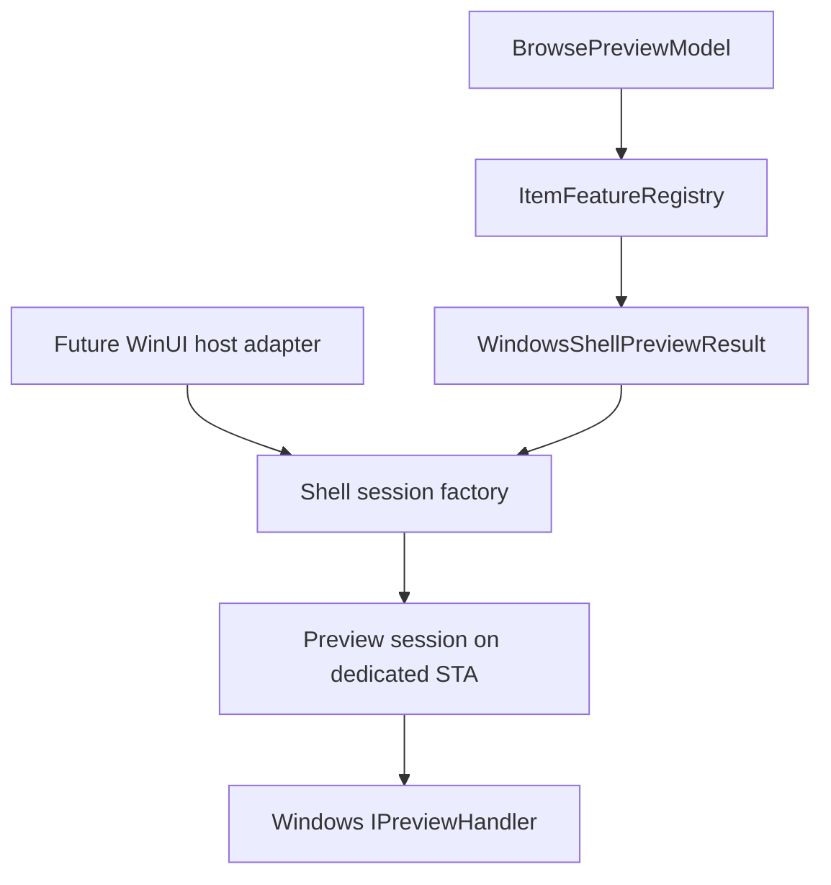
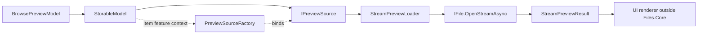
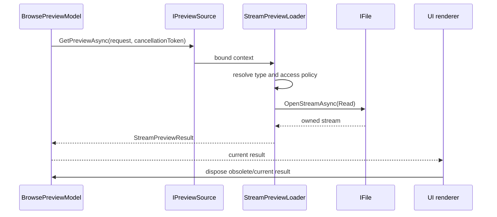

# Preview loading

Previews are UI-independent item features. `BrowsePreviewModel` selects the
current item, while an `IPreviewSource` turns that item into a disposable
`PreviewResult`. WinUI image, media, and document renderers consume the result
outside `Files.Core`.

The Core preview architecture has two independent result paths. Stream
previews return data owned by `StreamPreviewResult`; Windows Shell previews
return a descriptor and create the COM handler only when a UI host opens a
session.

## Shared loader and item-bound source

Loaders contain reusable backend logic. A
`PreviewSourceFactory` binds a loader to one
`ItemContext`, producing the item-bound `IPreviewSource` exposed by the
model.

`StreamPreviewLoader` currently supports `IFile` core models whose name has
an explicitly registered extension. `ExtensionPreviewContentTypeResolver`
owns that mapping and is case-insensitive. There is no implicit
`application/octet-stream` fallback: an unknown extension is unavailable, so
another loader may try.

## Composition and blocking

`PreviewSourceCombiner` orders options by descending priority and asks each
source until one returns a non-null result. `null` means “this source does
not handle the item”; a `BlockedPreviewResult` is a deliberate terminal
answer and prevents lower-priority fallback.

Access decisions are kept separate from stream opening through
`IPreviewStreamAccessPolicy`. A policy can return `RequiresHydration`,
`AccessDenied`, `DisabledByPolicy`, or another `PreviewBlockReason` before any
stream is opened. The request's `PreviewHydrationPolicy` is passed through to
the policy. `FilesCoreBuilder` supplies a permissive fallback; production
Files.App should inject its hydration and trust policy.

## Stream ownership and size limits

After `IFile.OpenStreamAsync` succeeds, `StreamPreviewLoader` owns the
stream until it returns a result. On success, ownership transfers to
`StreamPreviewResult`; its `DisposeAsync` is idempotent. On cancellation,
opening/read failure, or an over-limit result, the loader disposes the
opened stream.

With no `MaximumBytes`, the original stream is returned without buffering. If
the stream is seekable, its length is checked before returning it. A
non-seekable stream is copied only when a limit is required, reading at most
`MaximumBytes + 1` bytes. An over-limit copy is discarded as
`PreviewBlockReason.TooLarge`; an allowed copy is returned from position zero
and reports the actual length.

## Browse selection and races

`BrowsePreviewModel` owns the current result and cancels an older request when
selection, item identity, or browse generation changes. A result completed by
an obsolete request is disposed rather than published. This keeps the
item feature contract independent from WinUI thread affinity and leaves image
creation, such as `BitmapImage.SetSourceAsync`, to the UI layer.

WinUI renderers, dispatcher-affine image/media objects, and the child-HWND
host are outside Files.Core. Stream ownership, Shell association, handler
activation, STA scheduling, session control, and deterministic COM cleanup
are implemented in Core.

## Windows Shell preview backend

`WindowsShellPreviewResult` is a UI-independent descriptor. It stores the
stable `StorableReference` and the associated handler CLSID, but does not own a
COM object, `IShellItem`, PIDL, HWND, WinUI object, or a path used as identity.
`WindowsShellPreviewSessionFactory` resolves the reference again when a
session starts and verifies the returned source and item identity before using
the item.

`WindowsPreviewHandlerResolver` discovers the preview handler through the
Shell association API (`AssocQueryStringW`) using the preview-handler Shell
extension category. It normalizes extensions, performs the required-size
query before allocating the native result buffer, and caches both successful
and missing associations. A malformed CLSID is treated as unavailable. The
loader therefore performs no COM activation, file open, or HWND work.

The session factory uses a dedicated `WindowsShellScheduler` instance. Every
activation, handler method call, `IShellItem`/stream creation, and COM release
is queued to that preview STA. The handler is activated with
`CLSCTX_LOCAL_SERVER` by the default activation policy. An alternative context
such as in-process activation must be explicitly supplied by an injected
activation policy; there is no implicit in-process fallback. Initialization is
attempted in this order:

1. `IInitializeWithStream`
2. `IInitializeWithItem`
3. `IInitializeWithFile`

The first successful contract wins. Streams and Shell items are retained until
`Unload()` and deterministic disposal. The controller also supplies a minimal
`IPreviewHandlerFrame` site, applies optional `IPreviewHandlerVisuals`, and
exposes bounds, focus, and accelerator operations without taking a WinUI
dependency. Cleanup attempts `Unload()`, `SetSite(null)`, and every COM release
even when one cleanup operation fails. Disposal is idempotent.

Cancellation prevents queued operations from starting, but cannot interrupt a
synchronous third-party COM method that is already executing. The Files.App
adapter creates the dedicated host HWND, converts its arranged size to
physical-pixel bounds, forwards theme/focus/keyboard events, and disposes the
session on unload. XAML controls and host-window creation are deliberately not
part of Core.

Session teardown is ordered across the thread boundary. The preview controller
and its COM state are disposed on the dedicated preview STA first; the resolved
target `IStorableModel` is then asynchronously disposed outside that callback.
Both cleanup steps are attempted and multiple failures are aggregated.
Activation failure similarly cleans the controller on the preview STA and
awaits target-model disposal before returning the original error.

`AddWindowsStorage` gives `StreamPreviewLoader` priority 200 and
`WindowsShellPreviewLoader` priority 100. Known stream formats are therefore
preferred; a blocked result stops fallback, while a `null` stream result
allows the Shell descriptor source to run. The remaining implementation is
the Files.App renderer/host described in [New Files.App architecture](files-app.md).
