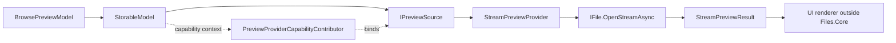
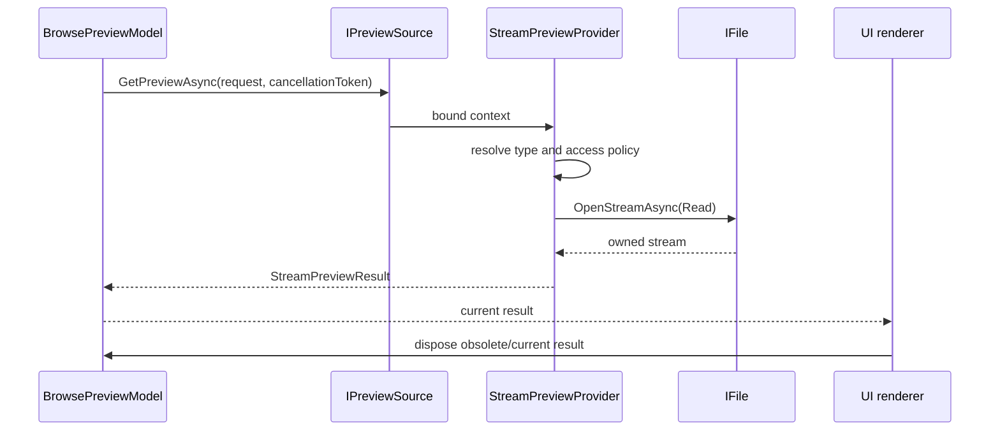

# Preview pipeline

Previews are UI-independent capabilities. `BrowsePreviewModel` selects the
current item, while an `IPreviewSource` turns that item into a disposable
`PreviewResult`. WinUI image, media, and document renderers consume the result
outside `Files.Core`.

## Provider and item-bound source

Providers contain reusable backend logic. A
`PreviewProviderCapabilityContributor` binds a provider to one
`CapabilityContext`, producing the item-bound `IPreviewSource` exposed by the
model.

`StreamPreviewProvider` currently supports `IFile` core models whose name has
an explicitly registered extension. `ExtensionPreviewContentTypeResolver`
owns that mapping and is case-insensitive. There is no implicit
`application/octet-stream` fallback: an unknown extension is unavailable, so
another provider may try.

## Composition and blocking

`PreviewSourceComposer` orders candidates by descending priority and asks each
source until one returns a non-null result. `null` means “this provider does
not handle the item”; a `BlockedPreviewResult` is a deliberate terminal
answer and prevents lower-priority fallback.

Access decisions are kept separate from stream opening through
`IPreviewStreamAccessPolicy`. A policy can return `RequiresHydration`,
`AccessDenied`, `DisabledByPolicy`, or another `PreviewBlockReason` before any
stream is opened. The request's `PreviewHydrationPolicy` is passed through to
the policy; production registration of a concrete policy remains an
application composition-root concern.

## Stream ownership and size limits

After `IFile.OpenStreamAsync` succeeds, `StreamPreviewProvider` owns the
stream until it returns a result. On success, ownership transfers to
`StreamPreviewResult`; its `DisposeAsync` is idempotent. On cancellation,
opening/read failure, or an over-limit result, the provider disposes the
opened stream.

With no `MaximumBytes`, the original stream is returned without buffering. If
the stream is seekable, its length is checked before returning it. A
non-seekable stream is copied only when a limit is required, reading at most
`MaximumBytes + 1` bytes. An over-limit copy is discarded as
`PreviewBlockReason.TooLarge`; an allowed copy is returned from position zero
and reports the actual length.

## Browse selection and races

`BrowsePreviewModel` owns the current result and cancels an older request when
selection, item identity, or browse generation changes. A result completed by
an obsolete request is disposed rather than published. This keeps the
capability contract independent from WinUI thread affinity and leaves image
creation, such as `BitmapImage.SetSourceAsync`, to the UI layer.

The renderer, preview cache, shell-specific preview handlers, and application
composition registrations are intentionally outside this Core slice.
