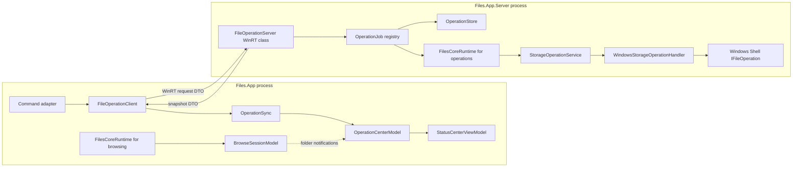
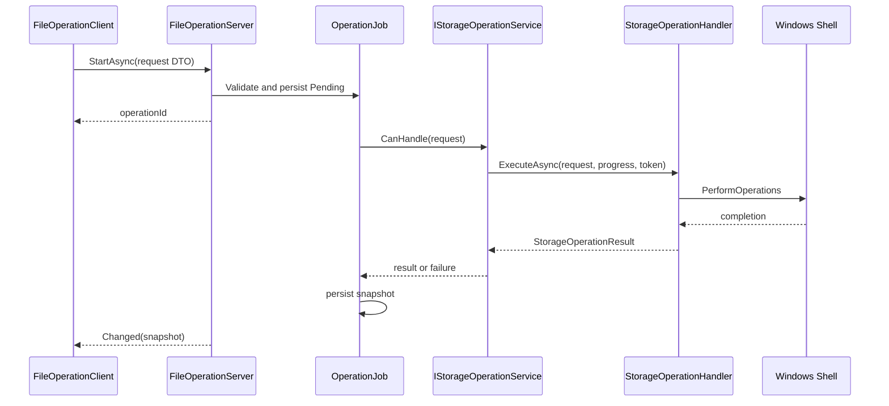
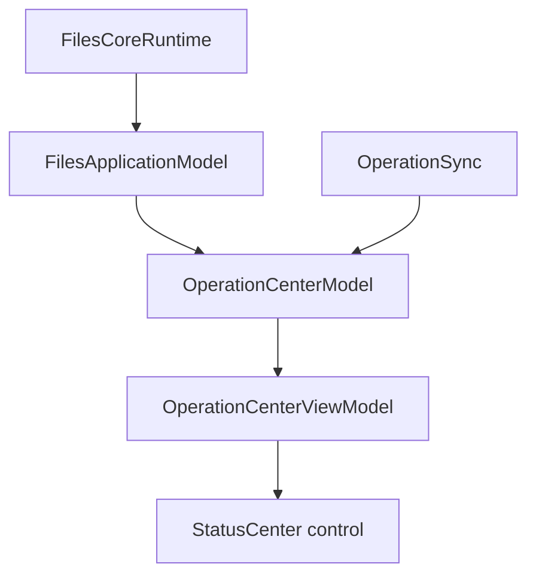

# Durable operations with `Files.App.Server`

## Status and scope

This document defines the proposed design for running long-lived storage
operations in `Files.App.Server`. It is the design target for the new
Files.Core model graph; it is not a description of the current implementation.

The goal is deliberately narrow:

- a copy, move, delete, create, or rename operation can continue when the
  foreground `Files.App` process exits unexpectedly;
- a newly started `Files.App` can discover and display operations that were
  started by an earlier process;
- the UI remains responsible for presentation, prompts, and navigation state;
- Files.Core remains UI-independent and continues to execute one storage
  request at a time through `IStorageOperationService`.

This design does not promise that an operation can resume after
`Files.App.Server` itself is terminated. A later phase may add recovery for
specific backends, but automatically replaying a partially completed file
operation is unsafe unless the backend provides an idempotent transaction.

## Current state

`Files.App.Server` is already packaged as a single-instance out-of-process
WinRT server. `Files.App` consumes its generated WinRT metadata, and the
server references `Files.Core`. The package manifest currently exposes only
`Files.App.Server.AppInstanceMonitor`.

The server currently has no operation API. Its process waits on
`Program.ExitSignal`, while `AppInstanceMonitor` signals that event when the
last monitored Files process exits. In addition, the foreground startup path
kills an existing server when it believes that no other Files process exists.
Those two lifetime rules are incompatible with crash-resistant operations:

1. a foreground crash could cause the server to exit while an operation is
   still running;
2. reopening Files could kill a server that is still completing an operation;
3. an in-flight operation is not represented by a stable ID that a new UI
   process can query;
4. the current WinRT surface cannot submit a Core operation request.

The existing Core boundary is the correct execution boundary. A
`FilesCoreRuntime` owns `StorageOperations`, and `WindowsStorageOperationHandler`
already resolves stable references and performs Shell mutations without
depending on WinUI.

## Target process topology

The foreground process and the server process each own their own Core graph.
No Core model, Shell object, stream, PIDL, or cancellation token crosses the
process boundary.



The server runtime is not a second UI. It is a process-local execution host.
The first implementation may construct it through the existing builder:

```csharp
await using var runtime = new FilesCoreBuilder()
	.AddWindowsStorage(
		enablePreviews: false,
		enableArchives: false)
	.Build();

var operations = runtime.StorageOperations;
```

`AddWindowsStorage` still registers the Windows source and its operation
handler when previews and archives are disabled. The extra item-feature
factories are construction-time registrations and do not make the server a
UI host. If server startup cost later proves significant, add a small
`AddWindowsOperations` composition method that registers only
`WindowsStorageSource` and `WindowsStorageOperationHandler`. That optimization
must not move Windows Shell code into `Files.App.Server`.

## Responsibilities

### Files.Core

Files.Core owns storage semantics:

- `StorageOperationRequest` types;
- `IStorageOperationService` and handler selection;
- `StorageOperationProgress` and `StorageOperationResult`;
- stable `StorableReference` resolution;
- Windows Shell threading and `IFileOperation` execution;
- backend-specific validation and result materialization.

The Core service remains a single-request executor. It must not know whether
the caller is a ViewModel, a local command adapter, or the out-of-process
server.

### Files.App.Server

The server owns process lifetime and durable job coordination:

- expose a WinRT-compatible API;
- validate and normalize untrusted DTOs;
- create or recover an `OperationJob`;
- persist job state before starting side effects;
- map DTOs to Core requests;
- execute a batch as a bounded sequence of Core requests;
- aggregate progress and per-item failures;
- keep jobs alive when the client proxy disappears;
- publish snapshots that a later Files process can query.

The server must not show dialogs, update WinUI collections, own tabs, or
return `IStorableModel` instances.

### Files.App

Files.App owns presentation and user policy:

- gather references from the current selection;
- show conflict, delete, credential, or elevation prompts before submission;
- submit a job and retain its operation ID;
- synchronize snapshots into the local operation model;
- display progress and errors;
- reconcile visible folders through the normal watcher/session flow;
- use a returned reference only for final focus or reveal.

The foreground command must not update the visible item collection directly
after a server operation completes.

## WinRT contract

The public server surface should be small and composed of WinRT-compatible
sealed classes, enums, strings, arrays, and asynchronous operations. Do not
publish Core records, `Exception`, `Task`, `CancellationToken`, pointers, or
COM interfaces.

The following is a conceptual contract; the exact C# signatures must follow
the CsWinRT authoring rules used by the server project.

```text
FileOperationServer
  StartAsync(OperationRequestData request) -> operationId
  GetAsync(operationId) -> OperationSnapshotData
  ListAsync() -> OperationSnapshotData[]
  CancelAsync(operationId)
  ForgetAsync(operationId)
  event Changed(OperationSnapshotData snapshot)
```

Events are an optimization, not the source of truth. A client that was
disconnected during an event must call `ListAsync` or `GetAsync` after it
starts again.

### Request data

`OperationRequestData` should contain:

| Field | Purpose |
| --- | --- |
| `SchemaVersion` | Reject unknown wire formats safely |
| `OperationId` | Client-generated idempotency key |
| `Kind` | Create, rename, copy, move, or delete |
| `Items` | One or more stable item references |
| `DestinationFolder` | Destination reference for copy/move |
| `Name` | New item or new name, when applicable |
| `ItemKind` | File or folder for create |
| `ConflictBehavior` | Fail or generate a unique name |
| `Permanently` | Explicit permanent-delete choice |

Each reference contains:

```text
SourceId
ItemId
LastKnownAddressScheme (optional)
LastKnownAddressValue (optional)
```

`SourceId` and `ItemId` are identity. `LastKnownAddress` is only a recovery
hint. The server must never treat a path alone as proof that the requested
item is still the same item.

### Snapshot data

`OperationSnapshotData` should contain:

| Field | Purpose |
| --- | --- |
| `OperationId` | Correlates all updates |
| `State` | Pending, Running, Cancelling, Succeeded, Failed, or Cancelled |
| `CompletedItems` | Aggregate completed count |
| `TotalItems` | Aggregate item count |
| `CurrentItem` | Optional current stable reference |
| `ResultItems` | Successful result references |
| `ErrorCode` | Stable machine-readable error category |
| `ErrorMessage` | Localized by Files.App when possible |
| `CreatedAt` / `UpdatedAt` | Recovery and retention |

Do not serialize the Core `Exception`. Map it to a stable error category and
keep the original exception in the server log. Error text returned to the UI
is diagnostic data and must not be used as a programmatic condition.

## Job lifecycle

### Start

1. The command adapter collects stable references and resolves all required
   UI decisions.
2. It creates a new operation ID. A retry uses the same ID.
3. `FileOperationClient` sends `OperationRequestData`.
4. The server validates the schema, limits, enum values, references, and
   operation ID.
5. The server checks whether the operation ID already exists:
   - same request hash: return the existing job snapshot;
   - different request hash: reject the request;
   - no job: persist `Pending` before queueing work.
6. The server returns the operation ID without waiting for the file mutation
   to finish.

Persisting before queueing closes the window where the UI could crash after
the server accepted a request but before the server had recorded it.

### Execute

The server turns each item in a batch into one existing Core request:



The first Windows implementation should use one active request per Windows
source. This avoids conflicting Shell mutations and makes ordering
predictable. A later backend may declare a different safe concurrency limit.
The batch coordinator must retain per-item results so a partial failure is
visible instead of being collapsed into one Boolean.

The current Core progress contract is item-oriented. Windows operations can
therefore report `0/1` and `1/1` for each request. The server aggregates those
values. Byte-level progress should not be invented; add a real Shell progress
source before exposing it as a percentage.

### Cancellation

`CancelAsync` changes the job to `Cancelling` and signals the server-owned
`CancellationTokenSource`. It must not be tied to the lifetime of the WinRT
client call.

Cancellation can prevent work that has not started. It cannot interrupt a
synchronous Shell extension already executing. After a mutation commits, the
server must finish materializing the result and report success rather than
reporting cancellation and encouraging an unsafe retry.

### Reattach after a foreground crash

When the client process disappears:

- the server keeps the job and its Core runtime alive;
- no client-disconnect callback cancels the job;
- progress continues to be persisted and optionally broadcast;
- a new Files process calls `ListAsync` during startup;
- `OperationSync` rehydrates the local `OperationCenterModel`;
- completed jobs remain visible until the normal retention policy removes
  them.

The server should use an idle shutdown timer only when there are no active
jobs and no recent client lease. It must not use the foreground process count
as its operation lifetime.

## Persistence and recovery

The minimum useful store is one record per operation under the package's
local application data directory, for example:

```text
operations/v1/{operationId}.json
```

The store must:

- write a temporary file and atomically replace the previous snapshot;
- validate the schema on read;
- cap item count, string lengths, and total file size;
- retain completed records for a bounded period;
- exclude passwords, access tokens, thumbnail bytes, PIDLs, and streams;
- record a request hash for idempotent retries.

On server startup, a `Running` record from a previous server process must be
marked `Unknown` unless the backend provides a safe checkpoint. It must not be
silently replayed. The foreground app can show that state and let the user
inspect the filesystem before choosing a new action.

This recovery rule is separate from the primary requirement: a foreground
crash does not stop a still-running server process.

## Files.App model and ViewModel flow

The operation list is application-wide, not window-specific. Add an
UI-independent `OperationCenterModel` to the Files application model graph.
It stores immutable operation snapshots and raises model state changes. It
does not contain WinUI collections, localized strings, or WinRT types.



`OperationSync` is a Files.App adapter around `FileOperationClient`:

1. subscribe to server changes when possible;
2. call `ListAsync` on startup and after reconnect;
3. map WinRT snapshots to Core-neutral operation snapshots;
4. update `OperationCenterModel` on the model's synchronization context;
5. dispose the subscription without cancelling server jobs.

The ViewModel owns localized headers, commands, and observable collections.
The control receives the ViewModel through the normal trickle-down DP path.
Lower ViewModels must not call `Ioc.Default`, search for the server, or use a
WinRT object as a hidden service locator.

Command adapters use this policy:

```text
selection -> stable references -> prompt for UI policy
          -> FileOperationClient.StartAsync
          -> operation ID -> OperationCenterModel
          -> watcher/session reconciliation
```

The returned result reference is useful for focus or reveal. It is not a
replacement for the browse session's authoritative item projection.

## UI-only decisions and unsupported cases

The server cannot display a WinUI dialog. Before submitting a job, Files.App
must resolve decisions that need a person:

- delete confirmation and permanent-delete choice;
- conflict policy or a user-selected new name;
- archive or FTP credentials;
- elevation consent;
- external drag/drop or clipboard behavior.

If a future operation genuinely needs interaction after it starts, add an
explicit `NeedsInput` snapshot state and a response method. Do not block a
server worker waiting for a UI callback that may never arrive.

The first server-backed slice should support Windows filesystem operations
with the existing `WindowsStorageOperationHandler`. FTP requires the server
to load the same saved connection profiles and a protected credential
resolver; credentials must never be placed in the request DTO. Archive
browsing is not automatically archive mutation support.

## Lifetime changes required in the existing server

The implementation must replace these rules:

1. `AppInstanceMonitor` must no longer be the condition that ends the server
   while jobs are active.
2. The startup code that kills an existing `Files.App.Server` must be removed
   or changed to a health check that never kills an active job.
3. `Program` must own a server host lifetime signal driven by active job count,
   client leases, and an idle timeout.
4. The manifest must expose the new operation server WinRT class in addition
   to any class still needed for compatibility.
5. The generated `.winmd` flow already used by `Files.App.csproj` should remain
   the only compile-time dependency from Files.App to the server surface.

The server's dynamic activation-factory registration should be reviewed when
the new public types are added. Only intended WinRT classes should be
activatable; DTO helper types should not accidentally become public activation
entry points.

## Security and validation

The package boundary is not a reason to trust input. Validate every request
before constructing a Core request:

- supported schema version;
- maximum number of items and maximum serialized size;
- non-empty, bounded operation ID;
- known operation and conflict enum values;
- source IDs registered in the server runtime;
- required destination and name fields;
- no duplicate item entries where duplicates are nonsensical;
- no credentials or opaque handles in address fields.

Core remains the authority for item identity, path validation, collision
checks, and permissions. In particular, the server must not turn an
untrusted address into a new identity or bypass `WindowsStorageSource`'s
reference resolution.

Log operation IDs, state transitions, backend error categories, and timing.
Do not log credentials or complete request payloads containing sensitive
addresses.

## Implementation phases

### Phase 1: contracts and server host

- Add WinRT-compatible request, reference, snapshot, and enum types.
- Add `FileOperationServer` and an internal `OperationJob`.
- Build a server-owned Core runtime with Windows storage and no previews.
- Implement single-item start, status, list, and cancellation.
- Keep the job in memory first, but persist snapshots before execution.

### Phase 2: foreground client and reattachment

- Add `FileOperationClient` in Files.App.
- Add `OperationCenterModel` and `OperationSync`.
- Rehydrate jobs during application startup.
- Adapt the Status Center to display server snapshots.
- Migrate one command, preferably copy or move, end to end.

### Phase 3: batches and remaining Windows commands

- Move multi-selection scheduling into the server job.
- Add create, rename, delete, and recycle-bin behavior.
- Preserve per-item failures and aggregate progress.
- Verify folder watchers reconcile each affected browse session.
- Add retention and explicit `ForgetAsync` behavior.

### Phase 4: lifetime hardening

- Replace process-count shutdown with active-job and idle-lifetime rules.
- Remove startup server killing.
- Test UI termination during every job state.
- Test reconnect from a new Files process while a job is pending, running,
  cancelling, succeeded, or failed.
- Add server startup handling for stale `Running` records.

### Phase 5: additional sources

- Register saved FTP sources in the server runtime.
- Resolve credentials inside the server from protected storage.
- Define explicit behavior for unsupported cross-source transfers.
- Add archive mutation only when a backend supplies safe operation handlers.

## Tests and acceptance criteria

Core operation tests remain process-local and should continue to cover
identity, conflicts, cancellation, and result materialization. Add server
tests for:

- DTO validation and schema rejection;
- idempotent retries with the same operation ID;
- rejection of the same ID with a different request hash;
- persistence before execution;
- snapshot transitions and per-item partial failure;
- bounded concurrency;
- cancellation before a request starts and during a running request;
- client disconnect without job cancellation;
- reattachment from a new client process;
- retention and `ForgetAsync`.

The Windows integration test should prove this scenario:

1. start a job through the WinRT surface;
2. terminate the foreground Files process;
3. verify the server continues and the filesystem mutation completes;
4. start a new Files process;
5. verify the completed snapshot is listed and the browse session reconciles;
6. verify no stale server is killed during startup.

The implementation is complete when the above scenario works without passing
an `IStorableModel`, path-only identity, UI dispatcher, or client-owned
cancellation token into `Files.App.Server`.
