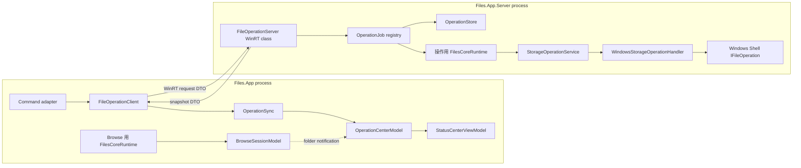
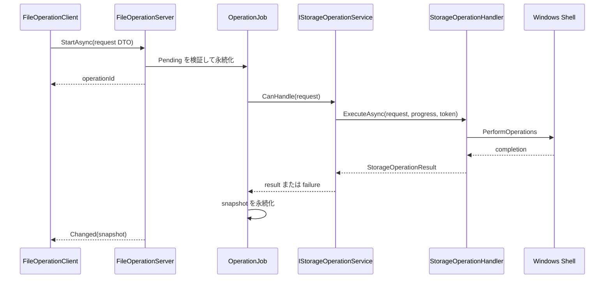
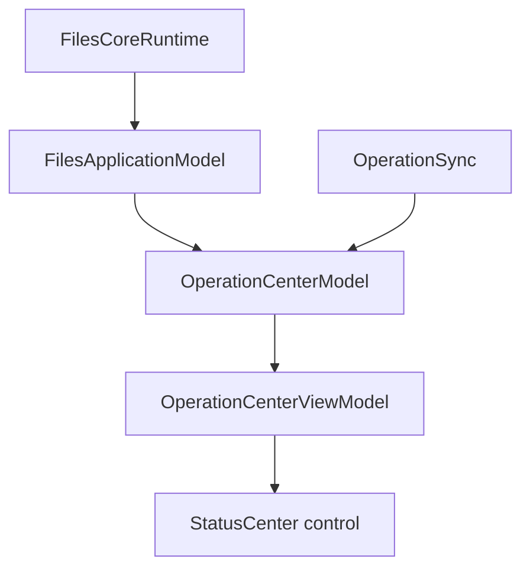

# `Files.App.Server` による永続操作

## 状態と対象範囲

この文書は、長時間実行するストレージ操作を `Files.App.Server` で動かす提案設計を定義します。
新しい Files.Core のモデルグラフを前提にした目標設計であり、現在の実装を説明する文書ではありません。

目標は意図的に限定します。

- フォアグラウンドの `Files.App` プロセスが予期せず終了しても、コピー、移動、削除、作成、名前変更を継続できる。
- 新しく起動した `Files.App` が、以前のプロセスが開始した操作を発見して表示できる。
- UI は表示、プロンプト、ナビゲーション状態を担当する。
- Files.Core は UI 非依存のまま、`IStorageOperationService` を通して 1 つのストレージ要求を実行する。

この設計は、`Files.App.Server` 自体が終了した後に操作を再開できることを保証しません。後続フェーズでバックエンドごとの復旧を追加することはできますが、
バックエンドが冪等なトランザクションを提供しない限り、途中まで完了したファイル操作を自動再実行するのは安全ではありません。

## 現在の状態

`Files.App.Server` はすでに単一インスタンスのアウトオブプロセス WinRT サーバーとしてパッケージ化されています。`Files.App` は生成された WinRT メタデータを利用し、
サーバーは `Files.Core` を参照します。現在パッケージマニフェストが公開しているのは `Files.App.Server.AppInstanceMonitor` だけです。

サーバーには現在、操作 API がありません。プロセスは `Program.ExitSignal` で待機し、`AppInstanceMonitor` は最後に監視していた Files プロセスが終了するとイベントを通知します。
さらにフォアグラウンドの起動経路は、他の Files プロセスがないと判断すると既存サーバーを kill します。この 2 つのライフタイム規則は、クラッシュ耐性のある操作と両立しません。

1. フォアグラウンドのクラッシュによって、操作実行中でもサーバーが終了する可能性がある。
2. Files を再度開くと、まだ操作を完了していないサーバーを kill する可能性がある。
3. 実行中の操作が安定した ID で表されず、新しい UI プロセスが問い合わせできない。
4. 現在の WinRT サーフェスから Core の操作要求を送信できない。

既存の Core 境界が正しい実行境界です。`FilesCoreRuntime` は `StorageOperations` を所有し、`WindowsStorageOperationHandler` は WinUI に依存せず安定した参照を解決して Shell 変更を実行します。

## 目標とするプロセス構成

フォアグラウンドプロセスとサーバープロセスは、それぞれ自分の Core グラフを所有します。Core モデル、Shell オブジェクト、ストリーム、PIDL、キャンセルトークンをプロセス間で共有しません。



サーバーランタイムは 2 つ目の UI ではなく、プロセス内の実行ホストです。最初の実装では既存 builder を使って次のように構築できます。

```csharp
await using var runtime = new FilesCoreBuilder()
	.AddWindowsStorage(
		enablePreviews: false,
		enableArchives: false)
	.Build();

var operations = runtime.StorageOperations;
```

プレビューとアーカイブを無効にしても `AddWindowsStorage` は Windows ソースと操作ハンドラーを登録します。追加の項目機能ファクトリは構築時の登録であり、サーバーを UI ホストにはしません。
サーバーの起動コストが後で問題になった場合は、`WindowsStorageSource` と `WindowsStorageOperationHandler` だけを登録する小さな `AddWindowsOperations` 合成メソッドを追加します。
この最適化のために Windows Shell コードを `Files.App.Server` へ移してはいけません。

## 責務

### Files.Core

Files.Core はストレージの意味を所有します。

- `StorageOperationRequest` 型。
- `IStorageOperationService` とハンドラー選択。
- `StorageOperationProgress` と `StorageOperationResult`。
- 安定した `StorableReference` の解決。
- Windows Shell のスレッド処理と `IFileOperation` の実行。
- バックエンド固有の検証と結果の具象化。

Core サービスは単一要求の実行器のままにします。呼び出し元が ViewModel、ローカルコマンドアダプター、アウトオブプロセスサーバーのどれであるかを知ってはいけません。

### Files.App.Server

サーバーはプロセスライフタイムと永続ジョブの調整を所有します。

- WinRT 互換 API を公開する。
- 信頼できない DTO を検証して正規化する。
- `OperationJob` を作成または復旧する。
- 副作用を開始する前にジョブ状態を永続化する。
- DTO を Core 要求へ対応付ける。
- バッチを Core 要求の上限付き順序処理として実行する。
- 進行状況と項目単位の失敗を集約する。
- クライアントプロキシが消えてもジョブを存続させる。
- 後から起動した Files プロセスが問い合わせできるスナップショットを公開する。

サーバーはダイアログを表示したり、WinUI コレクションを更新したり、タブを所有したり、`IStorableModel` を返したりしてはいけません。

### Files.App

Files.App は表示とユーザーポリシーを所有します。

- 現在の選択から参照を集める。
- 送信前に競合、削除、認証情報、昇格のプロンプトを表示する。
- ジョブを送信して操作 ID を保持する。
- スナップショットをローカルの操作モデルへ同期する。
- 進行状況とエラーを表示する。
- 通常のウォッチャー/セッションフローで表示フォルダーを調整する。
- 返された参照を最後のフォーカスまたは表示にだけ使う。

フォアグラウンドコマンドは、サーバー操作の完了後に表示項目コレクションを直接更新してはいけません。

## WinRT 契約

公開するサーバーサーフェスは小さくし、WinRT 互換の sealed class、enum、string、array、async operation で構成します。
Core の record、`Exception`、`Task`、`CancellationToken`、ポインター、COM インターフェースを公開してはいけません。

次は概念的な契約です。正確な C# シグネチャは、サーバープロジェクトで使う CsWinRT authoring ルールに従って決めます。

```text
FileOperationServer
  StartAsync(OperationRequestData request) -> operationId
  GetAsync(operationId) -> OperationSnapshotData
  ListAsync() -> OperationSnapshotData[]
  CancelAsync(operationId)
  ForgetAsync(operationId)
  event Changed(OperationSnapshotData snapshot)
```

イベントは最適化であり、source of truth ではありません。イベント中に切断したクライアントは、再起動後に `ListAsync` または `GetAsync` を呼び出さなければなりません。

### 要求データ

`OperationRequestData` には次を含めます。

| フィールド | 目的 |
| --- | --- |
| `SchemaVersion` | 未知の wire format を安全に拒否する |
| `OperationId` | クライアントが生成する冪等性キー |
| `Kind` | create、rename、copy、move、delete |
| `Items` | 1 つ以上の安定した項目参照 |
| `DestinationFolder` | copy/move の宛先参照 |
| `Name` | 必要に応じた新しい項目名 |
| `ItemKind` | 作成する file または folder |
| `ConflictBehavior` | 失敗または一意な名前の生成 |
| `Permanently` | 完全削除の明示的な選択 |

各参照は次を含みます。

```text
SourceId
ItemId
LastKnownAddressScheme (optional)
LastKnownAddressValue (optional)
```

`SourceId` と `ItemId` が識別情報です。`LastKnownAddress` は復旧ヒントにすぎません。サーバーはパスだけを根拠に、要求された項目が同じものだと扱ってはいけません。

### スナップショットデータ

`OperationSnapshotData` には次を含めます。

| フィールド | 目的 |
| --- | --- |
| `OperationId` | すべての更新を相関させる |
| `State` | pending、running、cancelling、succeeded、failed、cancelled |
| `CompletedItems` | 集約した完了数 |
| `TotalItems` | 集約した項目数 |
| `CurrentItem` | 任意の現在の安定参照 |
| `ResultItems` | 成功した結果参照 |
| `ErrorCode` | 安定した機械可読エラーカテゴリ |
| `ErrorMessage` | 可能なら Files.App でローカライズする |
| `CreatedAt` / `UpdatedAt` | 復旧と保持期間 |

Core の `Exception` はシリアライズしません。安定したエラーカテゴリへ対応付け、元の例外はサーバーログへ残します。
UI に返すエラーテキストは診断データであり、プログラム上の条件判定に使ってはいけません。

## ジョブのライフサイクル

### 開始

1. コマンドアダプターが安定した参照を集め、必要な UI の判断を解決する。
2. 新しい操作 ID を作る。再試行では同じ ID を使う。
3. `FileOperationClient` が `OperationRequestData` を送る。
4. サーバーがスキーマ、制限、enum 値、参照、操作 ID を検証する。
5. サーバーが操作 ID の存在を確認する。
   - 同じ request hash なら既存ジョブのスナップショットを返す。
   - 異なる request hash なら要求を拒否する。
   - ジョブがなければ、処理をキューに入れる前に `Pending` を永続化する。
6. サーバーはファイル変更の完了を待たずに操作 ID を返す。

キューに入れる前に永続化することで、サーバーが要求を受け入れた後、記録する前に UI がクラッシュする窓を閉じます。

### 実行

サーバーはバッチの各項目を既存の Core 要求 1 つへ変換します。



最初の Windows 実装では、Windows ソースごとにアクティブな要求を 1 つにします。これにより Shell 変更の競合を避け、順序を予測しやすくします。
後続のバックエンドは安全な同時実行数の上限を別に宣言できます。バッチコーディネーターは項目ごとの結果を保持し、部分的な失敗が 1 つの Boolean に潰れないようにします。

現在の Core 進行状況契約は項目単位です。そのため Windows 操作は要求ごとに `0/1` と `1/1` を報告できます。サーバーはそれらを集約します。
バイト単位の進行状況を推測してはいけません。パーセンテージとして公開する前に、本物の Shell 進行状況ソースを追加してください。

### キャンセル

`CancelAsync` はジョブを `Cancelling` へ変更し、サーバーが所有する `CancellationTokenSource` へ signal します。クライアント呼び出しのライフタイムに結び付けてはいけません。

キャンセルでは、まだ開始していない処理を止められますが、実行中の同期 Shell 拡張を中断することはできません。変更が確定した後は、サーバーは結果の具象化を完了し、
キャンセルを報告して安全でない再試行を促すのではなく成功を報告しなければなりません。

### フォアグラウンドクラッシュ後の再接続

クライアントプロセスが消えたとき:

- サーバーはジョブと Core ランタイムを存続させる。
- クライアント切断コールバックでジョブをキャンセルしない。
- 進行状況は永続化し続け、必要ならブロードキャストする。
- 新しい Files プロセスは起動時に `ListAsync` を呼ぶ。
- `OperationSync` がローカル `OperationCenterModel` を再水和する。
- 完了したジョブは通常の保持ポリシーで削除されるまで表示可能にする。

サーバーは、アクティブなジョブがなく、最近のクライアントリースもない場合にだけアイドル終了タイマーを使います。フォアグラウンドプロセス数を操作のライフタイムに使ってはいけません。

## 永続化と復旧

最小限有用なストアは、パッケージのローカルアプリケーションデータディレクトリに操作ごとのレコードを 1 つ置くことです。例えば次の場所です。

```text
operations/v1/{operationId}.json
```

ストアは次を満たさなければなりません。

- 一時ファイルへ書き、前のスナップショットをアトミックに置き換える。
- 読み取り時にスキーマを検証する。
- 項目数、文字列長、ファイル全体のサイズを制限する。
- 完了したレコードを上限付きの期間保持する。
- パスワード、アクセストークン、サムネイルバイト列、PIDL、ストリームを除外する。
- 冪等な再試行のため request hash を記録する。

サーバー起動時、以前のサーバープロセスから残った `Running` レコードは、安全なチェックポイントをバックエンドが提供しない限り `Unknown` に変更します。黙って再実行してはいけません。
フォアグラウンドアプリはその状態を表示し、ユーザーがファイルシステムを確認してから新しい操作を選べるようにします。

この復旧規則は主要求とは別です。フォアグラウンドのクラッシュでは、実行中のサーバープロセスは停止しません。

## Files.App のモデルと ViewModel の流れ

操作一覧はウィンドウ単位ではなくアプリケーション全体のものです。Files のアプリケーションモデルグラフに UI 非依存の `OperationCenterModel` を追加します。
これは不変の操作スナップショットを保存してモデル状態変更を発生させますが、WinUI コレクション、ローカライズ文字列、WinRT 型は持ちません。



`OperationSync` は `FileOperationClient` をラップする Files.App アダプターです。

1. 可能ならサーバーの変更を購読する。
2. 起動時と再接続後に `ListAsync` を呼ぶ。
3. WinRT スナップショットを Core 非依存の操作スナップショットへ対応付ける。
4. モデルの同期コンテキスト上で `OperationCenterModel` を更新する。
5. サーバージョブをキャンセルせず、購読を破棄する。

ViewModel はローカライズされたヘッダー、コマンド、observable collection を所有します。コントロールは通常の trickle-down DP 経路から ViewModel を受け取ります。
下位 ViewModel は `Ioc.Default` を呼んだり、サーバーを検索したり、WinRT オブジェクトを隠れたサービスロケーターとして使ったりしてはいけません。

コマンドアダプターは次のポリシーを使います。

```text
selection -> stable references -> UI policy の prompt
          -> FileOperationClient.StartAsync
          -> operation ID -> OperationCenterModel
          -> watcher/session reconciliation
```

返却された結果参照はフォーカスまたは表示に便利ですが、参照セッションが持つ権威ある項目投影の代わりにはなりません。

## UI だけが決めることと未対応ケース

サーバーは WinUI ダイアログを表示できません。ジョブを送信する前に、Files.App が人の判断を必要とする事項を解決します。

- 削除確認と完全削除の選択。
- 競合ポリシーまたはユーザーが選んだ新しい名前。
- アーカイブまたは FTP の認証情報。
- 昇格の同意。
- 外部ドラッグ/ドロップまたはクリップボードの動作。

開始後にも入力が必要な操作が将来生じた場合は、明示的な `NeedsInput` スナップショット状態と応答メソッドを追加します。
決して UI コールバックを待ってサーバーワーカーをブロックしません。UI は到着しない可能性があるためです。

最初のサーバー対応スライスは、既存の `WindowsStorageOperationHandler` による Windows ファイルシステム操作を対象にします。
FTP ではサーバーが同じ保存済み接続プロファイルと保護された認証情報リゾルバーを読み込む必要があり、認証情報を要求 DTO に入れてはいけません。
アーカイブ参照がそのままアーカイブ変更を意味するわけではありません。

## 既存サーバーに必要なライフタイム変更

実装では次の規則を置き換えます。

1. アクティブなジョブがある間、`AppInstanceMonitor` をサーバー終了の条件にしない。
2. 既存 `Files.App.Server` を kill する起動コードを削除するか、アクティブなジョブを決して kill しないヘルスチェックへ変更する。
3. `Program` がアクティブなジョブ数、クライアントリース、アイドルタイムアウトでサーバーホストのライフタイム信号を所有する。
4. 互換性のために必要なクラスに加え、新しい操作サーバー WinRT クラスをマニフェストへ公開する。
5. Files.App からサーバーサーフェスへのコンパイル時依存関係は、既存 `Files.App.csproj` の生成 `.winmd` フローだけにする。

新しい public 型を追加するときは、サーバーの動的 activation-factory 登録を見直します。意図した WinRT クラスだけをアクティブ化可能にし、DTO ヘルパー型を誤って public activation entry point にしないでください。

## セキュリティと検証

パッケージ境界があるからといって入力を信頼してはいけません。Core 要求を構築する前に、すべての要求を検証します。

- サポートしているスキーマバージョン。
- 項目数の最大値とシリアライズサイズの最大値。
- 空でなく上限のある操作 ID。
- 既知の操作と競合 enum 値。
- サーバーランタイムに登録されたソース ID。
- 必須の宛先と名前フィールド。
- 意味のない重複がある場合の重複項目エントリ。
- アドレスフィールドに認証情報や不透明なハンドルがないこと。

項目識別情報、パス検証、競合チェック、権限の権威は Core に残します。特にサーバーは、信頼できないアドレスを新しい識別情報に変換したり、`WindowsStorageSource` の参照解決を回避したりしてはいけません。

操作 ID、状態遷移、バックエンドのエラーカテゴリ、タイミングをログに記録します。認証情報や機密アドレスを含む完全な要求ペイロードはログに記録しません。

## 実装フェーズ

### フェーズ 1: 契約とサーバーホスト

- WinRT 互換の要求、参照、スナップショット、enum 型を追加する。
- `FileOperationServer` と内部 `OperationJob` を追加する。
- プレビューなしの Windows ストレージと、サーバー所有 Core ランタイムを構築する。
- 単一項目の start、status、list、キャンセルを実装する。
- 最初はメモリ内にジョブを保持してよいが、実行前にスナップショットを永続化する。

### フェーズ 2: フォアグラウンドクライアントと再接続

- Files.App に `FileOperationClient` を追加する。
- `OperationCenterModel` と `OperationSync` を追加する。
- アプリケーション起動時にジョブを再水和する。
- Status Center をサーバースナップショットの表示へ適応する。
- まずコピーまたは移動を 1 つ選び、エンドツーエンドで移行する。

### フェーズ 3: バッチと残りの Windows コマンド

- 複数選択のスケジュールをサーバージョブへ移す。
- 作成、名前変更、削除、ごみ箱動作を追加する。
- 項目ごとの失敗を保持し、進行状況を集約する。
- 影響する各参照セッションをフォルダーウォッチャーが調整することを検証する。
- 保持期間と明示的な `ForgetAsync` 動作を追加する。

### フェーズ 4: ライフタイムの堅牢化

- プロセス数による終了を、アクティブなジョブとアイドルライフタイムの規則に置き換える。
- 起動時にサーバーを kill する処理を削除する。
- すべてのジョブ状態で UI 終了をテストする。
- pending、running、cancelling、succeeded、failed の各状態で、新しい Files プロセスからの再接続をテストする。
- 古い `Running` レコードのサーバー起動処理を追加する。

### フェーズ 5: 追加ソース

- 保存済み FTP ソースをサーバーランタイムへ登録する。
- 保護されたストレージからサーバー内部で認証情報を解決する。
- 未サポートのソース間転送の動作を明示する。
- バックエンドが安全な操作ハンドラーを提供した場合だけアーカイブ変更を追加する。

## テストと受け入れ条件

Core の操作テストはプロセス内のまま、識別情報、競合、キャンセル、結果の具象化を引き続き検証します。サーバーテストには次を追加します。

- DTO 検証とスキーマ拒否。
- 同じ操作 ID を使う冪等な再試行。
- 異なる request hash で同じ ID を使った場合の拒否。
- 実行前の永続化。
- スナップショット遷移と項目ごとの部分失敗。
- 上限付き同時実行。
- 要求開始前と実行中のキャンセル。
- クライアント切断でジョブをキャンセルしないこと。
- 新しいクライアントプロセスからの再接続。
- 保持期間と `ForgetAsync`。

Windows 統合テストでは次のシナリオを証明します。

1. WinRT サーフェスからジョブを開始する。
2. フォアグラウンド Files プロセスを終了させる。
3. サーバーが継続し、ファイルシステムの変更が完了することを確認する。
4. 新しい Files プロセスを起動する。
5. 完了したスナップショットが一覧表示され、参照セッションが調整されることを確認する。
6. 起動時に古いサーバーが kill されないことを確認する。

次のシナリオが、`IStorableModel`、パスだけの識別情報、UI dispatcher、クライアント所有のキャンセルトークンを `Files.App.Server` へ渡さずに動作したとき、実装完了とします。
