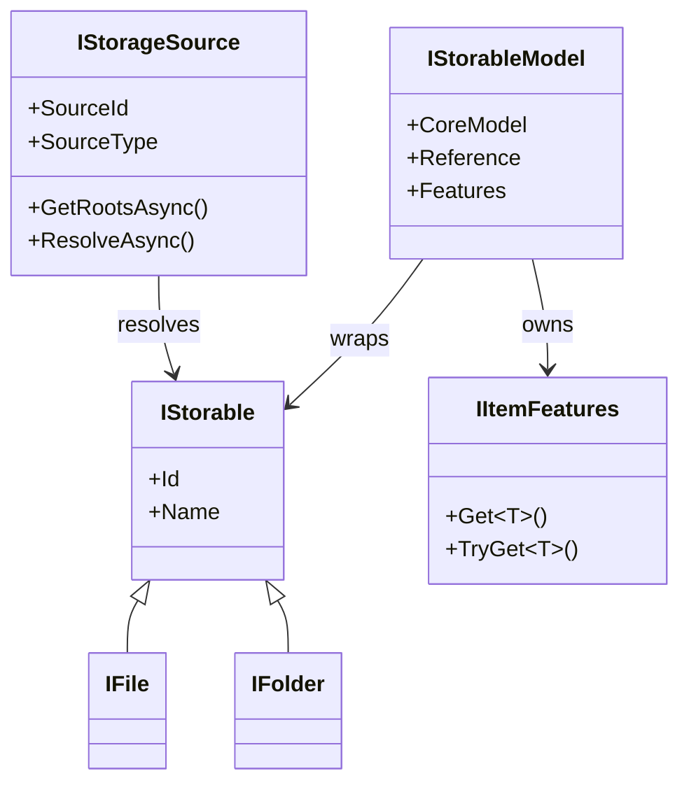
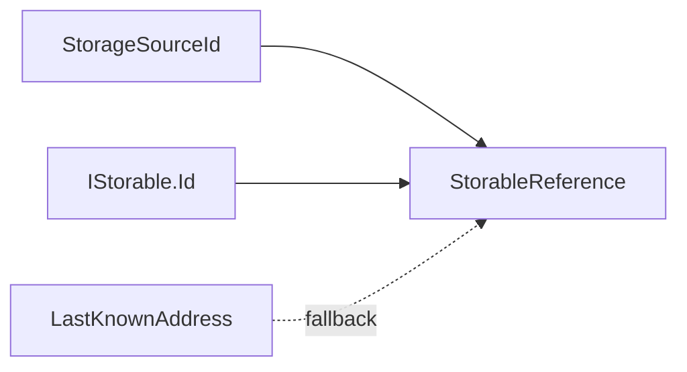
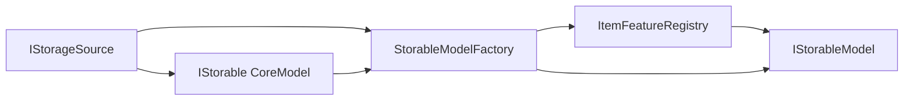

# Storage model boundaries

## CoreModels and AppModels

CoreModels standardize storage items across sources. For storage, the smallest CoreModels are the OwlCore.Storage interfaces such as `IStorable`, `IFile`, and `IFolder`.

Item AppModels wrap CoreModels and add Files-specific composition. They are
implemented by `Files.Core.Models.IStorableModel` and do not expose WinUI
concepts. `Files.Core.AppModels` contains the application-state AppModels for
windows, tabs, and panes; browsing models complete that state graph. These
are two scopes of AppModel, not competing architectural layers.

The `Files.Core` project contains both CoreModel adapters and AppModels.
Project placement must not be used as a substitute for the dependency
boundaries in this document.



`IStorageSource` is not an `IStorable`. It represents a configured connection or namespace capable of producing storage items. A Windows Shell namespace, an FTP account, and an opened archive are storage sources. Their child files and folders are storables.

## Identity and addresses

Three values have different jobs:

| Type | Meaning |
| --- | --- |
| `StorageSourceId` | Stable identity of a configured source |
| `IStorageSource.SourceType` | Short implementation category such as `windows-shell` or `ftp`; not item identity |
| `IStorable.Id` | Source-defined identity within that source |
| `StorageAddress` | An address that a source may resolve |

`StorableReference` combines the source ID and item ID. Its equality and hash
code deliberately use only those two values. `LastKnownAddress` is an
optional recovery hint and never participates in identity.

Windows filesystem items use the versioned `winfs:v1:<volume>:<file-index>` identity when available. Their current `StorageAddress` uses the `file:` scheme and filesystem path, while their Shell parsing name and managed absolute PIDL remain separate locators. Items without a filesystem path use a `shell:` address. Virtual or inaccessible items use the encoded `winshell-address:v1:<address>` identity fallback when a filesystem ID is unavailable.

An FTP connection uses `ftp:<ConnectionId>` as its source ID and a normalized,
case-preserving remote path as its item ID. FTP exposes no portable stable
file ID, so rename or move produces a new reference and invalidates the old
path identity. Its `ftp:`, `ftpes:`, or `ftps:` address contains the endpoint
and escaped path but never credentials. See [FTP storage](ftp-storage.md).

Resolution validates the resulting identity and rejects a different file that
has replaced a stale address. The Windows source can cold-resolve a
same-directory rename by scanning the previous parent. Cross-directory cold
lookup requires a volume file-ID index or `OpenFileById` strategy; live
operations return the updated reference and open sessions receive the move
through their watcher.



## Optional item features

Item features remain independent interfaces. A concrete CoreModel may directly implement both `IStorable` and an item feature, but the item feature does not inherit from `IStorable`.

```csharp
public interface IThumbnailSource
{
	ValueTask<ThumbnailResult?> GetThumbnailAsync(
		ThumbnailRequest request,
		CancellationToken cancellationToken = default);
}

public interface IPropertySource
{
	ValueTask<IReadOnlyDictionary<string, object?>> GetPropertiesAsync(
		PropertyRequest request,
		CancellationToken cancellationToken = default);
}
```

An implementation may instead come from a source adapter, a cache wrapper, or an extension. The `ItemFeatureRegistry` combines those options once and stores the result in the AppModel's `IItemFeatures`.



See [Item feature composition](item-features.md) for resolution, multiple sources, wrappers, and ownership.

## Ownership

`IStorableModelFactory` transfers ownership of a newly supplied CoreModel to
the returned AppModel. The AppModel asynchronously disposes its item feature set
before disposing the CoreModel. If an item feature or CoreModel supports only
`IDisposable`, that synchronous cleanup runs inside the same ordered
disposal.

Browse-session replacement, refresh, incremental delete/rename/update, failed
navigation, and session shutdown all await `IStorableModel.DisposeAsync`.
Cleanup attempts every owned item and aggregates failures instead of
abandoning the remaining models. Synchronous `Dispose` members are
compatibility bridges; Files.App must keep disposal asynchronous on the UI
thread.

Storage sources and shared services have a longer lifetime and are owned by `FilesDataRoot` or the application composition root. This keeps native resources bounded by the model graph rather than the visual tree.

An opened archive is a scoped exception to the process-wide source lifetime:
its selected `IArchiveMount` exposes an item source only for the active
`ArchiveBrowseLocationContext`. Inner entries use a backend-neutral outer
`StorableReference` plus normalized entry path for navigation. See
[Archive browsing](archives.md).
