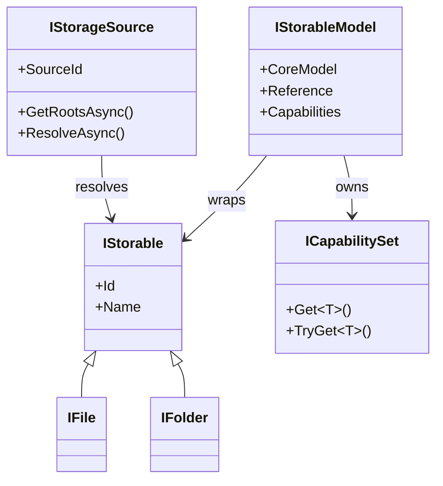
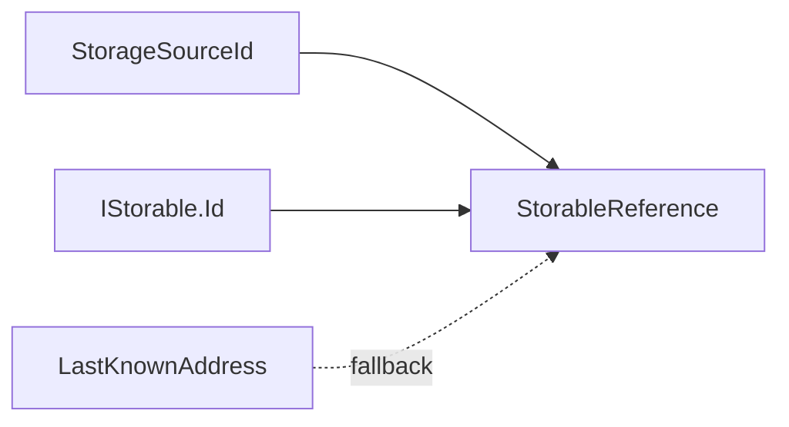
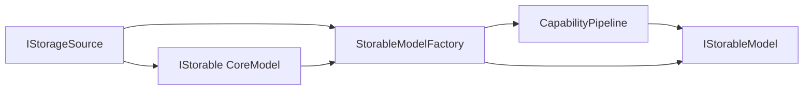

# Storage model boundaries

## CoreModels and AppModels

CoreModels standardize one provider. For storage, the smallest CoreModels are the OwlCore.Storage interfaces such as `IStorable`, `IFile`, and `IFolder`.

AppModels wrap CoreModels and add Files-specific composition. They do not expose WinUI concepts.



`IStorageSource` is not an `IStorable`. It represents a configured connection or namespace capable of producing storage items. A Windows Shell namespace, an FTP account, and an opened archive are storage sources. Their child files and folders are storables.

## Identity and addresses

Three values have different jobs:

| Type | Meaning |
| --- | --- |
| `StorageSourceId` | Stable identity of a configured source |
| `IStorable.Id` | Provider-defined identity within that source |
| `StorageAddress` | An address that a source may resolve |

`StorableReference` combines the source ID and item ID. `LastKnownAddress` is an optional recovery hint, not the primary identity.

Windows filesystem items use an opaque identity derived from the volume serial and file index when available. Their Shell parsing name remains a separate locator; virtual or inaccessible items use a documented address fallback. Reverse lookup of opaque file IDs is not implemented yet, so `LastKnownAddress` remains required for recovery.



## Optional capabilities

Capabilities remain independent interfaces. A concrete CoreModel may directly implement both `IStorable` and a capability, but the capability does not inherit from `IStorable`.

```csharp
public interface IThumbnailSource
{
	ValueTask<ThumbnailResult?> GetThumbnailAsync(
		ThumbnailRequest request,
		CancellationToken cancellationToken = default);
}

public interface IPropertySource
{
	ValueTask<IReadOnlyDictionary<string, object?>> GetPropertiesAsync(
		PropertyRequest request,
		CancellationToken cancellationToken = default);
}
```

An implementation may instead come from a source adapter, a cache decorator, or a plugin. The `CapabilityPipeline` composes those candidates once and stores the result in the AppModel's `ICapabilitySet`.



See [Capability composition](capabilities.md) for resolution, multiple providers, decorators, and ownership.

## Ownership

`IStorableModelFactory` transfers ownership of a newly supplied CoreModel to the returned AppModel. The AppModel disposes its capability set before disposing the CoreModel. A browse session disposes replaced item models.

Storage sources and shared services have a longer lifetime and are owned by `FilesDataRoot` or the application composition root. This keeps native resources bounded by the model graph rather than the visual tree.
