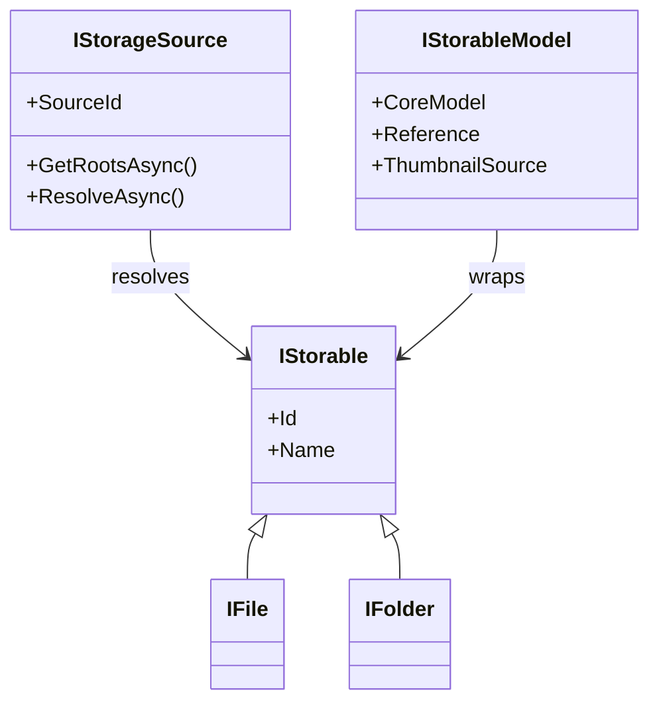
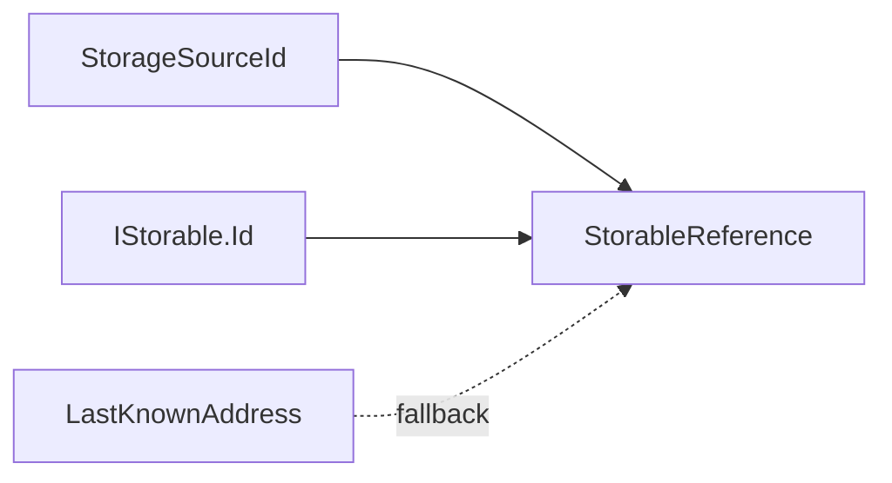

# Storage model boundaries

## CoreModels and AppModels

CoreModels standardize one provider. For storage, the smallest CoreModels are the OwlCore.Storage interfaces such as `IStorable`, `IFile`, and `IFolder`.

AppModels wrap CoreModels and add Files-specific composition. They do not expose WinUI concepts.



`IStorageSource` is not an `IStorable`. It represents a configured connection or namespace capable of producing storage items. A Windows Shell namespace, an FTP account, and an opened archive are storage sources. Their child files and folders are storables.

## Identity and addresses

Three values have different jobs:

| Type | Meaning |
| --- | --- |
| `StorageSourceId` | Stable identity of a configured source |
| `IStorable.Id` | Provider-defined identity within that source |
| `StorageAddress` | An address that a source may resolve |

`StorableReference` combines the source ID and item ID. `LastKnownAddress` is an optional recovery hint, not the primary identity.



## Optional capabilities

Capabilities remain independent interfaces. A concrete CoreModel may implement both `IStorable` and a capability, but the capability does not inherit from `IStorable`.

```csharp
public interface IThumbnailSource
{
	ValueTask<ThumbnailResult?> GetThumbnailAsync(
		ThumbnailRequest request,
		CancellationToken cancellationToken = default);
}
```

This permits capabilities to come from the provider, an adapter, a cache, or a plugin without changing the storage hierarchy.

The same rule should be used for properties, search, changes, and provider-specific actions. Mandatory OwlCore.Storage interfaces should be implemented only when their full contract can be honored.

## Ownership

`IStorableModelFactory` transfers ownership of a newly supplied CoreModel to the returned AppModel. Disposing the AppModel disposes its CoreModel and any separately owned capability. A browse session disposes replaced item models. This keeps native resources bounded by the model graph rather than the visual tree.
