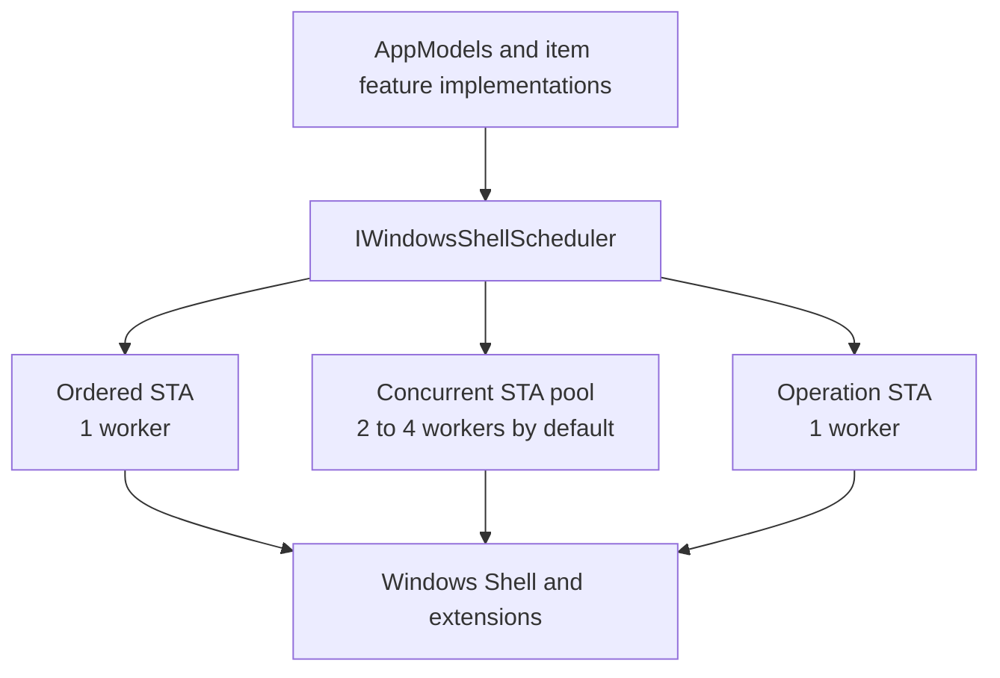
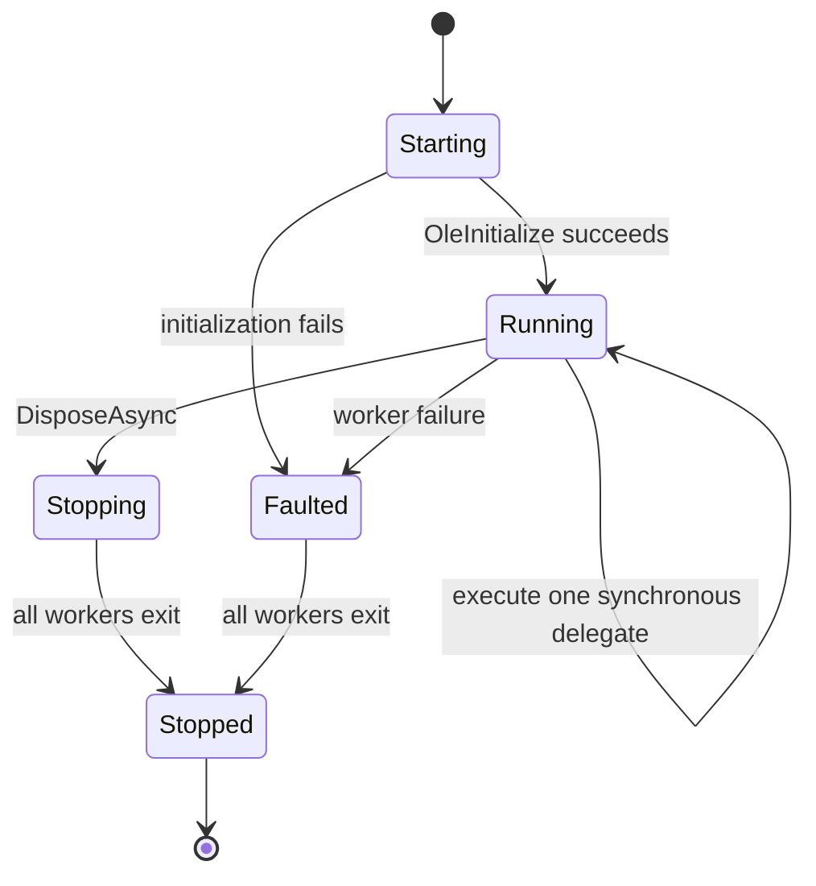
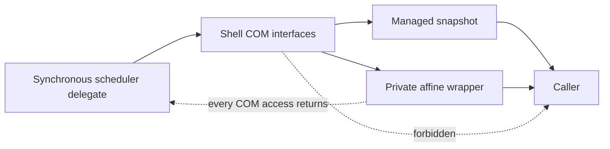
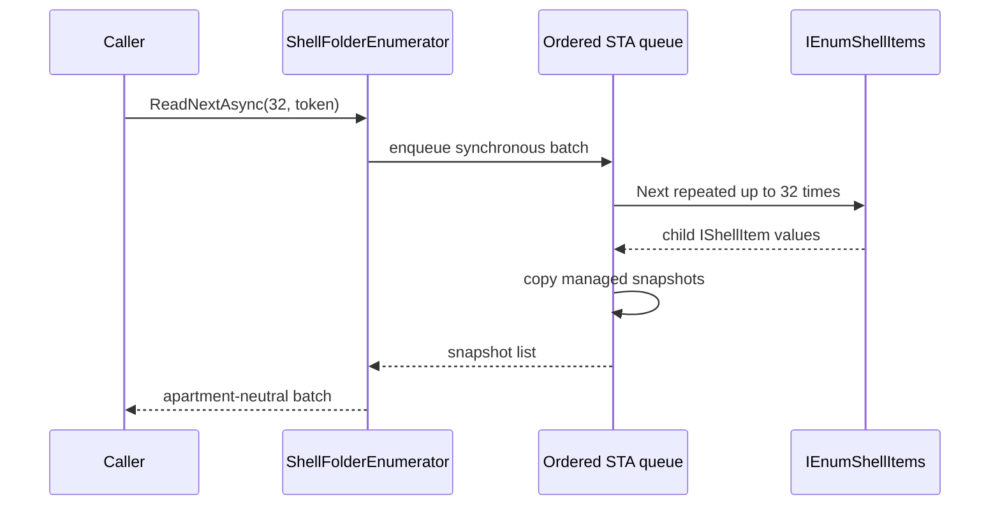

# Windows Shell threading

Windows Shell COM work is isolated behind `IWindowsShellScheduler`. The scheduler is a Files-specific service that can be injected, shared, and replaced in tests.

Its low-level STA mechanism follows the useful part of the ReFiles experiment—OLE initialization plus a Win32 message pump—but it does not adopt ReFiles' source, item feature, or root-model architecture. Files keeps its own CoreModel and item feature flow.

## Lanes

| API | Intended work | Ordering and affinity |
| --- | --- | --- |
| `InvokeAsync` | Item creation, metadata, enumeration, apartment-affine wrappers | One ordered worker; use for an object that must be revisited on its creating apartment |
| `InvokeConcurrentAsync` | Independent thumbnail/icon extraction with no retained COM object | Small worker pool; calls may run on different apartments |
| `InvokeOperationAsync` | Long `IFileOperation`-style mutations | Separate ordered worker so a copy dialog cannot block metadata and browsing |

The operation lane executes long-running Shell mutations such as rename without blocking ordered metadata work.

Windows Shell preview handlers use a separate
`WindowsShellScheduler(concurrentWorkerCount: 1)` owned by
`FilesCoreRuntime`. Handler activation, initialization, calls, and release
therefore cannot block storage metadata or operation lanes, and one preview
session remains on one message-pumped STA.

## Worker behavior

Each worker:

1. enters an STA and calls `OleInitialize`;
2. creates a Win32 message queue;
3. waits for either a queue semaphore or window messages through `MsgWaitForMultipleObjectsEx`;
4. pumps messages before continuing queued work;
5. pairs successful initialization with `OleUninitialize`.

This matters because Shell extensions and sources can depend on message dispatch and COM reentrancy even when Files has no visible window on that worker.

## Rules at the boundary

- Scheduler delegates are synchronous `Func<T>`. An `async` delegate would resume after leaving the STA contract.
- Raw Shell or COM interfaces do not escape to arbitrary callers.
- Prefer copying data into an immutable managed snapshot.
- If an object must stay alive, a private wrapper may retain it only when every access is scheduled back to the same ordered lane.
- Work already running is not forcibly canceled. The cancellation token cancels work while it waits to start; a delegate may also observe the token itself.
- A nested call from the same scheduler runs inline to avoid queuing behind itself and deadlocking.

## Enumeration sequence

Cancellation between batches is prompt without paying one scheduler transition per child.

## Shutdown and ownership

`WindowsShellScheduler` is an instance service rather than a static global.
Disposal atomically stops accepting work, faults queued work with
`ObjectDisposedException`, wakes every worker, waits for any already-running
delegate to finish, and then disposes the queue handles.

The application root disposes item models and affine streams before storage
sources and schedulers. An injected scheduler is borrowed by
`WindowsStorageSource`; a source-created scheduler is owned by that source.
Source and runtime disposal are idempotent and continue through independent
cleanup failures.
