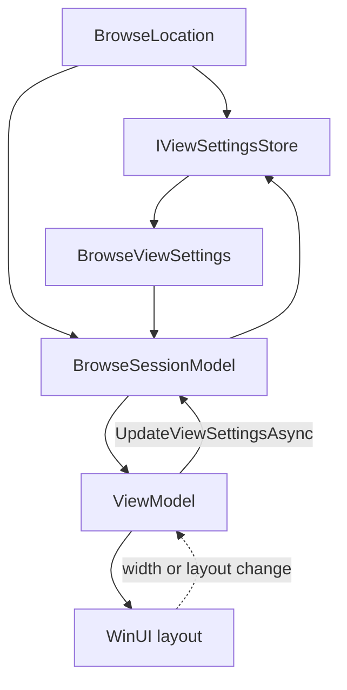
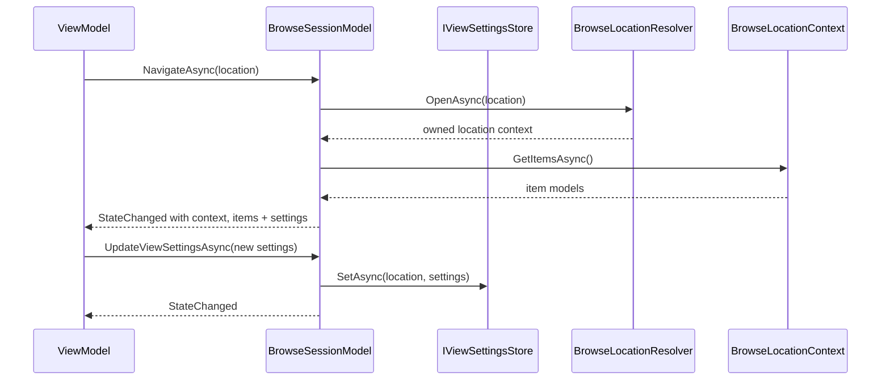
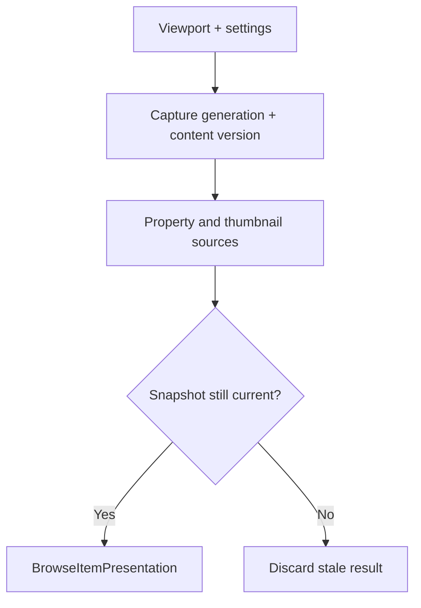

# Browse view settings

Details-view column widths, layout mode, sort selection, and item size describe how a browse location is presented. They are not properties or capabilities of one storage item.

The prototype therefore places them on `IBrowseSessionModel` and persists them through `IViewSettingsStore`.

## Model

`BrowseViewSettings` currently contains:

- `ViewLayoutMode` (`Details`, `List`, `Grid`, or `Columns`);
- ordered `ViewColumnSettings` with property ID, width, order, and visibility;
- sort property ID and direction;
- optional item size.

Column IDs use the same stable identifiers returned by `IPropertySource`. ViewModels translate those IDs into localized labels and WinUI column objects.

## Navigation flow

If no store is supplied, the session keeps an in-memory value per `BrowseLocation`. A real composition root can inject a persisted store backed by the Files settings database.

The session replaces the active context and item list only after the new context has finished loading. A failed or cancelled navigation disposes the new context and partial items while preserving the current context and items. Replacing or disposing the session disposes both the item models and the context that owns the location model.

When the active context exposes `IFolderChangeSource`, the session subscribes to `Changed` and `Faulted` before enumerating items. A bounded queue preserves detailed change order. The refresh pump applies complete create, delete, rename, and update notifications incrementally; incomplete, ambiguous, overflowed, or directory-wide notifications request one full refresh. Changes from the context currently being prepared are deferred until that context becomes active instead of being consumed repeatedly. A failed refresh leaves the displayed context and items in place while setting `Error`.

## Projection and selection

`BrowseSessionModel` owns the UI-agnostic ordered projection. It publishes immutable item snapshots and versioned `BrowseItemChange` values. Add, remove, replace, and single-item reposition operations remain granular. A settings or property-value resort publishes one `BrowseItemsReset`, because a set of final-index move records is not generally valid when a consumer applies the records sequentially.

The projection sorts `name` and `System.ItemNameDisplay` directly from `IStorableModel.Name`. Other property IDs use values already published into `BrowseItemPresentation`. Unavailable values remain at the end in either direction, with name and stable identity as deterministic tie-breakers.

Selection is stored as stable `StorableKey` values rather than model references or addresses. Synchronous UI selection updates normalize against one `ItemsVersion`; if an item mutation races that normalization, the update retries against the new snapshot. Rename migrates selection only when the provider identity changes.

Session events isolate each subscriber exception and continue to later subscribers, so a faulty observer cannot roll back an already committed model transition. Handlers should remain short and schedule asynchronous follow-up work instead of synchronously waiting on another session mutation.

## Viewport prefetch

`BrowsePrefetchCoordinator` processes the visible range first, then a bounded number of items after and before it. It does not scan the rest of a large folder. Each viewport request supersedes the previous request.

The session uses two independent counters:

- `Generation` changes when a browse context is replaced.
- The internal content version changes whenever item model membership or a model snapshot changes within that context.

The coordinator checks both before and after every awaited capability call. The session then checks both again and verifies that the exact model instance is still present before accepting the result. An incremental rename, update, delete, or create therefore cancels old work even though `Generation` is unchanged.

Accepted properties and copied thumbnail bytes are retained in `BrowseItemPresentation`. Consumers read them with `TryGetPresentation` and observe `ItemPresentationChanged`; property-based sorting re-evaluates as requested values arrive. This store is snapshot-scoped and is cleared or invalidated when models are replaced, so the prefetch result is useful even when no capability decorator provides a shared cache.

## Why this is not `FolderModel.Get<IViewSettings>()`

- Home, search, and tag pages have view settings but are not folders.
- The same folder can be open in two panes with independent transient presentation state.
- A storage provider should not know column pixel widths or the user's preferred layout.
- Item capabilities disappear with an item model; saved view settings must survive model recreation.

The session owns current state and its UI-agnostic projection, the store owns persistence, and the ViewModel adapts versioned model changes and presentation values into WinUI collections and image objects.
