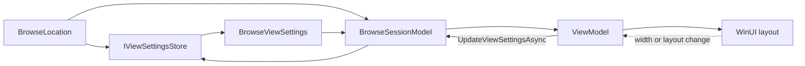
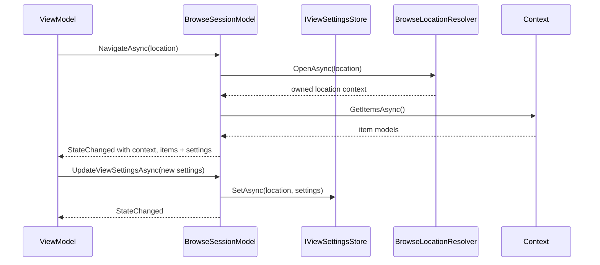

# Browse view settings

Details-view column widths, layout mode, sort selection, and item size describe how a browse location is presented. They are not properties or capabilities of one storage item.

The prototype therefore places them on `IBrowseSessionModel` and persists them through `IViewSettingsStore`.

## Model

`BrowseViewSettings` currently contains:

- `ViewLayoutMode` (`Details`, `List`, `Grid`, or `Columns`);
- ordered `ViewColumnSettings` with property ID, width, order, and visibility;
- sort property ID and direction;
- optional item size.

Column IDs use the same stable identifiers returned by `IPropertySource`. ViewModels translate those IDs into localized labels and WinUI column objects.

## Navigation flow

If no store is supplied, the session keeps an in-memory value per `BrowseLocation`. A real composition root can inject a persisted store backed by the Files settings database.

The session replaces the active context and item list only after the new context has finished loading. A failed or cancelled navigation disposes the new context and partial items while preserving the current context and items. Replacing or disposing the session disposes both the item models and the context that owns the location model.

## Why this is not `FolderModel.Get<IViewSettings>()`

- Home, search, and tag pages have view settings but are not folders.
- The same folder can be open in two panes with independent transient presentation state.
- A storage provider should not know column pixel widths or the user's preferred layout.
- Item capabilities disappear with an item model; saved view settings must survive model recreation.

The session owns current state, the store owns persistence, and the ViewModel owns the WinUI-specific projection.
