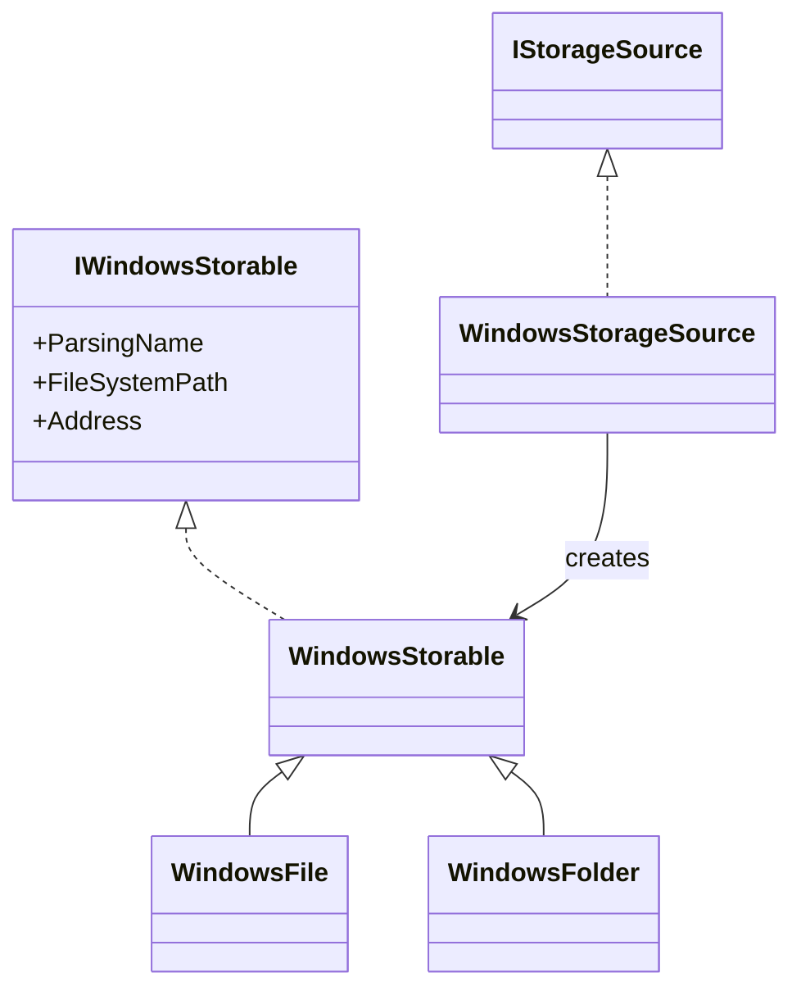
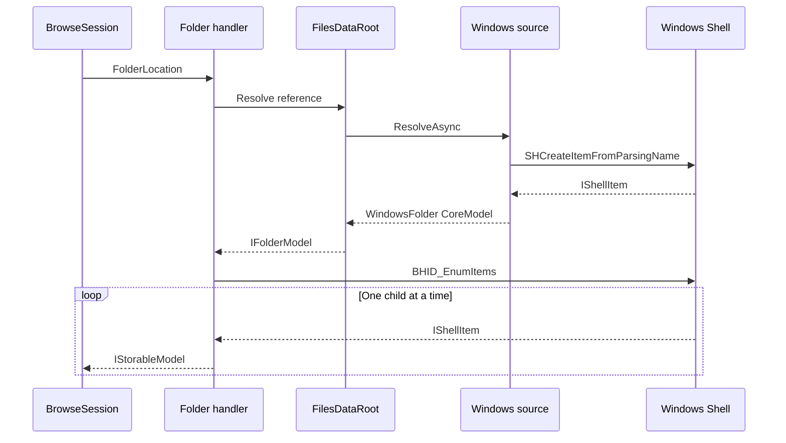
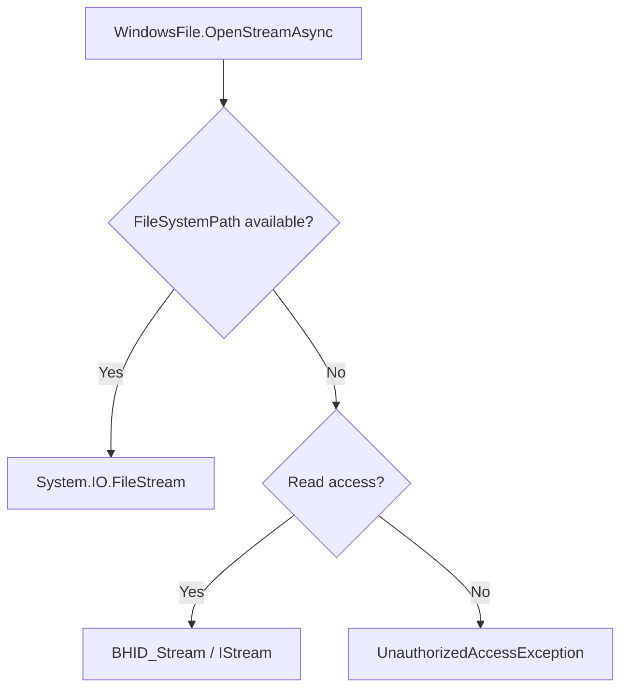

# Windows storage provider

The Windows provider maps the Windows Shell namespace to OwlCore.Storage without introducing WinUI dependencies.

## Object model



`WindowsStorageSource` resolves both `shell` and `file` addresses. Its default root is the Shell `ComputerFolder` known folder.

```csharp
await using var dataRoot = new FilesDataRoot(
	[new WindowsStorageSource()],
	new StorableModelFactory());

var windows = dataRoot.Sources.Single();

await foreach (var root in dataRoot.GetRootsAsync(windows.SourceId))
{
	using (root)
	{
		// Pass root.Reference into a FolderLocation or another AppModel.
	}
}
```

`WindowsStorable` keeps two different locations:

- `ParsingName` uses `SIGDN_DESKTOPABSOLUTEPARSING` and becomes `IStorable.Id`. It works for file-system and virtual Shell items.
- `FileSystemPath` uses `SIGDN_FILESYSPATH` only when `SFGAO_FILESYSTEM` is present. It is nullable by design.

Using `SIGDN_FILESYSPATH` as the identity would make virtual items such as This PC, libraries, Recycle Bin, and portable devices unidentifiable.

## Browse flow



`WindowsFolder.GetItemsAsync` yields each child as the Shell enumerator advances. It does not first buffer the entire folder.

## File streams



File-system items use `FileStream` with read/write/delete sharing. Virtual items request `IStream` through `BHID_Stream`; the initial implementation exposes that stream as read-only.

## Lifetime and threading

- `WindowsStorable` is disposable and owns its Shell projection.
- AppModels own the CoreModels they wrap.
- Folder enumeration keeps its Shell enumerator within the async-enumeration lifetime.
- Callers must run Shell operations on a COM-initialized thread. The provider does not capture a dispatcher or silently marshal to the UI thread.
- Source-generated COM projections are used through `Files.App.CsWin32`; incompatible `Marshal.ReleaseComObject` APIs are not used.

## Current scope

Implemented:

- Parsing file-system and virtual Shell items.
- Resolving known folders, addresses, and persisted references.
- Stable Shell parsing-name identity.
- Parent lookup.
- Streaming child enumeration with cancellation.
- File-system and virtual read streams.

Deferred as optional capabilities:

- Thumbnails and icons.
- Properties and visible columns.
- Folder watchers.
- Search.
- Mutations and bulk file operations.
- Context menus and Shell verbs.
