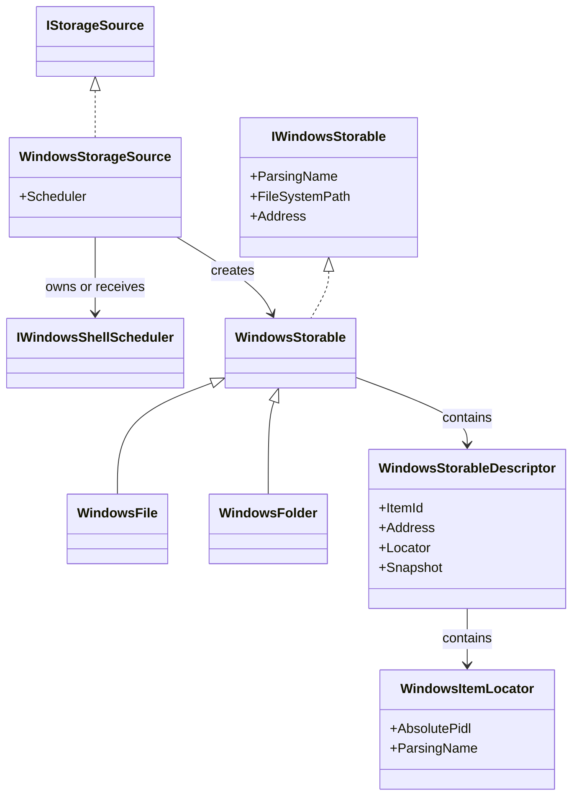
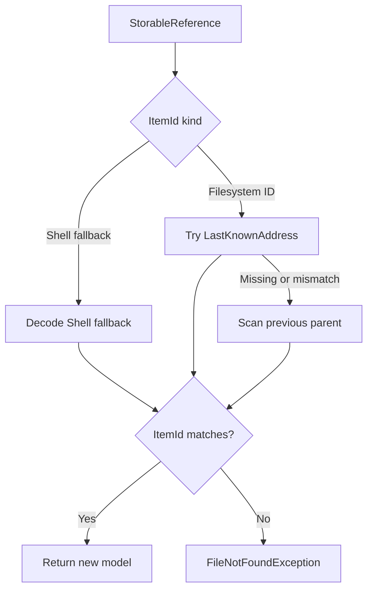
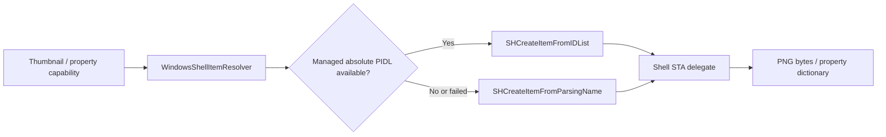
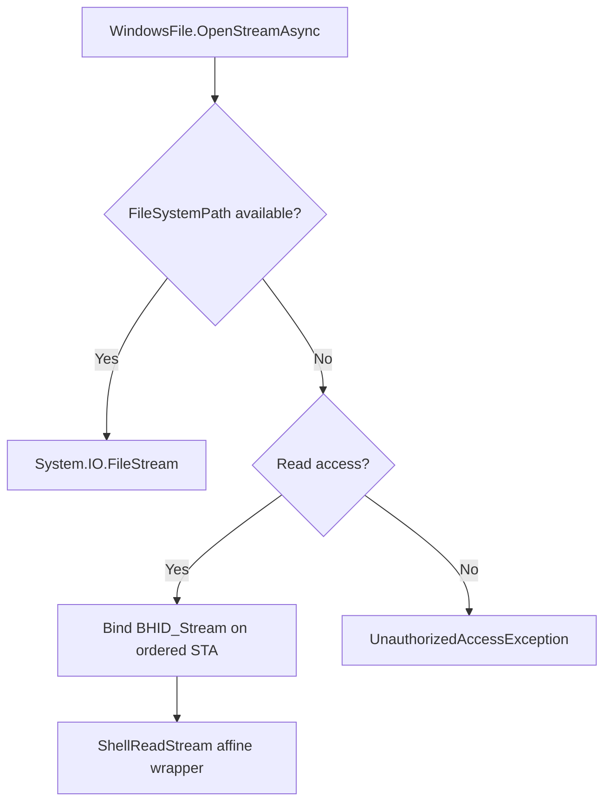

# Windows storage provider

The Windows provider maps the Windows Shell namespace to OwlCore.Storage without introducing WinUI dependencies or leaking apartment-affine COM interfaces into ordinary models.

## Object model



`WindowsStorageSource` resolves both `shell` and `file` addresses. Its default root is the Shell `ComputerFolder` known folder.

```csharp
await using var dataRoot = new FilesDataRoot(
	[new WindowsStorageSource()],
	new StorableModelFactory(capabilities));

var windows = dataRoot.Sources.Single();

await foreach (var root in dataRoot.GetRootsAsync(windows.SourceId))
{
	using (root)
	{
		// Pass root.Reference into a FolderLocation or another AppModel.
	}
}
```

`WindowsStorableDescriptor` copies these values while still on the ordered Shell STA:

- `ItemId` is created by one `IWindowsItemIdentityProvider`. File-system items use the versioned `winfs:v1:<volume>:<file-index>` identity; virtual or inaccessible items use the versioned, encoded `winshell-address:v1:<address>` fallback.
- `WindowsItemLocator` contains a managed copy of the absolute PIDL and the `SIGDN_DESKTOPABSOLUTEPARSING` fallback locator. The PIDL is copied before the Shell STA operation returns.
- `Name` uses a UI-friendly Shell display name with a normal-display fallback.
- `FileSystemPath` uses `SIGDN_FILESYSPATH` only when `SFGAO_FILESYSTEM` is present. It is nullable by design.
- `IsFolder` selects `WindowsFolder` or `WindowsFile` without retaining `IShellItem`.

Addresses and identities are intentionally independent. A filesystem model exposes a `file:` address containing its current filesystem path. An item without a filesystem path exposes a `shell:` address containing its desktop-absolute parsing name. Either kind may still use a provider-defined identity.

Windows file IDs are stable across rename. A persisted filesystem reference keeps its previous `file:` address as a recovery hint. Resolution tries that path and, when the path is missing or now identifies a different item, scans the previous parent directory for the requested file ID. A reference is accepted only when the resolved candidate has exactly the requested `ItemId`; a recreated file at a stale address is rejected.

This scan is a prototype fallback for a rename within the same directory. A cold reference cannot yet recover a move to a different directory. That requires a volume-relative reverse lookup such as `OpenFileById`, or an external watcher/index that persists the item's new address.

Using a filesystem path or parsing name as the identity would make virtual items such as This PC, libraries, Recycle Bin, and portable devices unidentifiable.

## Persisted reference recovery



The identity provider is stateless. Recovery works after the original `WindowsStorageSource` has been disposed and recreated; it does not rely on a process-local item-ID-to-path dictionary.

## Snapshot boundary


Most CoreModels are therefore apartment-neutral and do not need disposal. The two exceptions are private wrappers around resources that must remain live:

- `ShellFolderEnumerator` owns `IEnumShellItems` and routes each bounded batch to the same ordered STA.
- `ShellReadStream` owns a virtual `IStream` and routes `Read`, `Seek`, `Stat`, and release to the same ordered STA.

Neither wrapper exposes its COM interface.

## Shared Shell resolver

All Shell item materialization is routed through `WindowsShellItemResolver`. It first attempts `SHCreateItemFromIDList` using the managed PIDL, then falls back to `SHCreateItemFromParsingName` using the locator. The resolver invokes the caller's operation inside the selected STA and returns only managed data or a private affine wrapper.



Capability sources receive the locator, never an `IShellItem` or a raw PIDL pointer. This keeps COM affinity inside the resolver and gives filesystem, virtual Shell, thumbnail, and property paths one materialization boundary.

## Browse flow


Enumeration does not buffer the entire folder. A bounded batch amortizes scheduler transitions while preserving streaming and cancellation between batches.

## File streams



File-system items use `FileStream` with read/write/delete sharing. Virtual items request `IStream` through `BHID_Stream`; the prototype exposes that stream as read-only.

## Lifetime

- `FilesDataRoot` owns each `WindowsStorageSource`.
- A source created without an injected scheduler owns and disposes its `WindowsShellScheduler`.
- A source given an `IWindowsShellScheduler` borrows it; the composition root owns that shared scheduler.
- `WindowsStorable` contains only a managed snapshot and is not disposable.
- The affine enumerator and stream wrappers must finish before their source or shared scheduler is disposed.
- Source-generated COM projections are used through `Files.App.CsWin32`; incompatible `Marshal.ReleaseComObject` APIs are not used.

See [Windows Shell threading](threading.md) for lane selection, cancellation, reentrancy, and shutdown.

## Current scope

Implemented:

- Parsing file-system and virtual Shell items.
- Resolving known folders, addresses, and persisted references.
- Versioned provider-defined identity from volume serial and file index, with an encoded address fallback for items that cannot expose a stable filesystem ID.
- Strict reference resolution that refuses to return a different item occupying a stale address.
- Cold same-directory rename recovery from a filesystem reference.
- Managed PIDL descriptors and one shared Shell item resolver for storage and capabilities.
- Parent lookup.
- Streaming child enumeration in bounded batches.
- File-system streams and apartment-safe virtual read streams.
- Injectable message-pumped STA scheduling.
- Windows Shell thumbnail extraction through `IShellItemImageFactory`, with PNG materialization inside the concurrent Shell STA lane.

Generic capability composition now exists for thumbnails, previews, properties, and decorators. Cross-directory move recovery, Windows-specific property extraction beyond the initial typed set, watchers, search, mutations, bulk operations, context menus, and Shell verbs remain separate vertical slices.
