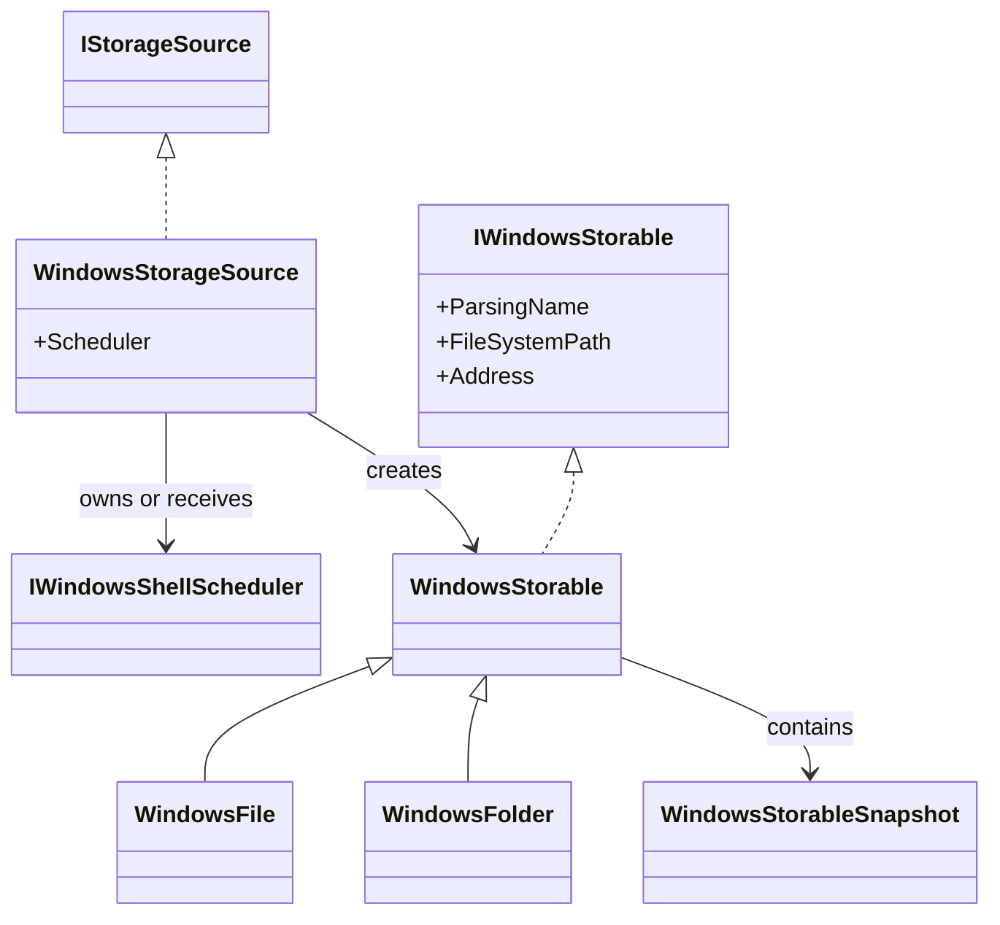
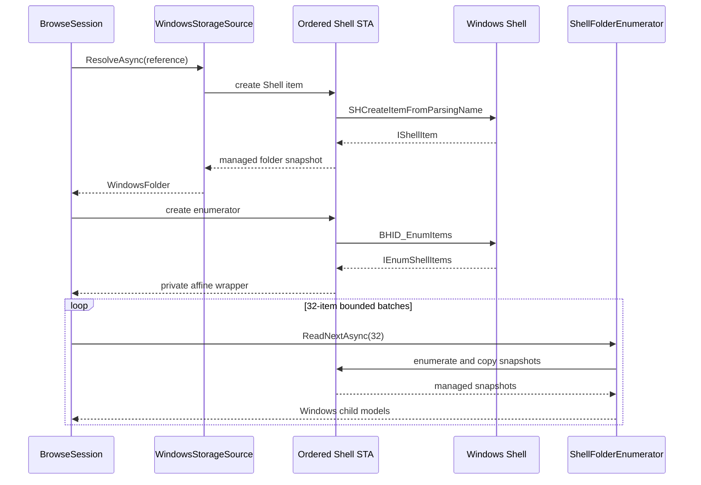
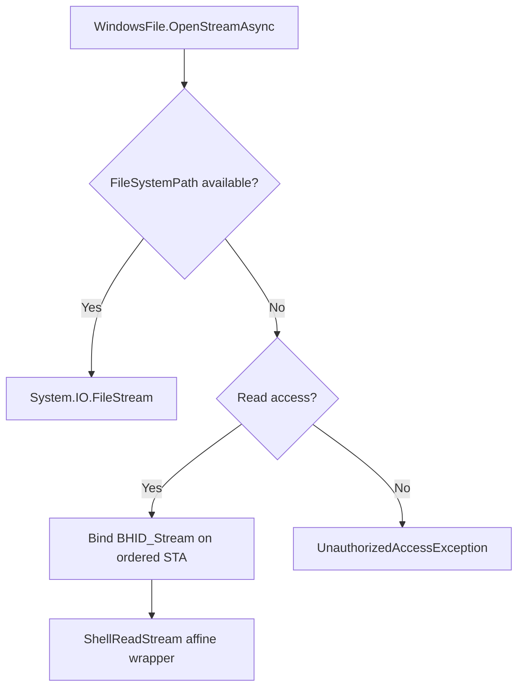

# Windows storage provider

The Windows provider maps the Windows Shell namespace to OwlCore.Storage without introducing WinUI dependencies or leaking apartment-affine COM interfaces into ordinary models.

## Object model



`WindowsStorageSource` resolves both `shell` and `file` addresses. Its default root is the Shell `ComputerFolder` known folder.

```csharp
await using var dataRoot = new FilesDataRoot(
	[new WindowsStorageSource()],
	new StorableModelFactory(capabilities));

var windows = dataRoot.Sources.Single();

await foreach (var root in dataRoot.GetRootsAsync(windows.SourceId))
{
	using (root)
	{
		// Pass root.Reference into a FolderLocation or another AppModel.
	}
}
```

`WindowsStorableSnapshot` copies these values while still on the ordered Shell STA:

- `ParsingName` uses `SIGDN_DESKTOPABSOLUTEPARSING` and becomes `IStorable.Id`. It works for file-system and virtual Shell items.
- `Name` uses a UI-friendly Shell display name with a normal-display fallback.
- `FileSystemPath` uses `SIGDN_FILESYSPATH` only when `SFGAO_FILESYSTEM` is present. It is nullable by design.
- `IsFolder` selects `WindowsFolder` or `WindowsFile` without retaining `IShellItem`.

Using `SIGDN_FILESYSPATH` as the identity would make virtual items such as This PC, libraries, Recycle Bin, and portable devices unidentifiable.

## Snapshot boundary


Most CoreModels are therefore apartment-neutral and do not need disposal. The two exceptions are private wrappers around resources that must remain live:

- `ShellFolderEnumerator` owns `IEnumShellItems` and routes each bounded batch to the same ordered STA.
- `ShellReadStream` owns a virtual `IStream` and routes `Read`, `Seek`, `Stat`, and release to the same ordered STA.

Neither wrapper exposes its COM interface.

## Browse flow



Enumeration does not buffer the entire folder. A bounded batch amortizes scheduler transitions while preserving streaming and cancellation between batches.

## File streams



File-system items use `FileStream` with read/write/delete sharing. Virtual items request `IStream` through `BHID_Stream`; the prototype exposes that stream as read-only.

## Lifetime

- `FilesDataRoot` owns each `WindowsStorageSource`.
- A source created without an injected scheduler owns and disposes its `WindowsShellScheduler`.
- A source given an `IWindowsShellScheduler` borrows it; the composition root owns that shared scheduler.
- `WindowsStorable` contains only a managed snapshot and is not disposable.
- The affine enumerator and stream wrappers must finish before their source or shared scheduler is disposed.
- Source-generated COM projections are used through `Files.App.CsWin32`; incompatible `Marshal.ReleaseComObject` APIs are not used.

See [Windows Shell threading](threading.md) for lane selection, cancellation, reentrancy, and shutdown.

## Current scope

Implemented:

- Parsing file-system and virtual Shell items.
- Resolving known folders, addresses, and persisted references.
- Stable Shell parsing-name identity.
- Parent lookup.
- Streaming child enumeration in bounded batches.
- File-system streams and apartment-safe virtual read streams.
- Injectable message-pumped STA scheduling.

Generic capability composition now exists for thumbnails, previews, properties, and decorators. Windows-specific thumbnail extraction, property extraction, watchers, search, mutations, bulk operations, context menus, and Shell verbs remain separate vertical slices.
